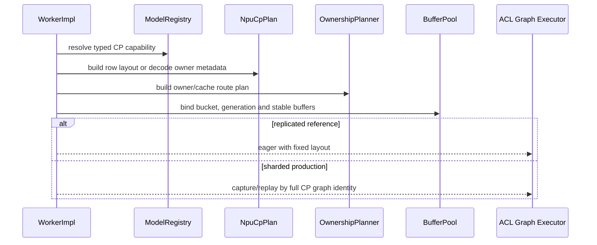
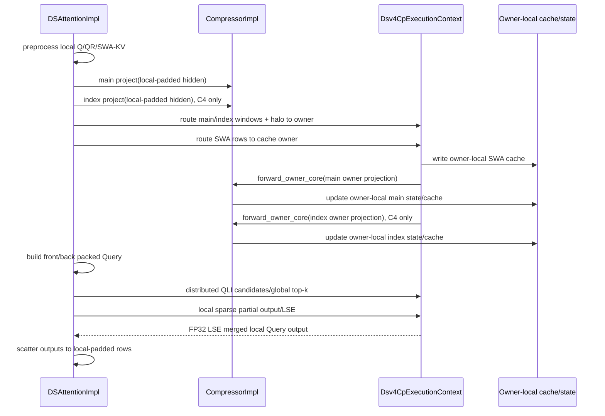

## 1. 文档状态

- 状态：P0/P1/P3、P4.1/P4.2 的实现和聚焦验证已完成；P4.3 已完成 query replication、owner
  index translation、QLI score API、deterministic top-k 和 FP32 LSE merge 的数据平面
  contract，但尚未接通 production sparse-attention operator。P5.1 已完成固定地址 buffer
  pool contract，P6.1 已完成 wavefront planner contract；P5.2/P6.2/P7.1 以及完整 owner
  attention 仍未完成。完整正交拓扑矩阵、msprof 分层数据和长时间 soak 作为发布扩展验证
  继续执行。Projection transport 已使用 model dtype，compressor state 默认 FP32、BF16
  为显式选项。State/cache 分片、state-owner/halo、CP prefill Graph 和跨 layer overlap
  仍必须通过对应运行时门禁后才能开放。
- 上层方案：`deepseek_v4_npu_cp_pre_compressor_v2.md`。
- 代码基线：`upstream/main`，提交 `e69351b4`。
- 目标后端：NPU Torch，A3。
- 当前验证拓扑：`world=8, dp=1, cp=8, attention-tp=1, ep=8,
  kv-split=1`。
- 目标模型：`deepseek_v4`、`deepseek_v4_mtp`。

本文是实现约束。现有 replicated pre-compressor 是 reference path，production 目标是
sharded state-owner。所有标记为“必须”的接口、shape、phase gate 和测试均为完整版本门禁；
示意代码允许根据现有代码风格调整参数传递方式，但不得改变
数据语义。

## 2. 实现目标

完整版本完成以下闭环：

1. global-real token 按 `2 * cp_size` zigzag 切成 local-padded rows。
2. Query、QLI、Sparse Attention 和 output projection 使用 CP-local real rows。
3. SWA KV、main/index projection 按 global block/window owner 路由，不在每 rank 恢复
   global-real cache/projection。
4. Owner-local Compressor 与 replicated reference 在 output、KV state、score state 和
   cache 逻辑内容上等价，每个 window 只执行一次。
5. 不能直接消费 CP-local rows 的 MoE 路径通过 global-row bridge 保证正确性。
6. CP prefill/decode/MTP 使用最终 owner path 的 bucketed ACL Graph；eager 使用同 layout
   作为 reference。
7. Target/draft 使用相同 immutable row layout value semantics，各自绑定自己的通信组和
   cache/state。
8. KV capacity estimator 按 owner-local blocks 估算，并与 Graph 固定 buffer、双缓冲和
   HCCL persistent reserve 共同完成容量门禁。
9. CP projection 使用 16-bit storage/collective，compressor state 默认 FP32、可显式选择
   BF16；两种 state storage dtype 均保持 FP32 softmax 和归约计算。

## 3. 完整版本范围和必须保持的不变量

当前版本必须实现：

- compressor state、SWA/compressed/index KV cache 的 CP 物理分片；
- compression-window state-owner 和 boundary halo routing；
- sharded QLI/sparse attention partial output + FP32 LSE merge；
- CP full/chunked/MTP prefill、decode 和 spec-verify ACL Graph；
- compression-aligned microchunk 跨 layer wavefront overlap；
- P2 model-dtype projection 和 FP32/BF16 可选 state storage。

必须保持：

- 非 CP 路径不依赖 owner/sharded modules，继续使用现有 fused compressor；
- `REPLICATED_REFERENCE` 只能显式启用用于差分，不作为 production 静默 fallback；
- 每个 global state/cache slot 只有一个 owner 写入；
- prefix/swap/transfer 在 metadata commit 前完成 owner-local 数据迁移；
- BF16 state 只有在 split owner Core 和 owner decode Compressor 均支持时才允许启动；
- padding/dummy/halo duplicate 不作为新 token 进入 compressor core、cache write、MoE router
  或 sampling；
- Graph/eager 使用同一 fixed-capacity layout 和 collective sequence；
- buffer event 未完成时不能跨 layer 复用；
- 缺少任一 owner/distributed-attention/Graph capability、容量不足或拓扑不满足时 fail-fast，
  不静默切算法。

## 4. 当前代码、目标模块和 dtype 实现方案

### 4.1 当前代码

| 领域 | 当前文件 | 当前职责 |
| --- | --- | --- |
| Model CP | `xllm/core/framework/parallel_state/npu_cp_plan.*` | zigzag row、ATB metadata、output merge |
| Process group | `xllm/core/framework/parallel_state/collective_communicator.*` | world/TP/DP/EP/CP group 生命周期 |
| Capability | `xllm/models/model_registry.*` | `CpShardingMode` 注册和查询 |
| DSV4 model | `xllm/models/llm/deepseek_v4*.h` | metadata、layer loop、model boundary |
| DSV4 attention | `xllm/core/layers/npu_torch/deepseek_sparse_attention.*` | preprocess/cache/compressor/indexer/attention |
| Compressor wrapper | `xllm/core/layers/npu_torch/compressor.*` | 权重、fused op 调用 |
| Cache config/policy | `xllm/core/framework/config/kv_cache_config.*`、`deepseek_v4_cache_policy.h` | cache 配置解析和 DSV4 dtype policy |
| Cache allocator | `xllm/core/framework/kv_cache/deepseek_v4_kv_cache_impl.*` | C4/C128 cache 和 compressor state 分配 |
| Capacity estimator | `xllm/core/framework/kv_cache/kv_cache_estimation.*` | persistent cache/state 字节核算 |
| MoE | `xllm/core/layers/npu_torch/fused_moe.*` | legacy reduction、EP2 dispatch/combine |
| Graph | `xllm/core/runtime/acl_graph_executor_impl.cpp` | eager/capture/replay phase dispatch |
| Operator | `third_party/xllm_ops/xllm_ops/attention/compressor` | fused Compressor host/kernel |

### 4.2 新增或修改后的模块

```text
xllm/models/model_registry.*
  NpuModelCpCapability / CpMetadataPolicy

xllm/core/framework/parallel_state/npu_cp_plan.*
  CpRowLayout
  NpuCpPlan compatibility wrapper

xllm/core/framework/parallel_state/collective_communicator.*
  orthogonal attention-TP and CP ProcessGroup creation

xllm/core/layers/npu_torch/deepseek_v4_cp_metadata.*
  Dsv4CpMetadataBuilder

xllm/core/layers/npu_torch/deepseek_v4_cp_execution.*
  Dsv4CpExecutionContext / per-forward bundle or sequential gather adapter

xllm/core/layers/npu_torch/deepseek_v4_cp_ownership.*
  Dsv4CpOwnershipPlanner / immutable owner and route descriptors

xllm/core/layers/npu_torch/deepseek_v4_cp_attention_exchange.*
  owner routing / distributed QLI / partial output and LSE merge

xllm/core/layers/npu_torch/deepseek_v4_cp_buffer_pool.*
  graph-stable typed double buffers and event generations

xllm/core/layers/npu_torch/deepseek_v4_cp_wavefront.*
  compression-aligned microchunk DAG and collective sequence ids

xllm/core/layers/npu_torch/compressor.*
  project / forward_core / existing forward

xllm/core/framework/config/kv_cache_config.*
xllm/core/framework/kv_cache/deepseek_v4_cache_policy.h
  user config / typed DSV4 compressor dtype policy

xllm/core/framework/kv_cache/kv_cache_utils.h
xllm/core/framework/kv_cache/kv_cache_estimation.*
xllm/core/framework/kv_cache/deepseek_v4_kv_cache_impl.*
xllm/core/framework/kv_cache/deepseek_v4_cp_cache_layout.*
  state dtype propagation / owner-local allocation / global-local block mapping

xllm/core/layers/npu_torch/deepseek_sparse_attention.*
  forward_cp orchestration and shared phase helpers

xllm/core/layers/npu_torch/fused_moe.*
  MoeRowCapability query only; no DSV4-specific branch

xllm/core/runtime/worker_impl.*
  capability resolution, CP policy preparation, memory gate

third_party/xllm_ops/xllm_ops/attention/compressor_projection
third_party/xllm_ops/xllm_ops/attention/compressor_core
third_party/xllm_ops/xllm_ops/attention/compressor
  A3 split operators and fused decode mixed-state support
```

`deepseek_v4_cp_metadata` 不依赖 `ProcessGroup`。`deepseek_v4_cp_execution` 不拥有模型权重、
cache 或 state。`CompressorImpl` 不理解 CP rank。该依赖方向用于防止 DSV4 语义扩散到通用
collective 和 planner。

### 4.3 Dtype 决策和边界

本设计采用与 SGLang 相同的保守原则：**state storage dtype 可选，但默认 FP32；所有敏感
计算保持 FP32。** 同时单独优化 CP projection 的 GM storage 和 collective，不把
projection transport dtype 与 persistent state dtype 绑定。

| 语义 | dtype | 约束 |
| --- | --- | --- |
| hidden / projection weight | model dtype | 当前目标模型为 BF16 |
| local/global packed projection | model dtype | 当前目标为 BF16；不得生成完整 FP32 GM 中间 tensor |
| CP projection AllGather | 与 packed projection 相同 | BF16 模型通信量相对 FP32 减半 |
| compressor state storage | FP32 默认；BF16 可选 | C4 main/index 和 C128 使用同一启动配置 |
| Cube accumulator | FP32 | Fixpipe 写 model dtype projection |
| Core/Compressor state update | FP32 | state load 后升 FP32，store 前按配置转换 |
| softmax/max/sum/exp/weighted reduction | FP32 | BF16 模式也不得降精度计算 |
| `pre_norm` | FP32 | P2 保留现有 RMSNorm/RoPE ABI，最终输出转 model dtype |

这里的“BF16 Core”指 Core 的大 tensor 输入和 GM transport 为 BF16，不表示 softmax 或状态
归约使用 BF16。Core 只在 tile 进入 UB/寄存器后升为 FP32，不允许在 runtime wrapper 中对
完整 projection 执行 `.to(torch::kFloat32)`。`pre_norm` 只有 `[Tc,D]`，不参与 CP 通信；
P2 保留 FP32 是为了不同时改变 RMSNorm/RoPE 数值路径。后续只有在 norm/rope 融合算子完成
独立精度门禁后，才评估直接输出 model dtype。

### 4.4 配置和 typed policy

新增 KV cache 配置：

```text
--dsv4_compress_state_dtype=float32   # default
--dsv4_compress_state_dtype=bfloat16  # opt-in
```

接受 `float32/fp32` 和 `bfloat16/bf16`，其他值启动失败。配置只决定 compressor state pool，
不改变模型权重、SWA KV、compressed KV 或 index cache dtype。配置通过现有
`KVCacheConfig` 的 flag/JSON 路径解析一次，底层 allocator 和 operator 不读取环境变量或
全局 flag。

`deepseek_v4_cache_policy.h` 新增 typed value object：

```cpp
enum class Dsv4CompressStateDtype : int8_t {
  FP32 = 0,
  BF16 = 1,
};

struct Dsv4CompressorDtypePolicy {
  torch::ScalarType projection_storage_dtype;
  torch::ScalarType state_storage_dtype;
  torch::ScalarType compute_dtype = torch::kFloat32;
};
```

`KVCacheEstimateOptions` 和 `KVCacheCreateOptions` 只携带解析后的 state storage dtype。
`WorkerImpl` 在容量估算和实际分配前解析 policy，并校验 target/draft、所有 rank 和 PD peer
配置一致。日志必须打印 resolved dtype，不能只打印原始字符串。

### 4.5 Projection/Core 算子改造

`CompressorProjection`：

1. host op output dtype 从 FP32 改为与 `x` 相同的 FP16/BF16；当前 DSV4 路径为 BF16。
2. Cube 继续 FP32 accumulate，Fixpipe 使用 `F322BF16`/对应 FP16 cast 直接写最终 packed
   tensor。
3. C++ wrapper 直接分配 model-dtype output；reference path 可继续做 AllGather 差分，
   production 由 `Dsv4CpAttentionExchange` 按 owner route，传输后仍保持 16-bit。
4. golden 以 FP32 GEMM 为参考，但不在 runtime 产生 FP32 projection 副本。

`CompressorCore`：

1. packed projection 支持 FP16/BF16，state input/output 分别支持 FP32/BF16，二者 dtype
   独立模板化。
2. projection/state 从 GM 搬入 tile 后统一转换为 FP32；APE、softmax、max/sum/exp、
   weighted reduction 和 state recurrence 保持 FP32。
3. state 写回按 `state_storage_dtype` 转换；FP32 默认实例必须保留现有路径和容差。
4. `pre_norm` 在 P2 继续 FP32，由 `CompressorImpl::forward_owner_core()` 复用现有 FP32 RMSNorm、
   partial RoPE，最后转换为 model dtype。
5. wrapper 检查 state pair dtype 相同、所有 state pool 使用同一 policy，禁止自动把完整
   state/projection tensor 转成 FP32 临时副本。

### 4.6 Fused decode 和生命周期闭环

BF16 state 不能只修改 CP prefill 的 owner Core。非 CP decode 仍调用 fused `Compressor`，
CP decode 调用 owner-local fused entry；两者必须增加独立的 state storage dtype 模板：

```text
model input/weight: BF16
state storage:      FP32 or BF16
state compute:      FP32
compressed output: model dtype
```

owner-decode/fused op 对 BF16 state 的处理与 owner Core 相同：tile load 时升 FP32，所有递推计算保持
FP32，store 时降 BF16。尤其 C128 continuation/decode 中反复使用的 state 不允许直接执行
BF16 `max/sum/exp`。若运行时请求 BF16 state，但任一 C4 main、C4 index、C128
owner-core/owner-decode
实例不可用，Worker 必须在分配 cache 前 fail-fast，不能仅将 decode 回退到 FP32，因为已
分配的 state ABI 不兼容。

state dtype 在服务启动后不可变。CP Graph warmup/capture 使用 owner-local state tensor；
Graph cache key 或 executor identity 必须包含 resolved state dtype，禁止 FP32/BF16 共用一次
capture。cache swap、prefix cache 和传输逻辑保持 dtype-agnostic copy，但发送端和接收端
必须在握手阶段校验 dtype 一致。

### 4.7 Allocation 和容量估算

`DeepSeekV4KVCacheImpl` 不再硬编码 `torch::kFloat32`，C4 main/index 和 C128 state 统一按
`state_storage_dtype` 分配。shape 和 cache tensor role 不变，因此 FP32/BF16 间不需要
layout migration。

`kv_cache_estimation` 使用 `torch::elementSize(state_storage_dtype)` 计算 state pool 字节，
不得继续写死 4 bytes。BF16 state 的 persistent logical bytes 应精确减半；由此释放的预算
可增加 state slot/KV capacity，但 allocator 实际值仍受 alignment 和其他 cache tensor
限制。CP transient estimator 则按 packed projection 的 16-bit element size 计算。

### 4.8 发布策略和正确性门禁

实施分四步，外部 BF16 state 开关只在第四步完成后开放：

1. projection storage/reference AllGather/owner route 改为 16-bit，state 仍固定 FP32；
   验证 CP1/CP8 output、cache/state 和通信字节。
2. split Core 支持 mixed state storage dtype；先跑 operator 和 chunk continuation 测试。
3. owner-decode 和 non-CP fused Compressor 支持相同 mixed-state ABI；覆盖 prefill 后
   decode、Graph 和 MTP。
4. allocator/estimator/config 全链路接通，开放 BF16 opt-in；默认继续 `float32`。

FP32 是兼容和回滚基线。BF16 只有在 C4/C128、full/chunked/prefix continuation、长上下文、
pure decode Graph 和 MTP 接受率 A/B 均通过后才能标记为 supported；在这些证据不足时不得
改成默认值。即使 operator 满足类似 `max_abs_diff < 0.1` 的基础门禁，也不能替代长上下文
生成精度和 MTP 接受率验证。

### 4.9 Owner planner 和 route descriptor

文件：`xllm/core/layers/npu_torch/deepseek_v4_cp_ownership.*`

```cpp
struct Dsv4CpRouteDescriptor {
  torch::Tensor send_row_indices;
  torch::Tensor send_owner_ranks;
  torch::Tensor recv_sequence_ids;
  torch::Tensor recv_window_ids;
  torch::Tensor recv_window_offsets;
  torch::Tensor send_real_counts;
  torch::Tensor recv_real_counts;
  int64_t padded_rows_per_peer = 0;
};

class Dsv4CpOwnershipPlan final {
 public:
  const Dsv4CpRouteDescriptor& main_route() const;
  const Dsv4CpRouteDescriptor& index_route() const;
  const Dsv4CpRouteDescriptor& swa_route() const;
  uint64_t signature() const;
};

class Dsv4CpOwnershipPlanner final {
 public:
  Dsv4CpOwnershipPlan build(
      const CpRowLayout& row_layout,
      const DSAMetadata& global_metadata,
      int64_t compress_ratio,
      int64_t block_size,
      int64_t cp_size) const;
};
```

global block mapping 固定为：

```text
owner_rank = global_block_id % cp_size
local_block_id = global_block_id / cp_size
```

planner 不持有 `ProcessGroup`、cache tensor 或 stream。它按 state/cache block table 找到每个
compression window 的 owner，将 real rows 和最多 `compress_ratio - 1` 个 boundary halo
排序为 `(sequence_id, window_id, offset)`。同一个 logical input row 可以作为 halo 被发送，
但 descriptor 必须另外标记唯一 cache-write row，禁止 halo duplicate 二次更新 state/cache。

Graph 使用每 peer 固定 `padded_rows_per_peer`；real counts 保存在稳定地址的 device tensor。
owner plan signature 包含 block-table generation、ratio、bucket、CP topology 和 route capacity，
不包含 tensor 地址或 `ProcessGroup*`。

### 4.10 Sharded cache layout

文件：`xllm/core/framework/kv_cache/deepseek_v4_cp_cache_layout.*`

```cpp
class Dsv4CpCacheLayout final {
 public:
  int64_t owner_rank(int64_t global_block_id) const;
  int64_t local_block_id(int64_t global_block_id) const;
  int64_t local_block_count(int64_t global_block_count) const;
  torch::Tensor map_global_block_table(
      const torch::Tensor& global_block_table) const;
};
```

`DeepSeekV4KVCacheImpl` 继续拥有 tensor，但 shape 第一维改为 owner-local block count。SWA、
C4 compressed、C4 index/scale、C128 compressed 和四类 compressor state 使用同一
`Dsv4CpCacheLayout`。non-owner block-table entry 在 local tensor view 中为 `-1`，global id
仍保存在 owner metadata 中用于 route/attention。

prefix reuse 保留 global block id。swap、host offload 和 PD transfer 按 owner 分组 copy；若
global block id 变化导致 owner 改变，数据 copy 和 completion event 必须先完成，再原子提交
新 block table generation。target/draft 有独立 physical pool 和 generation，不共享 mutable
cache layout。

`deepseek_v4_cp_cache_migration.*` 提供 cache-group-qualified migration plan 和 metadata
transaction。plan 只接收 global src/dst block id，统一派生 source/destination owner、owner-local
block id 和 `NO_COPY/LOCAL_COPY/CROSS_OWNER_COPY` 分类；prefix 命中使用相同 global id，因此
owner 稳定且不产生物理 copy。transaction 的状态固定为
`PREPARED -> COPY_IN_FLIGHT -> COPY_COMPLETE -> COMMITTED`，abort 在 commit 前始终保留旧
generation；stale generation、同 cache group 重复 destination 和 completion 前 commit 均
fail-fast。该对象不持有 tensor、event 或 `ProcessGroup`，swap、host offload 和 PD adapter
共享同一协议；P4.4 将物理 copy completion 和 Worker block-table 发布原子接通后，才允许默认
启用 owner-local allocator。

### 4.11 Distributed QLI 和 sparse attention

文件：`xllm/core/layers/npu_torch/deepseek_v4_cp_attention_exchange.*`

```cpp
class Dsv4CpAttentionExchange final {
 public:
  torch::Tensor replicate_query_rows(
      const torch::Tensor& local_padded_rows) const;

  static torch::Tensor select_query_rank_rows(
      const torch::Tensor& replicated_rows,
      int32_t query_rank);

  static Dsv4CpOwnerIndexMap build_owner_index_map(
      const torch::Tensor& global_block_table,
      const std::vector<int32_t>& global_seq_lens,
      int64_t block_size,
      int32_t cp_size,
      int32_t cp_rank,
      const torch::Device& device);

  torch::Tensor route_owner_rows(
      const torch::Tensor& local_rows,
      const Dsv4CpRouteDescriptor& route,
      Dsv4CpBufferSlot& slot) const;

  Dsv4CpQliResult global_topk(
      const Dsv4CpLocalQliResult& local_candidates,
      Dsv4CpBufferSlot& slot) const;

  torch::Tensor merge_attention_partials(
      const torch::Tensor& partial_output,
      const torch::Tensor& partial_lse,
      Dsv4CpBufferSlot& slot) const;
};
```

该类绑定 non-owning CP group 和 buffer slot，不拥有权重、cache 或 metadata。每个 owner 先
通过固定 shape 的 Query AllGather 获得所有 query-source rows，再从 local index shard 产生
`(score, global_index)` candidates。`Dsv4CpOwnerIndexMap` 同时保存 compact local block table
和 global/local token index 映射，禁止 consumer 解引用非 owner block 或 `-1` padding。固定
容量 AllGather 后按 `score desc, global_index asc` 做 deterministic top-k，attention partial
按 query-source rank 还原。C1/C4/C128 的 owner partial output 和 FP32 LSE 最终通过同一个
merge helper 合并。

当前阻塞项：现有 `SparseAttnSharedkv` SWA kernel 明确拒绝 `ori_sparse_indices`，且其 PA
block-table load 会直接把 block id 转成物理地址，不能安全消费带空洞的 owner table。因此
P4.3 的 data-plane contract 已有单测，但在 owner-aware sparse operator/position mapping
完成前不得打开 `dsv4_cp_cache_sharding`。

跨 owner 合并公式固定为：

```text
m = max(lse_i)
w_i = exp(lse_i - m)
output = sum(output_i * w_i) / sum(w_i)
```

empty owner 使用 `lse=-inf`、`output=0`。所有 max/exp/sum/weighted reduction 使用 FP32。
结果只返回 Query owner 的 local-real-half rows，不恢复 global Query。operator 单测必须覆盖
极值 score、全 empty 以外的任意 empty-owner 组合和 multi-sequence 不等 KV 长度。

### 4.12 Graph-stable buffer pool

文件：`xllm/core/layers/npu_torch/deepseek_v4_cp_buffer_pool.*`

```cpp
enum class Dsv4CpBufferState : int8_t {
  FREE = 0,
  PROJECTION_READY = 1,
  ROUTE_IN_FLIGHT = 2,
  OWNER_READY = 3,
  CORE_DONE = 4,
  ATTENTION_DONE = 5,
};

class Dsv4CpBufferSlot final {
 public:
  void transition(Dsv4CpBufferState expected,
                  Dsv4CpBufferState next,
                  int64_t generation,
                  int64_t collective_sequence_id);
};

class Dsv4CpBufferPool final {
 public:
  Dsv4CpBufferSlot& acquire(int64_t slot_id, int64_t generation);
  uint64_t capacity_signature() const;
};
```

pool 在 Graph capture 和 KV free-memory snapshot 前分配 projection route、owner receive、QLI
candidate、partial output/LSE 和 stable device metadata。forward 中不创建 replacement tensor；
只更新 stable tensor 内容。buffer capacity、dtype、topology、cache layout version、forward
phase 和 overlap schedule 共同进入 Graph key。

### 4.13 Wavefront scheduler

文件：`xllm/core/layers/npu_torch/deepseek_v4_cp_wavefront.*`

```cpp
struct Dsv4CpWavefrontNode {
  int32_t layer_id = 0;
  int32_t microchunk_id = 0;
  int32_t buffer_slot = 0;
  int64_t collective_sequence_base = 0;
};

class Dsv4CpWavefrontScheduler final {
 public:
  std::vector<Dsv4CpWavefrontNode> build(
      int32_t layer_count,
      int32_t microchunk_count,
      int32_t compression_alignment) const;
};
```

节点 `(L,K)` 依赖 `(L-1,K)` 的 hidden 和 `(L,K-1)` 的 state/cache completion。合法并行是
`(L+1,K)` 与 `(L,K+1)` 的对角 wavefront。microchunk 需携带 C4/C128 continuation/halo
metadata，不能简单把 token tensor 等宽切开。compute、CP comm 和 cache-copy stream 通过
slot event 转移状态；所有 rank 使用相同 node/collective sequence，即使 real count 为 0。

ACL Graph capture 固化 node 顺序、slot id 和 stream/event 关系。eager 与 Graph 调用同一
scheduler 和 buffer state machine；任何 generation、expected state 或 sequence id 不一致
立即失败。

## 5. 数据布局

### 5.1 Row layout 术语

| 名称 | dim 0 含义 |
| --- | --- |
| global-real | 当前 DP replica 内原始 packed token 顺序，无 padding |
| local-real | 当前 CP rank 实际拥有的 front/back token |
| local-padded | local-real 写入固定 rank-local layout 后的视图，包含 CP padding |
| rank-major-gathered | CP AllGather 原始结果，按 rank 拼接，仍包含 padding |

本文中的 `T` 是 global-real rows，`Tl` 是 local-real rows，`Tp` 是 local-padded rows。
`To` 是 owner receive 固定 padded capacity。每个 CP rank 的 `Tp`/`To` capacity 相同；
不同 rank 的 `Tl` 和 owner real rows 可以不同。

### 5.2 Projection ABI

```text
hidden:             [Tp, H]              model dtype, target BF16
wkv:                [coff * D, H]       same dtype as hidden
wgate:              [coff * D, H]       same dtype as hidden
local projection:   [Tp, 2*coff*D]      model dtype contiguous
owner projection:   [To, 2*coff*D]      model dtype contiguous
owner logical view: [To, coff, 2, D]     model dtype
```

最后两维顺序固定为：

```text
coff=1: [branch0.kv, branch0.score]
coff=2: [branch0.kv, branch0.score, branch1.kv, branch1.score]
```

Projection 可以计算 padding rows，但 owner route pack 必须在进入 Core 前删除 CP padding，并
通过 device real-count 标识 owner buffer 尾部 padding。Core 的第一条运行时检查是
`projection.size(0) == owner_padded_capacity` 且 metadata real rows 覆盖合法 window offset。

### 5.3 Cache/state 布局

完整版本沿用当前 tensor role，但第一维改为 owner-local block count：

```text
SWA KV:            [local_swa_count, block_size, 1, head_dim] model dtype
C4 compressed KV: [local_c4_count, block_size, 1, head_dim] model dtype
C4 index cache:   [local_c4_count, block_size, 1, index_head_dim] int8
C4 index scale:   [local_c4_count, block_size, 1] fp16
C4 KV state:      [local_swa_count, block_size, 2*head_dim] state dtype
C4 score state:   [local_swa_count, block_size, 2*head_dim] state dtype
C128 KV state:    [local_swa_count, block_size, head_dim] state dtype
C128 score state: [local_swa_count, block_size, head_dim] state dtype
```

`state dtype` 默认为 FP32，显式开启后为 BF16。两种模式 shape 和 role 完全相同；dtype 仅
控制 GM storage，不改变 Core/Compressor 内部 FP32 state update。

对 rank `r`，`local_count = floor((global_count + cp_size - 1 - r) / cp_size)`。所有 rank
共享 global block id、`start_pos` 和 q/kv length value semantics，但只保存 owner-local
physical tensor。跨 rank 汇总所有 shard 后才等于 replicated reference cache/state。

## 6. 类和接口设计

### 6.1 Model capability

文件：`xllm/models/model_registry.h`

```cpp
enum class CpMetadataPolicy : int8_t {
  NONE = 0,
  ATB_ATTENTION = 1,
  MODEL_MANAGED_GLOBAL_CACHE = 2,
};

struct NpuModelCpCapability {
  CpShardingMode sharding_mode = CpShardingMode::NONE;
  CpMetadataPolicy metadata_policy = CpMetadataPolicy::NONE;
  std::string required_backend;
  bool supports_dp = false;
  bool supports_mtp_prefill = false;
  bool requires_kv_split_one = false;
  bool requires_split_compressor = false;
};
```

`ModelRegistry` 新增：

```cpp
static void register_npu_cp_capability(
    const std::string& name,
    const NpuModelCpCapability& capability);

static NpuModelCpCapability get_npu_cp_capability(
    const std::string& name);
```

兼容函数 `is_npu_model_cp_capable()` 保留，但内部只查询 typed capability。DSV4 注册值：

```text
sharding_mode             = NPU_MODEL
metadata_policy           = MODEL_MANAGED_SHARDED_CACHE
required_backend          = TORCH
supports_dp               = true
supports_mtp_prefill      = true
supports_sharded_cache     = true
supports_cp_prefill_graph  = true
supports_cp_overlap        = true
requires_split_compressor = true
```

ATB 模型继续注册 `ATB_ATTENTION`，行为不变。

### 6.2 `CpRowLayout`

文件：`xllm/core/framework/parallel_state/npu_cp_plan.h`

```cpp
class CpRowLayout final {
 public:
  static CpRowLayout build(const CpPlanInput& input,
                           int32_t cp_size,
                           int32_t cp_rank,
                           const torch::Device& device);

  torch::Tensor shard_rows(const torch::Tensor& global_rows,
                           const torch::Scalar& pad_value) const;

  torch::Tensor gather_global_rows(const torch::Tensor& local_padded_rows,
                                   ProcessGroup* cp_group) const;

  std::vector<torch::Tensor> gather_global_rows_bundle(
      at::TensorList local_padded_tensors,
      ProcessGroup* cp_group) const;

  int32_t cp_size() const;
  int32_t cp_rank() const;
  int64_t global_real_token_count() const;
  int64_t local_real_token_count() const;
  int64_t local_padded_token_count() const;
  const std::vector<int32_t>& local_real_seq_lens() const;
  const std::vector<int32_t>& local_padded_seq_lens() const;
  const torch::Tensor& local_position_ids() const;
  const torch::Tensor& input_source_indices() const;
  const torch::Tensor& input_destination_indices() const;
  const torch::Tensor& output_restore_indices() const;
  uint64_t signature() const;

 private:
  int32_t cp_size_ = 1;
  int32_t cp_rank_ = 0;
  uint64_t signature_ = 0;
  CpInputShardMeta input_shard_meta_;
  CpOutputMergeMeta output_merge_meta_;
};
```

约束：

- `shard_rows()` 只改变 dim 0，保留任意 trailing dimensions；
- 只允许输入 global-real row count；防止重复 shard；
- `gather_global_rows()` 只允许 local-padded row count；
- bundle 只允许二维、同 row count、dtype、device 的 contiguous tensors；
- bundle 沿最后一维 concat，一次 gather 后按 width split；
- signature 在 host build 阶段产生，不包含 device pointer 或 `ProcessGroup*`；
- `NpuCpPlan` 组合 `CpRowLayout`，现有 ATB API 作为 wrapper 保留。

### 6.3 `Dsv4CpMetadata`

文件：

```text
xllm/core/layers/npu_torch/deepseek_v4_cp_metadata.h
xllm/core/layers/npu_torch/deepseek_v4_cp_metadata.cpp
```

```cpp
struct Dsv4CpHalfMetadata {
  torch::Tensor pack_indices;
  torch::Tensor destination_indices;
  torch::Tensor q_seq_lens;
  torch::Tensor q_cu_seq_lens;
  torch::Tensor kv_seq_lens;
  torch::Tensor active_sequence_indices;
  torch::Tensor c1_sparse_metadata;
  torch::Tensor c4_sparse_metadata;
  torch::Tensor c128_sparse_metadata;
  torch::Tensor qli_metadata;
  int64_t real_row_count = 0;
};

struct Dsv4CpMetadata {
  Dsv4CpHalfMetadata front;
  Dsv4CpHalfMetadata back;
  int64_t local_real_row_count = 0;
  uint64_t layout_signature = 0;
};

class Dsv4CpMetadataBuilder final {
 public:
  static Dsv4CpMetadata build(const CpRowLayout& row_layout,
                              const DSAMetadata& global_metadata,
                              int64_t window_size,
                              int64_t compress_ratio);
};
```

Builder 只构造 local Query 元数据，不复制 cache tensor。front/back 分别按 sequence 构造
真实 rows，空 half 使用零长度 tensor，不使用 dummy token。每个 half 的 `kv_seq_lens`
是该 fragment 最后一个绝对 Query position 加一，保证 causal endpoint 正确。

### 6.4 `Dsv4CpExecutionContext`

文件：

```text
xllm/core/layers/npu_torch/deepseek_v4_cp_execution.h
xllm/core/layers/npu_torch/deepseek_v4_cp_execution.cpp
```

```cpp
enum class Dsv4CpExecutionMode : int8_t {
  REPLICATED_REFERENCE = 0,
  SHARDED_STATE_OWNER = 1,
};

struct Dsv4CpMemoryBudget {
  int64_t owner_local_cache_bytes = 0;
  int64_t local_projection_bytes = 0;
  int64_t owner_route_bytes = 0;
  int64_t halo_bytes = 0;
  int64_t distributed_attention_bytes = 0;
  int64_t graph_buffer_bytes = 0;
  int64_t double_buffer_bytes = 0;
  int64_t moe_bridge_bytes = 0;
  int64_t hccl_persistent_bytes = 0;
  int64_t peak_transient_bytes = 0;
};

class Dsv4CpExecutionContext final {
 public:
  Dsv4CpExecutionContext(ProcessGroup* cp_group,
                         Dsv4CpExecutionMode mode,
                         Dsv4CpAttentionExchange* exchange,
                         Dsv4CpBufferPool* buffer_pool);

  torch::Tensor route_owner_rows(
      const torch::Tensor& local_rows,
      const Dsv4CpRouteDescriptor& route,
      Dsv4CpBufferSlot& slot);

  torch::Tensor merge_attention_partials(
      const torch::Tensor& partial_output,
      const torch::Tensor& partial_lse,
      Dsv4CpBufferSlot& slot);

  ProcessGroup* process_group() const;
  Dsv4CpExecutionMode mode() const;

 private:
  ProcessGroup* cp_group_ = nullptr;
  Dsv4CpExecutionMode mode_ = Dsv4CpExecutionMode::SHARDED_STATE_OWNER;
  Dsv4CpAttentionExchange* exchange_ = nullptr;
  Dsv4CpBufferPool* buffer_pool_ = nullptr;
};
```

该类只绑定 non-owning group/exchange/pool，不拥有权重或 cache。`Dsv4CpBufferPool` 由 worker
按最大 bucket 长期持有并在 Graph capture 前完成分配；ExecutionContext 只借用当前
generation 的 slot。reference mode 可以调用现有 global gather helper，但 production API
不暴露隐式 fallback。

### 6.5 Compressor wrapper

文件：`xllm/core/layers/npu_torch/compressor.*`

```cpp
class CompressorImpl : public torch::nn::Module {
 public:
  torch::Tensor project(const torch::Tensor& local_hidden_states) const;

  torch::Tensor forward_owner_core(
      const Dsv4CpOwnerMetadata& owner_metadata,
      const torch::Tensor& owner_packed_projection,
      std::tuple<torch::Tensor, torch::Tensor>& owner_states,
      std::tuple<torch::Tensor, torch::Tensor>& owner_block_tables,
      const torch::Tensor& compressed_sin,
      const torch::Tensor& compressed_cos,
      const torch::Tensor& owner_q_cu_seq_lens);

  torch::Tensor forward_owner_decode(
      const Dsv4CpOwnerMetadata& owner_metadata,
      const torch::Tensor& hidden_states,
      std::tuple<torch::Tensor, torch::Tensor>& owner_states,
      std::tuple<torch::Tensor, torch::Tensor>& owner_block_tables);

  torch::Tensor forward(/* existing fused arguments */);
};
```

所有权保持不变：`CompressorImpl` 继续拥有 wkv/wgate/norm/ape。`project()` 调用
`compressor_projection`，`forward_owner_core()` 调用 owner-capable `compressor_core`，
`forward_owner_decode()` 调用 owner-local fused entry，`forward()` 仅供非 CP/reference。

P2/P4 完成后，`forward_owner_core()` 必须检查：

- projection 为 FP16/BF16、contiguous、二维，且与 projection policy 一致；
- feature width 等于 `2 * coff * head_dim`；
- row count 等于 owner padded capacity，device real-count 不超过 capacity；
- metadata window offset 完整且按 canonical owner 顺序；
- block table 保留 global id，state/cache tensor 使用 owner-local physical id；
- KV/score state dtype 相同且等于 resolved state storage dtype；
- core 只原地更新 owner-local state storage。

### 6.6 Operator 接口

#### CompressorProjection

```text
Inputs:
  x       [T,H] or [B,S,H] BF16/FP16
  wkv     [coff*D,H]       same dtype as x
  wgate   [coff*D,H]       same dtype as x
Attrs:
  coff    1 or 2
Output:
  packed  [T,2*coff*D]     same dtype as x, contiguous
```

Projection 复用 fused A3 Cube MM1 和 FP32 accumulator，但由 Fixpipe 直接转换为 input/model
dtype，输出稳定的 token-major packed tensor，不暴露 per-core double-buffer workspace，
也不生成完整 FP32 GM projection。

实际模块位于：

```text
third_party/xllm_ops/xllm_ops/attention/compressor_projection/
  op_host/compressor_projection_def.cpp
  op_host/compressor_projection_tiling.cpp
  op_kernel/compressor_projection.cpp
```

kernel 仅启动 AIC，实例化 `CompressorBlockCubePerf<COMP, true>`。KV 和 score 分别使用
一次 `ndNum=1` Fixpipe 串行写入最终 tensor，`coff=2` 的物理顺序为
`[branch0.kv, branch0.score, branch1.kv, branch1.score]`。整个路径没有 AIV repack，也
没有 per-core projection workspace。

#### CompressorCore

```text
Inputs:
  packed_projection  [To,2*coff*D] FP16/BF16
  kv_state / score_state          FP32/BF16 Ref, same state dtype
  ape                             FP32
  owner block tables / cu_seqlens / start_pos / window offsets / real counts
Attrs:
  output_row_count, cmp_ratio, coff
Output:
  pre_norm                        [Tco,D] FP32 contiguous
  kv_state / score_state          alias input Ref
```

Core 复用 fused A3 Vector 的 APE、overlap、state read/write、softmax 和 reduce。projection
和 state tile load 后升为 FP32，state store 时按 state dtype 转换，输出 FP32 `pre_norm`。
Core 使用独立 AIV-only tiling，不等待 fused Cube flag，也不申请 fused Compressor 的
per-core projection workspace。`CompressorImpl::forward_core()` 负责组合 FP32 RMSNorm、
partial RoPE 和最终 model-dtype cast。这样 raw Core ABI 不依赖 norm/rope 输入，projection
transport、state storage 和模型 finalize 的职责边界明确。fused Compressor 同步扩展相同
mixed-state ABI，FP32 默认实例保持原行为。`To`/`Tco` 都是 fixed capacity，operator 只能
处理 metadata 标记的 real windows；non-owner/padding rows 不更新 state/cache。

### 6.7 MoE row capability

文件：`xllm/core/layers/npu_torch/fused_moe.*`

```cpp
enum class MoeRowCapability : int8_t {
  REQUIRES_IDENTICAL_GLOBAL_ROWS = 0,
  PRESERVES_LOCAL_ROW_ORDER = 1,
};

MoeRowCapability FusedMoEImpl::row_capability(
    const ModelInputParams& input_params) const;
```

只有 EP2 + fused MC2 且 `can_use_ep2_dispatch_combine()` 全部动态门禁通过时返回
`PRESERVES_LOCAL_ROW_ORDER`。其他路径返回 `REQUIRES_IDENTICAL_GLOBAL_ROWS`。

Decoder adapter 根据该值选择：

```text
local capability:
  local FFN -> local output

global capability:
  gather_global_rows(local FFN input)
    -> legacy FFN
    -> row_layout.shard_rows(global FFN output)
```

padding 在 gather 前已通过 row layout unpad；回到 local-padded 时重新填零。

## 7. 通信组设计

rank layout 固定为：

```text
global_rank = dp_rank * (cp_size * attn_tp_size)
            + cp_rank * attn_tp_size
            + tp_rank
```

因此：

```text
CP group  = same dp_rank, same tp_rank, all cp_rank
TP group  = same dp_rank, same cp_rank, all tp_rank
```

`compute_cp_group_ranks()` 继续作为 CP 纯函数。新增或修正 TP group rank 纯函数，
`CollectiveCommunicator` 分别创建 `tp_group_` 和 `cp_group_`，禁止 NPU Torch 把
`cp_group_` alias 到 DP-local TP group。

当前验证拓扑 `cp=8,tp=1` 时 TP group 是单 rank，CP group 是当前 DP replica 的 8 ranks。
完整版本先在该拓扑完成 Task 10-15；纯函数继续覆盖 `cp=2,tp=4` 和
`dp=2,cp=2,tp=2`，扩展 capability 前补齐 owner/cache/Graph 正交矩阵。

## 8. Forward 控制流

### 8.1 Worker prepare



`MODEL_MANAGED_SHARDED_CACHE` 不调用 ATB `apply_attention_meta()`；它保留 global block id
metadata，并由 `Dsv4CpCacheLayout` 映射 owner/local slot。ATB policy 保持现有行为。

### 8.2 DSV4 model boundary

```text
embed global-real tokens
  -> row_layout.shard_rows(hidden, 0)
  -> row_layout.local_position_ids
  -> local layer loop
  -> row_layout.gather_global_rows(final hidden)
  -> hc_head / final norm / LM head boundary
```

若 HC 实现要求在 layer loop 前后处理 token 维，所有 shard/gather 都必须在 token 维进行，
不能把 `[T,hc_mult,H]` 展平为 `[T*hc_mult,H]` 后再使用 token row indices。

### 8.3 每层 CP attention



所有 CP ranks 的 collective 调用顺序固定为：

```text
1. main/index owner route
2. SWA owner route
3. distributed QLI candidate merge
4. distributed attention partial/LSE merge
5. optional MoE bridge gather
6. model boundary gather
```

某个 half 为空只能跳过 half kernel，不能跳过本层 collective。

### 8.4 Decode

```text
pure decode
  -> lightweight owner/cache plan
  -> owner-local fused compressor update
  -> distributed QLI/sparse attention + FP32 LSE merge
  -> CP decode ACL Graph capture/replay
```

非 CP decode 继续调用现有 fused Compressor。CP decode 若调用 replicated fused update 或写入
non-owner state/cache，Debug 构建直接失败。

### 8.5 MTP prefill

Target 和 draft 分别持有自己的 `NpuCpPlan`、`ProcessGroup*`、cache 和 state。共享值仅为
layout signature。Draft prepare 必须比较 target/draft signature；不一致时 fail-fast。

Target aux hidden 在 token 维 shard，predictor fusion 在 local-padded rows 上执行，最终
target/draft output 在各自 model boundary gather。MTP decode/validate 使用各自 owner/cache
plan 和 Graph buffer pool，不共享 mutable owner generation。

## 9. 显存预算和 buffer 生命周期

### 9.1 预算输入

`Dsv4CpMemoryBudget` 使用：

- target/draft `ModelArgs`；
- C1/C4/C128 layer count；
- head/index head dim 和 dtype；
- max tokens per batch、max sequences、block size、SWA window；
- CP size、owner route capacity、Graph bucket 和 wavefront microchunk；
- MoE bridge mode；
- KV cache estimator 的现有 capacity 结果。

### 9.2 当前目标模型参考值

当前模型 43 层：C1=2、C4=21、C128=20。NPU cache 的 token-dependent 部分约为：

```text
C4:   21 * (512*2 + 128*1 + 1*2) / 4  = 6058.5 B/token
C128: 20 * (512*2) / 128               = 160 B/token
total                                           6218.5 B/global token
```

1M token 的 replicated logical cache 约 `5.8 GiB`。CP8 owner striping 的理想值约
`0.73 GiB/rank`，实际还需加入 `ceil` block imbalance、alignment、metadata、Graph buffers
和双缓冲。当前 FP32 state 的 replicated fixed pool 约 `2.2 GiB`，owner-local estimator
同样按 block striping缩减；BF16 state 再按 2-byte element size 计算。上述值是容量门禁
输入，不是性能承诺。

### 9.3 Transient 峰值

C4 全局 logical projection：

```text
logical main  = T * 2*2*512 * 2
logical index = T * 2*2*128 * 2
logical SWA   = T * 512 * model_dtype_size
```

BF16 模型 32K token 时分别约 128 MiB、32 MiB、32 MiB，但 production 不在单 rank 同时
分配这些 global tensor。每 rank 预算来自 planner 的 local projection、fixed per-peer
send/recv、halo、owner output、QLI candidates、partial output/LSE 和两个 buffer slots。
padding 后 route capacity 而非 logical bytes 决定峰值。HCCL all-to-all/all-gather/LSE merge
persistent memory 在 free-memory snapshot 前 warmup。禁止为了兼容旧 Core 创建完整 FP32
projection 或完整 KV cache 副本。

### 9.4 生命周期

- local projection view 生命周期止于 owner route producer event；
- owner main/index projection view 生命周期止于 owner Core completion event；
- owner SWA route view 生命周期止于 local cache-copy completion event；
- MoE bridge global input/output 生命周期止于 local-padded output 恢复；
- Graph/double-buffer owning tensor 只由 worker-scoped `Dsv4CpBufferPool` 持有；layer/module
  只能持有当前 generation 的 non-owning view；
- slot 达到 `ATTENTION_DONE` 并完成 consumer event 后才能进入 `FREE`；
- 日志记录 logical bytes 和 allocator 实测 peak，二者分开。

## 10. 错误处理和可观测性

### 10.1 启动失败

以下情况返回明确错误：

- backend 不是 NPU Torch；
- 当前验证拓扑不满足 `world=8,dp=1,cp=8,tp=1,ep=8`；
- model/draft 未注册 typed capability；
- CP target/draft 拓扑不一致，例如 CP 开启时同时使用
  `enable_mtp_draft_body_tp1=true`；
- 缺少 projection/owner-core/owner-decode/distributed QLI/attention/LSE merge 任一 operator；
- sharded cache layout version、Graph collective probe 或 overlap schedule 不可用；
- owner-local persistent + Graph/double-buffer transient 预算超过可用 HBM；
- 没有可用的 MoE local path，也未配置 correctness bridge。

### 10.2 运行时检查

- source/destination/restore indices 无重复且覆盖全部 real rows；
- `Tp` 在 CP group 内一致；
- global block id 到 owner/local block 是一一映射；
- owner route 覆盖全部 real window offsets，halo duplicate 不获得 cache-write 权限；
- core input capacity/real-count 与 owner metadata 一致；
- front/back destination 不相交，union 等于 local-real rows；
- owner-local cache slots 与 owner output 数量一致，non-owner 无写入；
- distributed QLI/top-k 和 attention/LSE merge 与 reference 一致；
- target/draft row signature 一致，各自 owner generation 有效；
- Graph key、buffer generation、slot state 和 collective sequence id 在所有 rank 一致；
- CP decode 未调用 replicated fused update。

### 10.3 日志和指标

一次性日志：

```text
dsv4_cp_path enabled=true cp=8 tp=1 ep=8 mode=sharded_state_owner
dsv4_cp_dtype projection=bf16 state=fp32 compute=fp32
dsv4_cp_cache global_blocks=... local_blocks=... owner_rank=...
dsv4_cp_memory owner_persistent=... graph_buffers=... double_buffers=... available=...
dsv4_cp_moe_bridge mode=local_dispatch|global_rows
dsv4_cp_graph phase=... bucket=... key=... capture|replay
dsv4_cp_overlap microchunks=... slots=2 schedule=...
```

计数/字节：

```text
dsv4_cp_projection_calls
dsv4_cp_core_calls
dsv4_cp_collective_calls
dsv4_cp_owner_route_logical_bytes
dsv4_cp_owner_route_padded_bytes
dsv4_cp_halo_rows
dsv4_cp_owner_core_windows
dsv4_cp_owner_skew
dsv4_cp_qli_candidate_bytes
dsv4_cp_attention_partial_bytes
dsv4_cp_lse_merge_calls
dsv4_cp_moe_bridge_bytes
dsv4_cp_padding_rows
dsv4_cp_front_half_calls
dsv4_cp_back_half_calls
dsv4_cp_graph_capture_count
dsv4_cp_graph_replay_count
dsv4_cp_buffer_wait_count
dsv4_cp_overlap_ratio
```

## 11. 测试设计

### 11.1 Operator

- Projection FP16/BF16 dtype、contiguous、packed order 和 FP32 golden；
- C4 main、C4 index、C128 main golden GEMM；
- Core `projection_dtype={fp16,bf16}` x `state_dtype={fp32,bf16}`；
- Core full/chunked prefill，state load/store 外的 softmax 和归约保持 FP32；
- owner real-count/padded-capacity、empty owner 和 non-owner no-write；
- 3/4/5 和 127/128/129 边界；
- owner-core/owner-decode 与 replicated reference 的 output、KV/score state 差分；
- CP=1 split 差分仅用于测试，生产 CP=1 仍走 fused。

### 11.2 Row layout

- CP=2/4/8；
- 单/多 sequence、uneven、empty half；
- 1-D/2-D/3-D；
- shard/gather round trip；
- bundle 和独立 gather 一致；
- signature 稳定且 rank/layout 变化时不同。

### 11.3 Ownership/cache

- `global_block_id -> owner/local_block` 覆盖 CP=2/4/8、非整除 block count；
- 每个 global block 恰好一个 owner，汇总 local counts 等于 global count；
- C1/C4/C128/index/state 各 role allocation 与 estimator 一致；
- prefix reuse 保持 owner，swap/host offload/PD transfer 跨 owner migration；
- metadata commit 晚于 copy event，旧/new generation 不混用；
- target/draft 独立 pool 和 owner generation；
- allocator inventory 不存在完整 cache/state replica。

### 11.4 Metadata/distributed attention

- front/back pack/scatter 覆盖且不重叠；
- causal endpoint 使用绝对 position；
- C1/C4/C128；
- full/chunked/prefix continuation；
- 汇总 owner shards 后 SWA/compressed/index/state checksum 与 reference 一致；
- route window offset、C4/C128 boundary halo 和 unique write coverage；
- distributed QLI local candidates/global top-k，score tie 按 global index 稳定排序；
- C1/C4/C128 partial output/LSE FP32 merge，覆盖 empty owner 和极值 score；
- sharded sparse attention output 与 replicated reference 对比。

### 11.5 MoE/MTP/Graph/overlap

- `expert_parallel_degree={1,2}` x `enable_fused_mc2={0,1}`；
- local dispatch 动态门禁失败时使用 global bridge；
- unequal local real rows 和 empty half；
- target/draft layout signature、aux hidden、首 token、接受率；
- full/chunked/MTP prefill、decode 和 spec-verify eager/Graph 差分；
- Graph key 的 bucket/topology/dtype/layout/route/schedule 任一变化触发独立 capture；
- stable tensor address 和 device metadata generation；
- wavefront DAG、双缓冲状态迁移、event wait 和 collective sequence id；
- empty owner/rank 仍执行相同 collective；
- eager/Graph/overlap 多轮交替无提前 slot 复用。

### 11.6 显存和端到端

- 1K/8K/32K，batch 1/multi-sequence；
- owner route/bundle/halo、Graph pool 和双缓冲 peak HBM；
- projection route 实际字节等于 16-bit padded-capacity 预算，runtime 不出现完整 FP32
  projection；
- owner-local FP32/BF16 state allocator bytes 与 estimator 一致，BF16 logical bytes 减半；
- CP8 persistent cache/state 明显低于 replicated reference，达到目标 context/concurrency；
- 连续多层和多请求 allocator peak 不增长；
- 容量不足启动失败；
- full/chunked/prefix continuation、prefill/decode Graph、overlap 和长上下文输出精度；
- 输出 token、TTFT、input throughput、decode TPOT 和 MTP 接受率；
- 默认 FP32 与当前基线无回归，BF16 state 作为独立 A/B 结果报告。

## 12. 实施顺序和状态

严格按以下顺序实施，前一阶段测试未通过时不进入后一阶段：

- [x] P0.1：Projection/Core operator 和 fused-vs-split 状态级等价。
  验证：A3 构建通过；`pytest -q test_compressor_projection.py
  test_compressor_core.py` 共 76 项通过。覆盖 FP16/BF16、`coff=1/2`、C4/C128、2D/3D
  projection、FP32 golden、packed 顺序、full/chunk continuation、HALF/INTERLEAVE RoPE、
  multi-sequence split、FP32/BF16 fused prefill-to-decode continuation，以及
  output/KV state/score state 差分。raw Core 输出连续 FP32 `pre_norm`，RMSNorm/RoPE 由
  测试/runtime finalize 组合。
- [x] P0.2：`CpRowLayout` 抽取、round-trip 和 bundle 测试。
  验证：`NpuCpPlanTest` 23 项及任意 trailing dimensions、value-semantic
  signature、空 DP placeholder 用例通过。
- [x] P0.3：Typed capability、独立 TP/CP group、首版拓扑门禁。
  验证：`ComputeCpGroupRanks` 5 项和 `NpuCpCapabilityTest` 3 项通过；主库
  `python setup.py build --device npu` 通过。
- [x] P0.4：Graph phase gate、decode fused path 和 operator fail-fast。
  验证：CP-active prefill 在 worker/model 两层显式禁用 effective graph；pure decode 保留
  现有 graph/fused compressor 路径；split operator capability 在 DSV4 CP 启动阶段检查。
  CP 下 `enable_mtp_draft_body_tp1=true` 因 target/draft CP 拓扑不一致而在 master 启动
  校验阶段被拒绝。
- [x] P0.5：显存预算、bundle/sequential 选择和临时 tensor 生命周期。
  验证：`Dsv4CpMemoryBudgetEstimatorTest` 8 项和 `Dsv4CpExecutionContextTest` 2 项通过；
  worker 在 KV capacity 估算前 warmup CP communicator、预留 CP transient，并将剩余容量
  交给 KV estimator。`Dsv4CpExecutionContext` 不持有跨层 tensor。
- [x] P1.1：DSV4 front/back metadata 和 C1 attention。
  验证：`Dsv4CpMetadataBuilderTest` 5 项通过，C1 local Query/global SWA 路径完成编译；
  模型级结果对比归入 P1.6。
- [x] P1.2：C128 main compressor。
  验证：local projection/global gather/split core/cache write 路径完成编译；C128 split
  operator 已包含在 18 项算子单测中，模型级结果对比归入 P1.6。
- [x] P1.3：C4 main/indexer、QLI 和 sparse attention。
  验证：main/index bundle/sequential gather、index cache update 和 local QLI 已接入；
  `DeepseekV4IndexerTest` 4 项通过，模型级结果对比归入 P1.6。
- [x] P1.4：HC/Decoder/MoE bridge。
  验证：HC row pack/scatter、typed MoE capability、global-row bridge 和空 rank collective
  路径完成编译；row/EP metadata 单测通过，四种 MoE 组合的模型验证归入 P1.6。
- [x] P1.5：Target boundary、MTP prefill。
  验证：target/draft value-semantic layout、global output merge、token 共识和 bootstrap 已
  接入；`MtpPrepareNextDraftTest` 2 项、`MtpAsyncStateTest` 5 项、
  `SequenceMtpBootstrapTest` 1 项、`MtpTokenConsensusTest` 4 项及 `NpuCpPlanTest` 中
  MTP/layout 用例通过。
- [x] P1.6：首版 8 卡端到端、性能和有界稳定性验证。
  8 卡正确性门禁：
  - CP=1 baseline 与 CP=8 eager 的 1K 输入结果一致；CP=8 的 8K 和 4 并发请求通过；
  - graph 开启时 CP prefill 成功，随后 8 个 rank 的 pure decode 均完成 8/4/2/1 token
    ACL Graph bucket capture；
  - 4K chunked prefill、1K prefix reuse 和 20K chunked+prefix 通过，20K 第二次请求命中
    16384 个 cached tokens；
  - MTP=3 的单请求和 2 并发通过；
  - `expert_parallel_degree=1, enable_fused_mc2={0,1}` 以及
    `expert_parallel_degree=2, enable_fused_mc2={0,1}` 四种组合均通过；EP2 fused MC2 的
    512-token 单请求输出、结束原因和 token usage 与 MC2=0 完全一致；
  - `enable_shm=true`、EP2 fused MC2 下双并发通过；随后 25 轮、每轮 4 并发共 100 条
    请求全部成功，8 个 rank 全程存活，轮耗时中位数为 1.338 秒、最大值为 1.543 秒。
  已在验证中修复 SWA 双 chunk 峰值容量、压缩输出尾部 padding slot、bundle split
  contiguous、SHM 反序列化残留 block table 和 MTP 跨 CP token 共识问题。EP2 fused MC2
  进一步修复了 Python forkserver 的 `LD_PRELOAD` 信号继承问题和
  `DispatchFFNCombine` 缺失 `xActiveMask` 导致的 ABI 参数错位。

  补充完成了 CP8 + MTP3 + schedule overlap 的长 chunk 生命周期回归。chunked prefill 的
  中间轮次不产生 `next_tokens`，但 NPU stream 仍异步使用 `ForwardInput` 持有的 CP row
  layout 和 restore index；原先 `WorkerImpl::step_async()` 会立即销毁该 tokenless output，
  导致后续 `gather_v3` 读取已释放或复用的 index storage。现在 tokenless 异步输出在释放
  `retained_input` 及其依赖前等待 `ready_event` 完成。固定拓扑
  `world=8,cp=8,ep=8,tp=1,dp=1`、MTP=3、chunk=4096、Graph 关闭下，89-token 短请求、
  13,288-token 单请求和两条 13,288-token 并发请求均通过，8 个 rank 全程存活且未再出现
  `gather_v3` 越界；关闭 schedule overlap 的同一长请求对照也通过。

  长输入性能使用后 8 卡、`max_memory_utilization=0.95`、20 GiB KV cap、chunked prefill、
  `expert_parallel_degree=2` 和 `enable_fused_mc2=0`，CP1/CP8 各执行 5 轮。约 7.5K token
  输入的中位端到端耗时为 1.098/0.959 秒，CP8 降低 12.7%；约 29.8K token 输入为
  3.195/2.486 秒，CP8 降低 22.2%；所有输出均一致。MC2=0 用于规避现有 fused MC2 对
  CP1 全局长 rows 的独立 tiling 限制，确保该组只比较 CP 差异。

  完整 `DP x CP x TP` 正交矩阵、msprof 层级拆分和更长时间 soak 不属于当前首版 capability
  的合入门禁，保留为发布扩展验证；首版 capability 仍只接受本文定义的固定拓扑。

- [x] P2.1：Projection storage 和 CP collective 改为 model dtype。
  验证：Projection Fixpipe 直接输出 FP16/BF16，安装后的 OPP ABI 也只声明
  `bfloat16,float16`；projection 8 项 NPU golden 全部通过。CP bundle/sequential 保持输入
  dtype，`Dsv4CpMemoryBudgetEstimator` 按 `model_dtype_size` 计算 local/global/collective
  bytes，`deepseek_v4_cp_execution_test` 10 项通过。CP1/CP8 的完整模型 A/B 统一归入 P2.5。
- [x] P2.2：Split Core 支持 FP32/BF16 state storage 和 FP32 compute。
  验证：Core 68 项 NPU 测试通过，覆盖 C4 main/index、C128、FP16/BF16 projection、
  FP32/BF16 state、3/4/5、127/128/129 continuation、多 sequence、chunk continuation 和
  单进程交替 state dtype；projection/state 仅在 tile load/store 边界转换，递推计算保持
  FP32。
- [ ] P2.3：Owner-decode/non-CP Fused Compressor 支持同一 mixed-state ABI。
  门禁：FP32 默认路径回归通过；BF16 state 的 prefill-to-decode、chunked/prefix continuation、
  ACL Graph capture/replay 和 MTP target/draft 测试通过。
  当前状态：算子级 continuation 子门禁已完成。C4/C128、FP32/BF16 state 的 fused
  prefill-to-decode 2/2 通过。验证中修复了 fused `InitBuffers()` 未初始化 BF16 state read
  专用 `packedProjectionInputQue` 导致的 AICore `507015` 非法地址访问；使用全新 build
  目录并禁用 ccache 重建全部 50 个算子后，Projection/Core 联合回归 76/76 通过。ACL
  Graph、MTP target/draft 和完整模型 chunked/prefix continuation 仍待完成，因此本项保持
  未完成。
- [ ] P2.4：配置、allocator、capacity estimator 和可观测性闭环。
  门禁：非法值、rank/target/draft/PD peer 不一致 fail-fast；FP32/BF16 logical bytes 与实际
  分配一致；对外开放 BF16 opt-in，但默认保持 `float32`。
  当前状态：本地链路已完成。`--dsv4_compress_state_dtype=float32|bfloat16` 已贯通
  LLM/VLM/MTP、allocator、capacity estimator、启动日志和 ACL Graph identity，默认值为
  `float32`。`config_json_test` 14 项、`kv_cache_estimation_test` 9 项、`kv_cache_test` 14 项
  通过；`spawn_worker_protocol_test` 8 项通过，覆盖新 dtype 参数、旧 36 参数协议默认 FP32
  和 null 参数拒绝；`python setup.py build --device npu` 通过。跨 rank、target/draft 和 PD
  peer 配置不一致的分布式 fail-fast 仍需补齐，因此本项保持未完成。
- [ ] P2.5：长上下文精度和性能 A/B。
  门禁：固定模型、prompt、sampling、chunk/prefix、并发和 MTP 配置，报告生成差异、评测
  分数、MTP 接受率、TTFT/TPOT、HBM 和 collective bytes。即使算子满足类似
  `max_abs_diff < 0.1` 的基础门禁，也不能单独作为发布结论。

- [x] P3.1：`Dsv4CpCacheLayout` global-owner-local block mapping。
  门禁：CP=2/4/8、非整除 block count、每 role 唯一 owner、local counts 汇总和 invalid
  non-owner mapping 单测通过。
  验证：`deepseek_v4_cp_cache_layout_test` 5/5 通过，覆盖 CP=2/4/8、37 个非整除
  blocks、唯一 owner、local count 汇总、non-owner `-1`、int32/int64 shape/dtype/device
  保持和非法 topology/block id fail-fast。
- [x] P3.2：Owner-local cache/state allocator 和 capacity estimator。
  门禁：C1/C4/C128/index/state physical bytes 与 estimator 一致；CP8 不存在 hidden replica，
  target/draft 独立 pool 通过。
  验证：`kv_cache_estimation_test` 11/11、`kv_cache_test` 15/15 通过。CP8 对每个 rank
  使用相同 round-robin owner 公式分配 SWA、C4、C128、index/scale 和 FP32/BF16 state；
  实际 tensor bytes 与 estimator 精确一致，最坏 owner 的下一个 manager unit 超预算门禁
  生效，MTP target/draft combined budget 与独立 storage 均通过。为避免 P4 完成前 global
  block id 直接索引 owner-local tensor，Worker 默认开关保留关闭；P4.4 必须将 allocator、
  estimator 和 owner runtime path 原子启用，禁止中间态上线。
- [x] P3.3：Prefix/swap/offload/PD transfer owner migration。
  门禁：prefix owner 稳定，跨 owner copy completion 早于 block-table generation commit；
  interruption/retry 不产生半提交状态。
  验证：`deepseek_v4_cp_cache_migration_test` 7/7 通过。CP=2/4/8 global-owner-local route、
  prefix no-copy、same/cross-owner 分类、cache-group 级 duplicate destination、copy completion
  前禁止 commit、stale generation 和 abort/retry 保留旧 generation 均通过。该任务完成共享
  migration plan/transaction；真实 cache tensor copy 和 block-table 发布按 P3.2 的原子启用约束
  在 P4.4 接通，禁止此前单独打开 sharded allocator。

- [x] P4.1：Compression-window ownership 和 fixed-capacity halo route。
  门禁：C4/C128 full/chunk continuation、uneven/empty owner、canonical window offset 和 unique
  cache-write coverage 通过。
  验证：`deepseek_v4_cp_ownership_test` 9/9 通过。`Dsv4CpOwnershipPlanner` 覆盖 CP=2/4/8
  zigzag source row、C4/C128 full/continuation、空 source rank、每 peer 固定容量、owner 端
  `(sequence, window, offset)` canonical reorder 和每个完成 window 唯一 cache-write endpoint；
  partial tail 仅更新 owner state，compressed output route 不获得写权限。同一 state block 内的
  多个 compression window 被合并为一个连续 Core segment，避免并行 virtual sequence 对同一
  state slot 发生覆盖；C4 的 8-token 输入验证为 1 个 Core segment、2 个 compressed output。
  main/index 共享 route value，SWA 与 compressed output 使用独立 route。测试显式覆盖 state
  owner 与 compressed-cache owner 不同，Core output 必须二次路由，禁止假设一套 block table
  同时决定两类 owner。
- [x] P4.2：Main/index owner Core 和 CP owner-decode。
  门禁：每个 window 只执行一次；汇总 owner state/cache/output 与 replicated reference
  一致；FP32/BF16 state 均覆盖。
  验证：A3 物理卡 8 上 `test_compressor_core.py -k "owner_core or owner_decode"` 8/8 通过，
  覆盖 C4/C128、FP32/BF16 state。owner shard 汇总后的 Core output、KV state、score state
  与 replicated reference 一致；partial prefill 后继续调用 owner-local fused decode 时，decode
  output 和持久 state 也保持一致。多序列 RoPE 按各 sequence 的绝对位置构造，测试同时覆盖
  fused Compressor 的 `token_count / cmp_ratio + batch_size` RoPE capacity ABI。
- [x] P4.3：Distributed QLI 和 sparse attention/LSE merge。
  门禁：deterministic global top-k、empty owner、极值 score、C1/C4/C128、多序列与 reference
  对比通过。
  验证：`Dsv4CpAttentionExchange` 已完成 Query replication、query-source selection、
  global/local index translation、empty-owner handling、deterministic top-k 和 FP32 LSE
  merge；`DeepseekV4Indexer::select_qli_candidates()` 已仅在新 API 下打开 QLI score 返回。
  owner-aware `SparseAttnSharedkv` 已覆盖 C1/C4/C128、多序列、empty query partition 和极值
  score；空 partition 在 wrapper 中强制规范为 `output=0`、`LSE=sink/-inf`。启动 capability
  同时检查 Metadata/Main 两组 ACLNN 符号，缺失时 fail-fast。C4 production 路径在各 CP rank
  仅对 owner-local index cache 生成 candidate，再按 `(score, global_index)` 做 deterministic
  global top-k。

  长 TND 回归中定位并修复了 arch32 owner sparse kernel 的多核 S2 调度错误：owner 分支曾把
  metadata 分配给每个 AI Core 的 `s2Start/s2End` 覆盖为零，4753-token 输入下多个 core 会
  重复写同一 output/workspace，表现为复用同一临时地址后间歇 NaN 或进程异常退出。kernel
  现在保留 tiling metadata 的 S2 范围。全量 OPP clean build 通过；owner sparse 13/13、
  Projection/Core/owner 联合回归 96/96、`deepseek_v4_cp_attention_exchange_test` 22/22、
  `deepseek_v4_cp_owner_attention_test` 8/8 通过。真实 `[4753,32,512]` dump 在同一地址连续
  10 次调用均无 NaN/Inf，output/LSE 每次 bitwise 相同；自包含 CP4 rank3 长输入重复调用
  回归 1/1 通过。
- [ ] P4.4：DSAttention、prefix、decode 和 MTP 完整 owner path。
  门禁：non-owner no-write、target/draft generation、四种 MoE 组合和 SHM 构建/单测通过。

- [ ] P5.1：`Dsv4CpBufferPool` 和完整 CP Graph identity。
  门禁：bucket/topology/dtype/layout/route/schedule key 单测，stable address 和 generation
  检查通过。
  当前状态：`Dsv4CpBufferPool` 已提供 projection/owner-receive/QLI/partial-output/LSE 五类
  stable tensor、严格 generation/collective sequence 状态机和 capacity signature；
  `deepseek_v4_cp_buffer_pool_test` 4/4 通过。ACL graph key 已纳入 CP row-layout、rank、
  topology 和 gather mode，但 route/schedule identity 尚未从 DSAttention 接入，故本项保持
  未完成。
- [ ] P5.2：CP prefill/decode/MTP/spec-verify ACL Graph capture/replay。
  门禁：所有 rank collective probe/sequence 一致；eager/Graph 多 bucket 交替输出一致。

- [ ] P6.1：Compression-aligned microchunk wavefront planner。
  门禁：`(L,K)` 双依赖、C4/C128 continuation、empty microchunk 和 sequence id 单测通过。
  当前状态：`Dsv4CpWavefrontScheduler` 已按 diagonal 顺序生成 `(L,K)` 节点，固定双 buffer
  slot 和 compression-aligned collective sequence；`deepseek_v4_cp_wavefront_test` 3/3
  通过。stream/event runtime 尚未接通，故本项保持未完成。
- [ ] P6.2：双缓冲 stream/event runtime 和 Graph schedule。
  门禁：slot state/generation 无提前复用；allocator peak 有界；profiler 证明 compute/comm
  存在实际重叠。

- [ ] P7.1：完整版本 8 卡正确性、容量、性能和 soak。
  门禁：CP1 reference/CP8 owner 的 1K/8K/32K/目标长上下文、full/chunked/prefix、Graph、
  overlap、MTP=3、四种 MoE、SHM 和并发矩阵通过，报告精度/接受率/TTFT/TPOT/HBM/通信。

实现过程中每完成一项，就在本文更新状态，并在同一项下记录测试命令和结果摘要。

## 13. Rollout 和回滚

1. 保留已完成的 replicated reference path，不注册为完整版本 production capability。
2. P2 完成 16-bit projection/mixed state；BF16 state 保持 opt-in。
3. P3 完成 sharded allocator/estimator/transfer，但 owner attention 未完成前仍不开放。
4. P4 按 C1、C128、C4 接入 owner core 和 distributed attention，完成 eager reference 差分。
5. P5 接入 CP Graph，P6 接入 wavefront overlap。
6. P7 全部通过后注册 `MODEL_MANAGED_SHARDED_CACHE` capability。

回滚必须重启服务并重新分配 cache。非 CP 继续使用现有 fused path；CP 只允许通过显式诊断
配置回到 `REPLICATED_REFERENCE`，并重新执行其 HBM 门禁。服务运行中禁止切换 dtype、
cache layout 或 execution mode，也不能因单个 owner op 失败自动回退。

## 14. 完整版本之后的扩展

以下内容仍不在当前 Task 10-15 范围：

- `cp x tp`、多 DP replica 的完整 production 拓扑矩阵；
- 非 A3 backend 的 owner/distributed-attention operator；
- 将 FP32 pre-norm、RMSNorm 和 RoPE 进一步融合为 model-dtype output；
- 超过双缓冲的自适应 pipeline depth；
- BF16 之外的 compressor state 量化。若 BF16 仍不足以满足容量目标，应先调整 block
  layout/CP size，不继续降低 state 精度。
