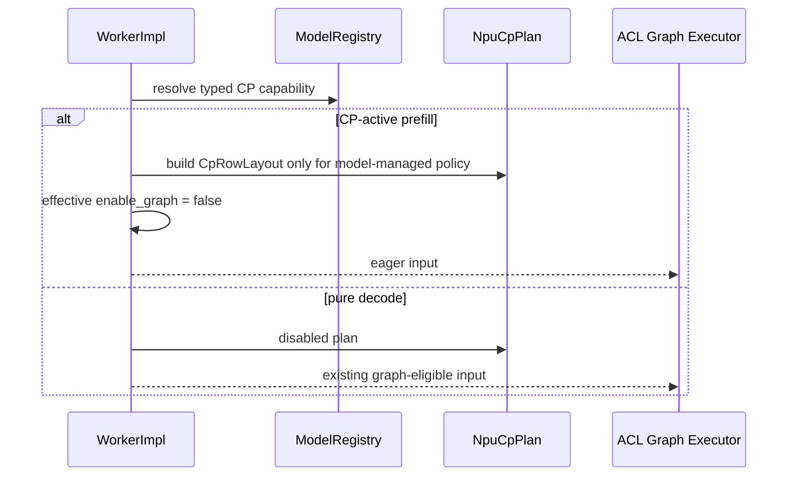
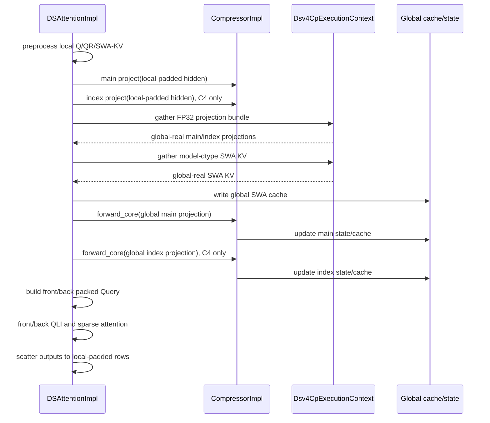

## 1. 文档状态

- 状态：Task 0-8 的实现、标准 NPU 构建和聚焦单测已完成；Task 9 的首版 8 卡正确性、
  SHM、有界稳定性和长输入性能门禁已完成。完整正交拓扑矩阵、msprof 分层数据和长时间
  soak 作为发布扩展验证继续执行。
- 上层方案：`deepseek_v4_npu_cp_pre_compressor_v2.md`。
- 代码基线：`upstream/main`，提交 `e69351b4`。
- 目标后端：NPU Torch，A3。
- 首版正式拓扑：`world=8, dp=1, cp=8, attention-tp=1, ep=8,
  kv-split=1`。
- 目标模型：`deepseek_v4`、`deepseek_v4_mtp`。

本文是实现约束，不重复讨论 Pre/Post-Compressor 选型。所有标记为“必须”的接口、shape、
phase gate 和测试均为首版门禁；示意代码允许根据现有代码风格调整参数传递方式，但不得改变
数据语义。

## 2. 实现目标

首版完成以下闭环：

1. global-real token 按 `2 * cp_size` zigzag 切成 local-padded rows。
2. Query、QLI、Sparse Attention 和 output projection 使用 CP-local real rows。
3. SWA KV、main compressor projection 和 indexer projection 在 cache/state 更新前恢复
   global-real 顺序。
4. Compressor split path 与现有 fused path 在 output、KV state、score state 和 cache
   scatter 上等价。
5. 不能直接消费 CP-local rows 的 MoE 路径通过 global-row bridge 保证正确性。
6. CP-active prefill 强制 eager；pure decode 保持现有 ACL Graph 和 fused compressor。
7. Target/draft 使用相同 immutable row layout value semantics，各自绑定自己的通信组和
   cache/state。
8. 现有 KV capacity estimator 与最大 bucket CP transient reserve 在启动时共同完成
   容量门禁。

## 3. 非目标和必须保持的不变量

首版不实现：

- compressor state 或 KV cache 的 CP 分片；
- Post-Compressor halo/state-owner；
- CP prefill ACL Graph capture/replay；
- 跨 layer 计算通信 overlap；
- `cp=2,tp=4` 等非首版拓扑的对外 capability。

这些非目标不阻塞首版正确性：replicated cache/state 由 HBM 门禁限定容量，CP prefill
显式 eager，decode 继续走 fused/Graph；post-compressor 和跨层 overlap 都会引入新的
owner、stream 或 buffer 生命周期，应在首版单层 pre-compressor 闭环之后独立设计。

首版必须保持：

- CP=1 完全不创建或调用 split compressor；
- decode 完全不调用 `project()` 或 `forward_core()`；
- decode cache layout、state update、fused compressor 和 Graph key 不变；
- CP prefill 不改写 global DSV4 block table/slot mapping；
- padding/dummy rows 不进入 compressor core、cache write、MoE router 或 sampling；
- 缺少 split operator、容量不足或拓扑不满足时 fail-fast，不静默切算法。

## 4. 当前代码和目标模块

### 4.1 当前代码

| 领域 | 当前文件 | 当前职责 |
| --- | --- | --- |
| Model CP | `xllm/core/framework/parallel_state/npu_cp_plan.*` | zigzag row、ATB metadata、output merge |
| Process group | `xllm/core/framework/parallel_state/collective_communicator.*` | world/TP/DP/EP/CP group 生命周期 |
| Capability | `xllm/models/model_registry.*` | `CpShardingMode` 注册和查询 |
| DSV4 model | `xllm/models/llm/deepseek_v4*.h` | metadata、layer loop、model boundary |
| DSV4 attention | `xllm/core/layers/npu_torch/deepseek_sparse_attention.*` | preprocess/cache/compressor/indexer/attention |
| Compressor wrapper | `xllm/core/layers/npu_torch/compressor.*` | 权重、fused op 调用 |
| MoE | `xllm/core/layers/npu_torch/fused_moe.*` | legacy reduction、EP2 dispatch/combine |
| Graph | `xllm/core/runtime/acl_graph_executor_impl.cpp` | eager/capture/replay phase dispatch |
| Operator | `third_party/xllm_ops/xllm_ops/attention/compressor` | fused Compressor host/kernel |

### 4.2 新增或修改后的模块

```text
xllm/models/model_registry.*
  NpuModelCpCapability / CpMetadataPolicy

xllm/core/framework/parallel_state/npu_cp_plan.*
  CpRowLayout
  NpuCpPlan compatibility wrapper

xllm/core/framework/parallel_state/collective_communicator.*
  orthogonal attention-TP and CP ProcessGroup creation

xllm/core/layers/npu_torch/deepseek_v4_cp_metadata.*
  Dsv4CpMetadataBuilder

xllm/core/layers/npu_torch/deepseek_v4_cp_execution.*
  Dsv4CpExecutionContext / per-forward bundle or sequential gather adapter

xllm/core/layers/npu_torch/compressor.*
  project / forward_core / existing forward

xllm/core/layers/npu_torch/deepseek_sparse_attention.*
  forward_cp orchestration and shared phase helpers

xllm/core/layers/npu_torch/fused_moe.*
  MoeRowCapability query only; no DSV4-specific branch

xllm/core/runtime/worker_impl.*
  capability resolution, CP policy preparation, memory gate

third_party/xllm_ops/xllm_ops/attention/compressor_projection
third_party/xllm_ops/xllm_ops/attention/compressor_core
  A3 split operators
```

`deepseek_v4_cp_metadata` 不依赖 `ProcessGroup`。`deepseek_v4_cp_execution` 不拥有模型权重、
cache 或 state。`CompressorImpl` 不理解 CP rank。该依赖方向用于防止 DSV4 语义扩散到通用
collective 和 planner。

## 5. 数据布局

### 5.1 Row layout 术语

| 名称 | dim 0 含义 |
| --- | --- |
| global-real | 当前 DP replica 内原始 packed token 顺序，无 padding |
| local-real | 当前 CP rank 实际拥有的 front/back token |
| local-padded | local-real 写入固定 rank-local layout 后的视图，包含 CP padding |
| rank-major-gathered | CP AllGather 原始结果，按 rank 拼接，仍包含 padding |

本文中的 `T` 是 global-real rows，`Tl` 是 local-real rows，`Tp` 是 local-padded rows。
每个 CP rank 的 `Tp` 相同；不同 rank 的 `Tl` 可以不同。

### 5.2 Projection ABI

```text
hidden:             [Tp, H]              BF16/FP16
wkv:                [coff * D, H]       BF16/FP16
wgate:              [coff * D, H]       BF16/FP16
local projection:   [Tp, 2*coff*D]      FP32 contiguous
global projection:  [T,  2*coff*D]      FP32 contiguous
logical view:       [T, coff, 2, D]      FP32
```

最后两维顺序固定为：

```text
coff=1: [branch0.kv, branch0.score]
coff=2: [branch0.kv, branch0.score, branch1.kv, branch1.score]
```

Projection 可以计算 padding rows，但 `gather_global_rows()` 必须在进入 Core 前删除 padding。
Core 的第一条运行时检查是 `projection.size(0) == global_real_token_count`。

### 5.3 Cache/state 布局

第一版沿用当前 `DeepSeekV4KVCacheImpl`：

```text
SWA KV:            [block_count, block_size, 1, head_dim] model dtype
C4 compressed KV: [block_count, block_size, 1, head_dim] model dtype
C4 index cache:   [block_count, block_size, 1, index_head_dim] int8
C4 index scale:   [block_count, block_size, 1] fp16
C4 KV state:      [swa_count, block_size, 2*head_dim] fp32
C4 score state:   [swa_count, block_size, 2*head_dim] fp32
C128 KV state:    [swa_count, block_size, head_dim] fp32
C128 score state: [swa_count, block_size, head_dim] fp32
```

每个 CP rank 保存相同逻辑 cache/state。所有 cache slot、block table、`start_pos` 和 global
q/kv length 均保持 global 语义。

## 6. 类和接口设计

### 6.1 Model capability

文件：`xllm/models/model_registry.h`

```cpp
enum class CpMetadataPolicy : int8_t {
  NONE = 0,
  ATB_ATTENTION = 1,
  MODEL_MANAGED_GLOBAL_CACHE = 2,
};

struct NpuModelCpCapability {
  CpShardingMode sharding_mode = CpShardingMode::NONE;
  CpMetadataPolicy metadata_policy = CpMetadataPolicy::NONE;
  std::string required_backend;
  bool supports_dp = false;
  bool supports_mtp_prefill = false;
  bool requires_kv_split_one = false;
  bool requires_split_compressor = false;
};
```

`ModelRegistry` 新增：

```cpp
static void register_npu_cp_capability(
    const std::string& name,
    const NpuModelCpCapability& capability);

static NpuModelCpCapability get_npu_cp_capability(
    const std::string& name);
```

兼容函数 `is_npu_model_cp_capable()` 保留，但内部只查询 typed capability。DSV4 注册值：

```text
sharding_mode             = NPU_MODEL
metadata_policy           = MODEL_MANAGED_GLOBAL_CACHE
required_backend          = TORCH
supports_dp               = true
supports_mtp_prefill      = true
requires_kv_split_one     = true
requires_split_compressor = true
```

ATB 模型继续注册 `ATB_ATTENTION`，行为不变。

### 6.2 `CpRowLayout`

文件：`xllm/core/framework/parallel_state/npu_cp_plan.h`

```cpp
class CpRowLayout final {
 public:
  static CpRowLayout build(const CpPlanInput& input,
                           int32_t cp_size,
                           int32_t cp_rank,
                           const torch::Device& device);

  torch::Tensor shard_rows(const torch::Tensor& global_rows,
                           const torch::Scalar& pad_value) const;

  torch::Tensor gather_global_rows(const torch::Tensor& local_padded_rows,
                                   ProcessGroup* cp_group) const;

  std::vector<torch::Tensor> gather_global_rows_bundle(
      at::TensorList local_padded_tensors,
      ProcessGroup* cp_group) const;

  int32_t cp_size() const;
  int32_t cp_rank() const;
  int64_t global_real_token_count() const;
  int64_t local_real_token_count() const;
  int64_t local_padded_token_count() const;
  const std::vector<int32_t>& local_real_seq_lens() const;
  const std::vector<int32_t>& local_padded_seq_lens() const;
  const torch::Tensor& local_position_ids() const;
  const torch::Tensor& input_source_indices() const;
  const torch::Tensor& input_destination_indices() const;
  const torch::Tensor& output_restore_indices() const;
  uint64_t signature() const;

 private:
  int32_t cp_size_ = 1;
  int32_t cp_rank_ = 0;
  uint64_t signature_ = 0;
  CpInputShardMeta input_shard_meta_;
  CpOutputMergeMeta output_merge_meta_;
};
```

约束：

- `shard_rows()` 只改变 dim 0，保留任意 trailing dimensions；
- 只允许输入 global-real row count；防止重复 shard；
- `gather_global_rows()` 只允许 local-padded row count；
- bundle 只允许二维、同 row count、dtype、device 的 contiguous tensors；
- bundle 沿最后一维 concat，一次 gather 后按 width split；
- signature 在 host build 阶段产生，不包含 device pointer 或 `ProcessGroup*`；
- `NpuCpPlan` 组合 `CpRowLayout`，现有 ATB API 作为 wrapper 保留。

### 6.3 `Dsv4CpMetadata`

文件：

```text
xllm/core/layers/npu_torch/deepseek_v4_cp_metadata.h
xllm/core/layers/npu_torch/deepseek_v4_cp_metadata.cpp
```

```cpp
struct Dsv4CpHalfMetadata {
  torch::Tensor pack_indices;
  torch::Tensor destination_indices;
  torch::Tensor q_seq_lens;
  torch::Tensor q_cu_seq_lens;
  torch::Tensor kv_seq_lens;
  torch::Tensor active_sequence_indices;
  torch::Tensor c1_sparse_metadata;
  torch::Tensor c4_sparse_metadata;
  torch::Tensor c128_sparse_metadata;
  torch::Tensor qli_metadata;
  int64_t real_row_count = 0;
};

struct Dsv4CpMetadata {
  Dsv4CpHalfMetadata front;
  Dsv4CpHalfMetadata back;
  int64_t local_real_row_count = 0;
  uint64_t layout_signature = 0;
};

class Dsv4CpMetadataBuilder final {
 public:
  static Dsv4CpMetadata build(const CpRowLayout& row_layout,
                              const DSAMetadata& global_metadata,
                              int64_t window_size,
                              int64_t compress_ratio);
};
```

Builder 只构造 local Query 元数据，不复制 cache tensor。front/back 分别按 sequence 构造
真实 rows，空 half 使用零长度 tensor，不使用 dummy token。每个 half 的 `kv_seq_lens`
是该 fragment 最后一个绝对 Query position 加一，保证 causal endpoint 正确。

### 6.4 `Dsv4CpExecutionContext`

文件：

```text
xllm/core/layers/npu_torch/deepseek_v4_cp_execution.h
xllm/core/layers/npu_torch/deepseek_v4_cp_execution.cpp
```

```cpp
enum class Dsv4CpProjectionBundleMode : int8_t {
  BUNDLED = 0,
  SEQUENTIAL = 1,
};

struct Dsv4CpMemoryBudget {
  int64_t persistent_cache_bytes = 0;
  int64_t local_projection_bytes = 0;
  int64_t global_projection_bytes = 0;
  int64_t swa_gather_bytes = 0;
  int64_t moe_bridge_bytes = 0;
  int64_t collective_workspace_bytes = 0;
  int64_t peak_transient_bytes = 0;
};

class Dsv4CpExecutionContext final {
 public:
  Dsv4CpExecutionContext(ProcessGroup* cp_group,
                         Dsv4CpProjectionBundleMode bundle_mode);

  torch::Tensor gather_global_rows(const CpRowLayout& layout,
                                   const torch::Tensor& local_rows);

  std::vector<torch::Tensor> gather_projection_bundle(
      const CpRowLayout& layout,
      at::TensorList local_projections);

  ProcessGroup* process_group() const;
  Dsv4CpProjectionBundleMode bundle_mode() const;

 private:
  ProcessGroup* cp_group_ = nullptr;
  Dsv4CpProjectionBundleMode bundle_mode_ =
      Dsv4CpProjectionBundleMode::BUNDLED;
};
```

该类仅绑定 non-owning group。首版不把 allocator 封装为通用 tensor pool；临时 tensor
依赖 allocator 和严格作用域，容量统计以真实 `numel * element_size` 为准。
`ProcessGroup` 没有调用方持有的 collective workspace，HCCL persistent buffer 在内存
快照前通过 warmup AllGather 初始化。若后续 profiling 证明 allocator 重复申请是瓶颈，
再在该类中加入 typed buffer owner。

### 6.5 Compressor wrapper

文件：`xllm/core/layers/npu_torch/compressor.*`

```cpp
class CompressorImpl : public torch::nn::Module {
 public:
  torch::Tensor project(const torch::Tensor& local_hidden_states) const;

  torch::Tensor forward_core(
      const DSAMetadata& global_metadata,
      const torch::Tensor& global_packed_projection,
      std::tuple<torch::Tensor, torch::Tensor>& states,
      std::tuple<torch::Tensor, torch::Tensor>& block_tables,
      const torch::Tensor& compressed_sin,
      const torch::Tensor& compressed_cos,
      const torch::Tensor& global_q_cu_seq_lens);

  torch::Tensor forward(/* existing fused arguments */);
};
```

所有权保持不变：`CompressorImpl` 继续拥有 wkv/wgate/norm/ape。`project()` 调用
`compressor_projection`，`forward_core()` 调用 `compressor_core`，`forward()` 调用现有
fused `compressor`。

`forward_core()` 必须检查：

- projection 为 FP32、contiguous、二维；
- feature width 等于 `2 * coff * head_dim`；
- row count 等于 global q token count；
- metadata、block table、state、RoPE 均为 global 语义；
- core 原地更新输入 state storage。

### 6.6 Operator 接口

#### CompressorProjection

```text
Inputs:
  x       [T,H] or [B,S,H] BF16/FP16
  wkv     [coff*D,H]       same dtype as x
  wgate   [coff*D,H]       same dtype as x
Attrs:
  coff    1 or 2
Output:
  packed  [T,2*coff*D]     FP32 contiguous
```

Projection 复用 fused A3 Cube MM1/Fixpipe 数学和 accumulator dtype，但输出改为稳定的
token-major packed tensor，不暴露 per-core double-buffer workspace。

实际模块位于：

```text
third_party/xllm_ops/xllm_ops/attention/compressor_projection/
  op_host/compressor_projection_def.cpp
  op_host/compressor_projection_tiling.cpp
  op_kernel/compressor_projection.cpp
```

kernel 仅启动 AIC，实例化 `CompressorBlockCubePerf<COMP, true>`。KV 和 score 分别使用
一次 `ndNum=1` Fixpipe 串行写入最终 tensor，`coff=2` 的物理顺序为
`[branch0.kv, branch0.score, branch1.kv, branch1.score]`。整个路径没有 AIV repack，也
没有 per-core projection workspace。

#### CompressorCore

```text
Inputs:
  packed_projection  [T,2*coff*D] FP32
  kv_state / score_state          FP32 Ref
  ape                             FP32
  block tables / cu_seqlens / start_pos
Attrs:
  output_row_count, cmp_ratio, coff
Output:
  pre_norm                        [Tc,D] FP32 contiguous
  kv_state / score_state          alias input Ref
```

Core 复用 fused A3 Vector 的 APE、overlap、state read/write、softmax 和 reduce，输出
FP32 `pre_norm`。Core 使用独立 AIV-only tiling，不等待 fused Cube flag，也不申请 fused
Compressor 的 per-core projection workspace。`CompressorImpl::forward_core()` 负责组合
FP32 RMSNorm、partial RoPE 和最终 model-dtype cast。这样 raw Core ABI 不依赖 norm/rope
输入，projection state recurrence 与模型 finalize 的职责边界明确。fused Compressor ABI
和源码路径保持不变。

### 6.7 MoE row capability

文件：`xllm/core/layers/npu_torch/fused_moe.*`

```cpp
enum class MoeRowCapability : int8_t {
  REQUIRES_IDENTICAL_GLOBAL_ROWS = 0,
  PRESERVES_LOCAL_ROW_ORDER = 1,
};

MoeRowCapability FusedMoEImpl::row_capability(
    const ModelInputParams& input_params) const;
```

只有 EP2 + fused MC2 且 `can_use_ep2_dispatch_combine()` 全部动态门禁通过时返回
`PRESERVES_LOCAL_ROW_ORDER`。其他路径返回 `REQUIRES_IDENTICAL_GLOBAL_ROWS`。

Decoder adapter 根据该值选择：

```text
local capability:
  local FFN -> local output

global capability:
  gather_global_rows(local FFN input)
    -> legacy FFN
    -> row_layout.shard_rows(global FFN output)
```

padding 在 gather 前已通过 row layout unpad；回到 local-padded 时重新填零。

## 7. 通信组设计

rank layout 固定为：

```text
global_rank = dp_rank * (cp_size * attn_tp_size)
            + cp_rank * attn_tp_size
            + tp_rank
```

因此：

```text
CP group  = same dp_rank, same tp_rank, all cp_rank
TP group  = same dp_rank, same cp_rank, all tp_rank
```

`compute_cp_group_ranks()` 继续作为 CP 纯函数。新增或修正 TP group rank 纯函数，
`CollectiveCommunicator` 分别创建 `tp_group_` 和 `cp_group_`，禁止 NPU Torch 把
`cp_group_` alias 到 DP-local TP group。

首版 `cp=8,tp=1` 时 TP group 是单 rank，CP group 是当前 DP replica 的 8 ranks。纯函数
单测仍覆盖 `cp=2,tp=4` 和 `dp=2,cp=2,tp=2`，但 capability 暂不对外接受这些拓扑。

## 8. Forward 控制流

### 8.1 Worker prepare



`MODEL_MANAGED_GLOBAL_CACHE` policy 不调用 `apply_attention_meta()` 和
`prepare_cache_slots()`。ATB policy 保持现有行为。

### 8.2 DSV4 model boundary

```text
embed global-real tokens
  -> row_layout.shard_rows(hidden, 0)
  -> row_layout.local_position_ids
  -> local layer loop
  -> row_layout.gather_global_rows(final hidden)
  -> hc_head / final norm / LM head boundary
```

若 HC 实现要求在 layer loop 前后处理 token 维，所有 shard/gather 都必须在 token 维进行，
不能把 `[T,hc_mult,H]` 展平为 `[T*hc_mult,H]` 后再使用 token row indices。

### 8.3 每层 CP attention



所有 CP ranks 的 collective 调用顺序固定为：

```text
1. projection bundle gather
2. SWA KV gather
3. optional MoE bridge gather
4. model boundary gather
```

某个 half 为空只能跳过 half kernel，不能跳过本层 collective。

### 8.4 Decode

```text
pure decode
  -> cp_plan disabled
  -> existing DSAttentionImpl::forward
  -> existing fused CompressorImpl::forward
  -> existing ACL Graph eligibility/capture/replay
```

Debug 构建在 decode 调用 `project()` 或 `forward_core()` 时直接失败。

### 8.5 MTP prefill

Target 和 draft 分别持有自己的 `NpuCpPlan`、`ProcessGroup*`、cache 和 state。共享值仅为
layout signature。Draft prepare 必须比较 target/draft signature；不一致时 fail-fast。

Target aux hidden 在 token 维 shard，predictor fusion 在 local-padded rows 上执行，最终
target/draft output 在各自 model boundary gather。MTP decode/validate 不启用 CP。

## 9. 显存预算和 buffer 生命周期

### 9.1 预算输入

`Dsv4CpMemoryBudget` 使用：

- target/draft `ModelArgs`；
- C1/C4/C128 layer count；
- head/index head dim 和 dtype；
- max tokens per batch、max sequences、block size、SWA window；
- CP size、bundle mode；
- MoE bridge mode；
- KV cache estimator 的现有 capacity 结果。

### 9.2 当前目标模型参考值

当前模型 43 层：C1=2、C4=21、C128=20。NPU cache 的 token-dependent 部分约为：

```text
C4:   21 * (512*2 + 128*1 + 1*2) / 4  = 6058.5 B/token
C128: 20 * (512*2) / 128               = 160 B/token
total                                           6218.5 B/token/rank
```

1M token 约 `5.8 GiB/rank`，加当前 max-seqs/burst 对应的 fixed SWA/state pool 约
`2.2 GiB/rank`。该值是容量门禁输入，不是性能承诺。

### 9.3 Transient 峰值

C4 bundled projection：

```text
global main  = T * 2*2*512 * 4
global index = T * 2*2*128 * 4
global SWA   = T * 512 * model_dtype_size
```

32K token 时分别约 256 MiB、64 MiB、32 MiB。预算还需加入 local projection、
AllGather 输入/输出与 concat 临时 tensor。当前 `ProcessGroup` 没有调用方 workspace，
其 HCCL persistent buffer 已在 free-memory 快照前 warmup。若 bundled 峰值超过剩余 HBM，
改用 sequential main/index gather，通过多一次 collective 换取更低峰值；禁止把 projection
降为 BF16。

### 9.4 生命周期

- local projection 生命周期止于对应 gather 完成；
- global main projection 生命周期止于 main core 返回；
- global index projection 生命周期止于 index core 返回；
- global SWA KV 生命周期止于 cache scatter 完成；
- MoE bridge global input/output 生命周期止于 local-padded output 恢复；
- tensor 不保存到 layer/module member，防止跨 layer 持有；
- 日志记录 logical bytes 和 allocator 实测 peak，二者分开。

## 10. 错误处理和可观测性

### 10.1 启动失败

以下情况返回明确错误：

- backend 不是 NPU Torch；
- 首版拓扑不满足 `world=8,dp=1,cp=8,tp=1,ep=8`；
- `kv_split_size_effective != 1`；
- model/draft 未注册 typed capability；
- CP target/draft 拓扑不一致，例如 CP 开启时同时使用
  `enable_mtp_draft_body_tp1=true`；
- 缺少 projection/core operator；
- persistent + transient 预算超过可用 HBM；
- 没有可用的 MoE local path，也未配置 correctness bridge。

### 10.2 运行时检查

- source/destination/restore indices 无重复且覆盖全部 real rows；
- `Tp` 在 CP group 内一致；
- core input rows 等于 global-real rows；
- front/back destination 不相交，union 等于 local-real rows；
- cache slots 数量与 global output 数量一致；
- target/draft signature 一致；
- CP-active input 的 effective graph flag 为 false；
- decode path 未调用 split operator。

### 10.3 日志和指标

一次性日志：

```text
dsv4_cp_path enabled=true cp=8 tp=1 ep=8 bundle=...
dsv4_cp_memory persistent=... transient=... available=...
dsv4_cp_moe_bridge mode=local_dispatch|global_rows
dsv4_cp_graph_phase prefill=eager decode=graph_eligible
```

计数/字节：

```text
dsv4_cp_projection_calls
dsv4_cp_core_calls
dsv4_cp_collective_calls
dsv4_cp_main_projection_bytes
dsv4_cp_index_projection_bytes
dsv4_cp_swa_bytes
dsv4_cp_moe_bridge_bytes
dsv4_cp_padding_rows
dsv4_cp_front_half_calls
dsv4_cp_back_half_calls
dsv4_cp_prefill_eager_fallbacks
```

## 11. 测试设计

### 11.1 Operator

- Projection FP32 dtype、contiguous 和 packed order；
- C4 main、C4 index、C128 main golden GEMM；
- Core full/chunked prefill；
- 3/4/5 和 127/128/129 边界；
- fused-vs-split output、KV state、score state、cache scatter；
- CP=1 split 差分仅用于测试，生产 CP=1 仍走 fused。

### 11.2 Row layout

- CP=2/4/8；
- 单/多 sequence、uneven、empty half；
- 1-D/2-D/3-D；
- shard/gather round trip；
- bundle 和独立 gather 一致；
- signature 稳定且 rank/layout 变化时不同。

### 11.3 Metadata/attention

- front/back pack/scatter 覆盖且不重叠；
- causal endpoint 使用绝对 position；
- C1/C4/C128；
- full/chunked/prefix continuation；
- SWA/compressed/index cache checksum 与 CP=1 一致；
- QLI top-k 和 sparse attention output 对比。

### 11.4 MoE/MTP/Graph

- `expert_parallel_degree={1,2}` x `enable_fused_mc2={0,1}`；
- local dispatch 动态门禁失败时使用 global bridge；
- unequal local real rows 和 empty half；
- target/draft layout signature、aux hidden、首 token、接受率；
- CP prefill eager，随后 pure decode graph replay；
- decode split-op call count 恒为 0。

### 11.5 显存和端到端

- 1K/8K/32K，batch 1/multi-sequence；
- bundle/sequential peak HBM；
- 连续多层和多请求 allocator peak 不增长；
- 容量不足启动失败；
- 输出 token、TTFT、input throughput、decode TPOT 和 MTP 接受率。

## 12. 实施顺序和状态

严格按以下顺序实施，前一阶段测试未通过时不进入后一阶段：

- [x] P0.1：Projection/Core operator 和 fused-vs-split 状态级等价。
  验证：A3 构建通过；`pytest -q test_compressor_projection.py
  test_compressor_core.py` 共 18 项通过。覆盖 FP16/BF16、`coff=1/2`、C4/C128、2D/3D
  projection、FP32 golden、packed 顺序、full/chunk continuation、HALF/INTERLEAVE RoPE、
  multi-sequence split，以及 output/KV state/score state 差分。raw Core 输出连续 FP32
  `pre_norm`，RMSNorm/RoPE 由测试/runtime finalize 组合。
- [x] P0.2：`CpRowLayout` 抽取、round-trip 和 bundle 测试。
  验证：`NpuCpPlanTest` 23 项及任意 trailing dimensions、value-semantic
  signature、空 DP placeholder 用例通过。
- [x] P0.3：Typed capability、独立 TP/CP group、首版拓扑门禁。
  验证：`ComputeCpGroupRanks` 5 项和 `NpuCpCapabilityTest` 3 项通过；主库
  `python setup.py build --device npu` 通过。
- [x] P0.4：Graph phase gate、decode fused path 和 operator fail-fast。
  验证：CP-active prefill 在 worker/model 两层显式禁用 effective graph；pure decode 保留
  现有 graph/fused compressor 路径；split operator capability 在 DSV4 CP 启动阶段检查。
  CP 下 `enable_mtp_draft_body_tp1=true` 因 target/draft CP 拓扑不一致而在 master 启动
  校验阶段被拒绝。
- [x] P0.5：显存预算、bundle/sequential 选择和临时 tensor 生命周期。
  验证：`Dsv4CpMemoryBudgetEstimatorTest` 8 项和 `Dsv4CpExecutionContextTest` 2 项通过；
  worker 在 KV capacity 估算前 warmup CP communicator、预留 CP transient，并将剩余容量
  交给 KV estimator。`Dsv4CpExecutionContext` 不持有跨层 tensor。
- [x] P1.1：DSV4 front/back metadata 和 C1 attention。
  验证：`Dsv4CpMetadataBuilderTest` 5 项通过，C1 local Query/global SWA 路径完成编译；
  模型级结果对比归入 P1.6。
- [x] P1.2：C128 main compressor。
  验证：local projection/global gather/split core/cache write 路径完成编译；C128 split
  operator 已包含在 18 项算子单测中，模型级结果对比归入 P1.6。
- [x] P1.3：C4 main/indexer、QLI 和 sparse attention。
  验证：main/index bundle/sequential gather、index cache update 和 local QLI 已接入；
  `DeepseekV4IndexerTest` 4 项通过，模型级结果对比归入 P1.6。
- [x] P1.4：HC/Decoder/MoE bridge。
  验证：HC row pack/scatter、typed MoE capability、global-row bridge 和空 rank collective
  路径完成编译；row/EP metadata 单测通过，四种 MoE 组合的模型验证归入 P1.6。
- [x] P1.5：Target boundary、MTP prefill。
  验证：target/draft value-semantic layout、global output merge、token 共识和 bootstrap 已
  接入；`MtpPrepareNextDraftTest` 2 项、`MtpAsyncStateTest` 5 项、
  `SequenceMtpBootstrapTest` 1 项、`MtpTokenConsensusTest` 4 项及 `NpuCpPlanTest` 中
  MTP/layout 用例通过。
- [x] P1.6：首版 8 卡端到端、性能和有界稳定性验证。
  8 卡正确性门禁：
  - CP=1 baseline 与 CP=8 eager 的 1K 输入结果一致；CP=8 的 8K 和 4 并发请求通过；
  - graph 开启时 CP prefill 成功，随后 8 个 rank 的 pure decode 均完成 8/4/2/1 token
    ACL Graph bucket capture；
  - 4K chunked prefill、1K prefix reuse 和 20K chunked+prefix 通过，20K 第二次请求命中
    16384 个 cached tokens；
  - MTP=3 的单请求和 2 并发通过；
  - `expert_parallel_degree=1, enable_fused_mc2={0,1}` 以及
    `expert_parallel_degree=2, enable_fused_mc2={0,1}` 四种组合均通过；EP2 fused MC2 的
    512-token 单请求输出、结束原因和 token usage 与 MC2=0 完全一致；
  - `enable_shm=true`、EP2 fused MC2 下双并发通过；随后 25 轮、每轮 4 并发共 100 条
    请求全部成功，8 个 rank 全程存活，轮耗时中位数为 1.338 秒、最大值为 1.543 秒。
  已在验证中修复 SWA 双 chunk 峰值容量、压缩输出尾部 padding slot、bundle split
  contiguous、SHM 反序列化残留 block table 和 MTP 跨 CP token 共识问题。EP2 fused MC2
  进一步修复了 Python forkserver 的 `LD_PRELOAD` 信号继承问题和
  `DispatchFFNCombine` 缺失 `xActiveMask` 导致的 ABI 参数错位。

  长输入性能使用后 8 卡、`max_memory_utilization=0.95`、20 GiB KV cap、chunked prefill、
  `expert_parallel_degree=2` 和 `enable_fused_mc2=0`，CP1/CP8 各执行 5 轮。约 7.5K token
  输入的中位端到端耗时为 1.098/0.959 秒，CP8 降低 12.7%；约 29.8K token 输入为
  3.195/2.486 秒，CP8 降低 22.2%；所有输出均一致。MC2=0 用于规避现有 fused MC2 对
  CP1 全局长 rows 的独立 tiling 限制，确保该组只比较 CP 差异。

  完整 `DP x CP x TP` 正交矩阵、msprof 层级拆分和更长时间 soak 不属于当前首版 capability
  的合入门禁，保留为发布扩展验证；首版 capability 仍只接受本文定义的固定拓扑。

实现过程中每完成一项，就在本文更新状态，并在同一项下记录测试命令和结果摘要。

## 13. Rollout 和回滚

1. 先合入 split operator，但不注册 DSV4 capability。
2. 合入 row layout、typed capability、group 和 phase gate。
3. 按 C1、C128、C4 启用 layer path。
4. 完成 MoE/MTP 后注册首版拓扑 capability。
5. 默认 bundle；容量预算不满足时选择 sequential。

回滚只取消 DSV4 typed capability。CP=1、decode 和原 fused Compressor 始终不依赖 split
path，因此无需迁移 cache 格式或 checkpoint。

## 14. 后续设计触发条件

以下需求触发独立设计，不在本实现中顺手扩展：

- 1M context/目标并发无法通过 HBM 门禁：设计 compressed KV 分片和 distributed sparse
  attention；
- C4 FP32 projection collective 抵消本地 GEMM 收益：评估 Post-Compressor state-owner；
- eager prefill host/kernel gap 成为主要瓶颈：设计固定容量 CP Prefill Graph；
- 单层 collective 已优化但仍占主要时间：设计跨层双缓冲 overlap；
- `cp x tp` 拓扑有明确产品需求：扩展 capability 和完整权重/cache/collective 测试矩阵。
