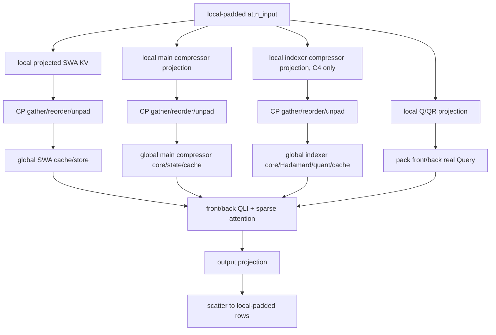

## 1. 摘要

本文给出 DeepSeek-V4（DSV4）NPU Torch 后端 Prefill Context Parallelism
的重新实现方案。方案采用 **projection-first pre-compressor**：模型 hidden 按 CP
切分后，各 rank 先完成本地无状态 projection，只在 stateful compressor core 之前恢复
全局 packed projection。每个 CP rank 维护完整逻辑 cache 和 compressor state，Query、QLI 和
sparse attention 仅处理本 rank 的 token。

本方案不新增第二套 token owner 规划器。现有 `NpuCpPlan` 继续提供 `2 * cp_size`
zigzag row layout，但需要把通用 row layout 与 ATB 专用 attention/KV-split metadata
解耦。DSV4 只消费通用 row layout，并使用模型专用 typed metadata 表达 front/back
Query、causal KV endpoint 和 sparse/QLI metadata。

本方案的核心决策如下：

1. 不 AllGather normalized hidden。
2. main compressor 和 indexer compressor 都拆成无状态 projection 与 stateful core。
3. projected SWA KV、main projection 和 indexer projection 在进入 cache/stateful core
   前恢复为 global-real 顺序。
4. Cache 不按 CP 切分，强制 `kv_split_size_effective == 1`。
5. Compressor padding row 永远不能进入 stateful core 或 cache write。
6. MoE 是否能直接消费 CP-local token 由明确 capability 决定，不能只靠 token count
   metadata 推断。
7. CP 只参与 prefill 类 forward；decode 可继续使用 ACL Graph，CP prefill 本身走 eager。

## 2. 设计状态和代码基线

- 文档状态：V2 设计已冻结；Task 0-8 的代码、标准 NPU 构建和聚焦单测已完成，
  Task 9 的 8 卡端到端、性能和稳定性验证待设备空闲后执行。
- 代码基线：`upstream/main`，提交 `e69351b4`。
- 目标后端：NPU Torch。
- 目标模型：`deepseek_v4`、`deepseek_v4_mtp`。
- 参考实现：SGLang DSV4 projection-first prefill CP，仅用于确认 projection/core
  的数学边界，不作为 xLLM 模块边界的直接实现。
- 算子源码基线：`ops-transformer` 的 `9.0.0` 分支不含 Compressor；A3 融合实现位于
  `origin/9.1.0-beta.2:experimental/attention/compressor` 的 arch22 路径。xLLM 当前
  `xllm-ops` 已在 `xllm_ops/attention/compressor` 携带一份 A3 融合实现，但只暴露完整
  Compressor，没有 projection 后可插入 collective 的 core API。
- 算子拆分归属：新增 A3-only `CompressorProjection` 和 `CompressorCore` 到
  `xllm-ops` 的 `attention/compressor_projection` 和 `attention/compressor_core` 目录，
  复用 `attention/compressor` 的 fused kernel 组件并保留现有 fused Compressor；xLLM runtime
  只通过 wrapper 调用，不复制 AscendC 算法。源码继续保留原 CANN license header 和
  notices。

本文所说的“global”均指当前 DP replica 内、CP 切分前的 token 视图，不表示跨 DP
replica 汇总。

## 3. 目标

1. DSV4 target full prefill 在 CP=2/4/8 下保持正确。
2. 支持多序列 batch、非均匀长度和某个 half 为空的场景。
3. 支持 chunked prefill 和 prefix cache continuation。
4. 支持 DSV4 MTP prefill，并保证 target/draft 使用同一 row ownership。
5. 支持正交 `DP x CP x attention-TP` 拓扑。
6. 保持 decode、非 CP、现有 fused compressor 路径不变。
7. 通过 zigzag 切分改善 causal attention 负载均衡。
8. 将 CP 编排限制在 row layout、DSV4 adapter 和 compressor 接口内，不把模型细节
   扩散到 scheduler、cache manager 或通用 collective。

## 4. 非目标

1. 第一版不做 compressor state 或 KV cache 的 CP 分片。
2. 第一版不实现 post-compressor halo/state-owner 方案。
3. 第一版不在 CP prefill 内执行 ACL Graph capture/replay。
4. 第一版不做跨 layer 的计算通信 overlap。

上述四项经过首版闭环重新评估后均不升级为实现前置项：

| 项目 | 首版结论 | 原因 |
| --- | --- | --- |
| compressor state/KV cache CP 分片 | 后续容量特性 | replicated state/cache 不影响 CP8 正确性；通过启动 HBM 门禁控制可运行范围 |
| post-compressor halo/state-owner | 后续替代算法 | 会改变 state owner、halo 通信和 decode cache 语义，不能与 pre-compressor 首版混合实现 |
| CP prefill ACL Graph | 后续性能优化 | collective、动态 real-row shape 和临时 tensor 地址尚未纳入稳定 graph key；首版 eager 可保证正确性 |
| 跨 layer overlap | 后续性能优化 | 需要双缓冲、stream/event 生命周期和额外峰值预算，不应阻塞单层正确性闭环 |

以上范围不表示忽略相关运行时问题。第一版必须同时满足以下 P0 约束：

1. CP-active prefill 显式走 eager，pure decode 继续使用现有 ACL Graph；不能依赖模型内部
   偶然绕过 graph。
2. DSV4 decode 的 cache layout、state 更新和 fused compressor 保持不变，并由显式 phase
   dispatch 隔离 split prefill 路径。
3. 启动时验证 `compressor_projection` 和 `compressor_core` capability；缺少任一算子时
   fail-fast，不允许静默切换为 gather global hidden 或 post-compressor。
4. 启动时在现有 KV capacity estimator 之前预留最大 prefill bucket 的 CP 临时显存；
   HCCL persistent buffer 必须在 free-memory 快照前完成初始化，AllGather 输出、concat、
   projection 和 MoE bridge tensor 必须计入峰值并限制在单次 forward 作用域内。
   `ProcessGroup` 不提供调用方持有的 collective workspace。

Cache 分片是条件升级项：第一版默认以降低 prefill 延迟/提升吞吐为目标，不承诺通过 CP
扩大单卡 cache capacity。若发布目标要求在当前 A3 HBM 预算内支持 1M context 和目标并发，
而完整 cache replica 无法通过容量门禁，则 KV cache 分片必须升级为独立 P0 设计，不能以
临时关闭门禁代替。

### 4.1 首版接受的性能非最优点（后续优化）

与 PR #2097「layer 末对完整 hidden 做 all-gather」相比，本方案把 gather 前移到
compressor projection 之后、core 之前（§7.2）。这一取舍换来 projection 局部计算与更小的
gather 宽度，但引入两项已知的性能非最优点。二者均不影响首版正确性，作为后续优化项记录，
不升级为实现前置项：

| 项目 | 首版结论 | 后续优化方向 |
| --- | --- | --- |
| `compressor_core` replicated 重算 | 每个 CP rank 对 global-real 全序列冗余重算 core，compute 不随 CP 摊薄（见 §17 `T_replicated_compressor_core`） | 与非目标第 1 项（compressor state/KV cache CP 分片）一并推进：state 分片后 core 可按 CP 局部计算，消除 N 重冗余 |
| projection gather 通信量 | gather 对象为 FP32 packed projection；C4 因 `coff=2` 宽度翻倍，且每层可能多次 collective，带宽非最优 | 评估 gather wire 降精度（BF16 传输、core 侧按 §6.2 要求升回 FP32）与合并 collective（§8.5 bundle）次数；须与 FP32 精度约束一并权衡 |

需要说明的是：projection 局部计算已消除 #2097 中 projection 的 N 重冗余，`compressor_core`
与 attention 的相对开销两方案一致，因此上述两项是本方案在 compressor 路径上**剩余**的优化空间，
而非相对 #2097 的净劣化。

## 5. 当前实现

### 5.1 CP row layout

当前 `NpuCpPlan` 位于：

```text
xllm/core/framework/parallel_state/npu_cp_plan.h
xllm/core/framework/parallel_state/npu_cp_plan.cpp
```

它已经提供：

- 每条 sequence 的 `2 * cp_size` zigzag 分块；
- global-real 到 local-padded 的 source/destination indices；
- CP rank 间相同的 local-padded row count；
- rank-major gather 后恢复 global-real 顺序的 indices；
- model output gather/reorder/unpad；
- ATB attention、KV-split 和 CP/EP bridge metadata。

当前问题是 row layout 与 ATB 专用 metadata 在同一个 `NpuCpPlan::build()` 中一起构建，
而 DSV4 需要 global cache metadata，不能直接调用现有 `apply_attention_meta()` 和
`prepare_cache_slots()`。

### 5.2 DSV4 attention

当前 DSV4 NPU Torch attention 位于：

```text
xllm/core/layers/npu_torch/deepseek_sparse_attention.cpp
xllm/core/layers/npu_torch/deepseek_v4_indexer.cpp
```

当前 `DSAttentionImpl::forward()` 串行完成：

```text
Q/QR/KV preprocess
  -> SWA KV prepare/store
  -> main compressor
  -> indexer compressor/cache update
  -> QLI
  -> sparse attention
  -> output projection
```

该函数目前只有一套 sequence metadata，无法表达 zigzag rank 上彼此不连续的 front/back
Query fragment。

### 5.3 Compressor

当前 `CompressorImpl::forward()` 将以下输入直接传给 `aclnnCompressor`：

```text
hidden + wkv + wgate
  + kv_state + score_state
  + APE/Norm/RoPE/metadata
```

现有算子同时完成 projection、aggregation、state update、norm 和 compressed RoPE。
因此当前接口无法实现：

```text
local projection
  -> CP AllGather
  -> global stateful core
```

### 5.4 Model 和运行时门禁

当前 main 中：

- DSV4 是 NPU Torch-only model；
- NPU CP 启动校验仍主要面向 ATB model-side CP；
- NPU Torch 的 TP group 尚未按 `world / (dp * cp)` 缩小；
- `deepseek_v4` 尚未注册为 NPU model-side CP capable；
- Worker 在 model forward 前调用 `NpuCpPlan::prepare()`；
- `NpuCpPlan::prepare()` 会改写普通 attention metadata 和 cache slots。

这些门禁必须通过 typed capability 处理，不能在通用 planner 中写
`model_type == "deepseek_v4"` 分支。

## 6. 现有 Pre-Compressor 草案评审

### 6.1 保留的设计

以下判断是正确的，应继续保留：

1. Projection 是逐 token、无状态操作，可以在 local-padded rows 上执行。
2. Compressor recurrence 必须看到 global-real 原序输入。
3. 每个 CP rank 可以对相同的 global packed projection 独立执行 core，并维护完整逻辑
   state。
4. SWA KV 必须在 cache write 前恢复全局顺序。
5. Query 和 sparse attention 应保持本地，输出 scatter 回 local-padded layout。
6. DSV4 不应重新实现第二套 token owner/reorder planner。
7. Global cache metadata 与 local query metadata 必须分离。

### 6.2 必须修正的问题

#### P0：Projection/Core 算子契约尚未被证明

拆分接口不能只按数学公式定义，还必须证明与现有 fused operator 的以下状态完全等价：

- `compressed_kv`；
- `kv_state` 原地更新；
- `score_state` 原地更新；
- C4 overlap；
- C128 recurrence；
- full/chunked prefill；
- main/indexer 两套权重和 state。

在该等价测试通过前，不能开始多卡 CP 正确性验证。

#### 已确认：Projection 输出为 FP32

A3 融合算子已给出直接证据：

- `ops-transformer` arch22 的 `CompressorBlockCubePerf` 定义
  `using MM1_OUT_T = float`，并把 `x @ wkv`、`x @ wgate` 的 L0C 累加结果通过
  `Fixpipe` 写入两个 FP32 GM workspace；
- 当前 `xllm-ops` A3 Compressor 同样定义 `MM1_OUT_T = float`，其 workspace tiling
  使用 4-byte element，并已按每个 branch 的 `[kv, score]` 顺序打包 MM1 结果；
- `CompressorBlockVectorPerf` 以 FP32 读取 projection，完成 APE、overlap、state 更新和
  softmax/reduce；split Core 输出 FP32 pre-norm，norm 和 RoPE 由 runtime finalize。

因此 split operator 的稳定 tensor ABI 定为 FP32。这里的 tensor ABI 与
`_GLIBCXX_USE_CXX11_ABI` 无关；当前 xLLM `setup.py` 根据 Torch 配置传入
`-D_GLIBCXX_USE_CXX11_ABI=1`，现有 CMake configure log 和容器内 Torch 2.9 均确认值为
1。CANN op-host/device 目标继续使用各自构建系统规定的 C++ ABI，不改变 projection
tensor dtype。

由于 projection 为 FP32，不能仅根据 feature width 判断 projection-first 的通信量更小。

以一个示例配置为例：

```text
hidden_size       = 4096
main head_dim     = 512
index head_dim    = 128
hidden/SWA dtype  = BF16
projection dtype  = FP32
```

每 token collective payload 为：

| Layer | Hidden BF16 | Projection-first payload | 结果 |
| --- | ---: | ---: | --- |
| C1 | 8192 B | SWA KV 1024 B | 明显更小 |
| C4 | 8192 B | SWA 1024 B + main projection 8192 B + index projection 2048 B = 11264 B | 字节数更大 |
| C128 | 8192 B | SWA 1024 B + main projection 4096 B = 5120 B | 更小 |

Projection-first 仍可通过消除重复 GEMM 获得收益，但 C4 必须单独 profiling，不能预设
收益。禁止仅为了减少通信将 projection 强制转换为 BF16，除非后续独立数值方案明确证明
compressed output、state、cache 和端到端结果均等价；该降精度不属于第一版。

Correctness MoE bridge 是独立于 ratio 的额外预算：

| 路径 | 每 token 逻辑 CP payload | 发生频率 |
| --- | ---: | --- |
| MoE bridge gather | hidden BF16 8192 B | 每个使用正确性 bridge 的 MoE 层一次 |

该预算使用当前 `hc_pre()` 契约：decoder state 为 `[T, hc_mult, H]`，但 FFN 前的
`ffn_input` 已收缩为 `[T, H]`，所以 payload 不乘 `hc_mult`。实现中的字节指标必须根据
实际 `ffn_input.numel() * element_size()` 计算，不能硬编码 8192 B。

该行只统计 Pre-Compressor 新增的 CP-group gather。`shard_rows()` 是本地索引，不产生
第二次 collective；AllGather 的实际链路收发量应按 CP size 和通信实现另行计算。Baseline
已有的 DP/EP dispatch、combine 或 reduction 通信必须分项记录，不能归入新增 CP payload。

#### P0：现有 MoE 并不天然支持不同 CP token rows

部分 `FusedMoE` 路径最终在 `moe_ep_group_` 上执行 reduction。若同一 group 内不同
CP rank 持有不同 token，逐元素 reduction 会把不同行错误相加。新增
`dp_cp_padded_token_nums` 只能解决变长 gather/slice，不能解决 EP reduction 的 token
对齐问题。

因此必须显式区分：

- 能消费 CP-local token 并返回同一 local row order 的 dispatch/combine 路径；
- 要求 group 内 token rows 完全一致的 reduction 路径。

#### P0：通用 row layout 与 ATB metadata 必须解耦

DSV4 需要 global cache slot/block table，而现有 ATB CP 会改写 attention metadata 和
cache slots。仅增加 DSV4 条件分支会进一步加深耦合。应在 `NpuCpPlan` 内部拆出通用
`CpRowLayout`，由不同 execution policy 选择后续 metadata 构建。

#### P1：Graph 门禁应按 forward phase 判断

CP 只运行 prefill，而 DSV4 ACL Graph 主要服务 decode。启动时不应因为
`enable_graph=true` 拒绝整个服务。正确策略是：

- CP prefill eager；
- pure decode 可 graph；
- spec-verify chunked-prefill 显式 eager；
- CP collective 不进入 graph capture。

#### P1：MTP 不能共享带 raw ProcessGroup 指针的 plan

Target/draft 可以共享 immutable row layout tensors 和 layout signature，但不能在 worker
之间传递包含 non-owning `ProcessGroup*` 的完整 plan。每个 leaf 使用自己的 CP group
重新绑定 collective executor。

#### P1：空 DP replica 与 padding 必须分开

用于保持 collective shape 的 CP padding 可以进入无状态 projection，但不能进入
compressor core、cache write、router 或采样。用于 empty DP rank 的 dummy row 也不能
伪装成真实 DSV4 token 更新 state/cache。

## 7. V2 总体设计

### 7.1 数据布局

设 CP size 为 `P`。每条 sequence 被切为 `2P` 个等长物理 chunk：

```text
global: [B0, B1, ..., B(P-1), BP, ..., B(2P-1)]
rank r: [Br, B(2P-1-r)] + local padding
```

运行时存在三种 row view：

| View | dim 0 | 顺序 | 用途 |
| --- | ---: | --- | --- |
| local-padded | `Tp` | 每条 sequence 的 front/back + padding | layer、projection、collective input |
| local-real-half | 当前 half 真实行 | active sequence 顺序 | QLI、sparse attention |
| global-real | `T` | CP 切分前 batch 原序 | cache write、compressor core、model output |

### 7.2 每层执行流



所有 CP rank 必须先完成该层需要的 collective，之后才允许某个 rank 跳过空 half。

## 8. 模块边界

### 8.1 Typed CP capability

将当前单一 `CpShardingMode` 扩展成可表达 backend 和 metadata policy 的 capability。
示意接口：

```cpp
enum class CpMetadataPolicy : int8_t {
  NONE = 0,
  ATB_ATTENTION = 1,
  MODEL_MANAGED_GLOBAL_CACHE = 2,
};

struct NpuModelCpCapability {
  CpMetadataPolicy metadata_policy = CpMetadataPolicy::NONE;
  std::string required_backend;
  bool supports_dp = false;
  bool supports_mtp_prefill = false;
  bool requires_full_kv_replica = false;
};
```

DSV4 target/MTP 注册为：

```text
required_backend          = TORCH
metadata_policy           = MODEL_MANAGED_GLOBAL_CACHE
supports_dp               = true
supports_mtp_prefill      = true
requires_full_kv_replica  = true
```

Master 根据 capability 校验 backend、DP、MTP 和 KV split。Worker 根据
`metadata_policy` 决定 `NpuCpPlan::prepare()` 是否改写普通 attention metadata。

### 8.2 `NpuCpPlan` 内部拆分

不创建新的 DSV4 planner。将现有 plan 内部整理为：

```text
NpuCpPlan
  ├── CpRowLayout               通用 zigzag row ownership
  ├── CpAttentionMeta           ATB attention 专用
  ├── CpEpMeta                  ATB/EP bridge 专用
  └── CpOutputMergeMeta         可由 CpRowLayout 派生
```

新增通用 row API：

```cpp
class CpRowLayout final {
 public:
  torch::Tensor shard_rows(const torch::Tensor& global_rows,
                           const torch::Scalar& pad_value) const;

  torch::Tensor gather_global_rows(
      const torch::Tensor& local_padded_rows,
      ProcessGroup* cp_group) const;

  int64_t global_real_token_count() const;
  int64_t local_padded_token_count() const;
  uint64_t signature() const;
};
```

要求：

- `shard_rows()` 支持 1-D tokens 和任意 trailing dimensions；
- `gather_global_rows()` 在 dim 0 AllGather 后恢复原序并 unpad；
- `signature()` 在 plan 构建时由 canonical host row descriptor 计算，只包含 value
  semantics，不包含 tensor 地址或 process-group 指针，也不在 forward 中触发 D2H；
- API 不理解 compressor、ratio、prefix cache 或 DSA；
- 现有 `shard_model_input()`、`merge_model_output()` 保留为兼容 wrapper；
- `MODEL_MANAGED_GLOBAL_CACHE` 下不执行普通 attention metadata 改写和 KV slot shard。

### 8.3 DSV4 typed CP metadata

新增：

```text
xllm/core/layers/npu_torch/deepseek_v4_cp_metadata.h
xllm/core/layers/npu_torch/deepseek_v4_cp_metadata.cpp
```

建议结构：

```cpp
struct Dsv4CpHalfMetadata {
  torch::Tensor pack_indices;
  torch::Tensor destination_indices;
  torch::Tensor q_seq_lens;
  torch::Tensor q_cu_seq_lens;
  torch::Tensor kv_endpoints;
  torch::Tensor active_sequence_indices;
  torch::Tensor qli_metadata;
  torch::Tensor c1_sparse_metadata;
  torch::Tensor c4_sparse_metadata;
  torch::Tensor c128_sparse_metadata;
  bool empty = false;
};

struct Dsv4CpMetadata {
  Dsv4CpHalfMetadata front;
  Dsv4CpHalfMetadata back;
};
```

它只表达 local Query 执行，不拥有：

- process group；
- compressor state；
- cache tensor；
- global block table/slot mapping；
- collective 方法。

Global `DSAMetadata` 保持以下内容不变：

- global q/kv lengths；
- `start_pos`；
- compressed positions 和 RoPE；
- multi-cache block tables/slot mappings；
- compressor/indexer state metadata。

### 8.4 Compressor API

`CompressorImpl` 继续拥有权重和 stateful 算子调用，不把 `wkv/wgate` 暴露给
`DSAttentionImpl`。

建议接口：

```cpp
class CompressorImpl final : public torch::nn::Module {
 public:
  torch::Tensor project(const torch::Tensor& local_hidden) const;

  torch::Tensor forward_core(
      const DSAMetadata& global_metadata,
      const torch::Tensor& global_projection,
      std::tuple<torch::Tensor, torch::Tensor>& states,
      std::tuple<torch::Tensor, torch::Tensor>& block_tables,
      const torch::Tensor& compressed_sin,
      const torch::Tensor& compressed_cos,
      const torch::Tensor& global_q_cu_seq_lens);

  torch::Tensor forward(/* existing fused API */);
};
```

底层在 `xllm-ops/xllm_ops/attention/compressor` 新增两个 A3 kernel API：

```text
compressor_projection(x, wkv, wgate, coff) -> packed_projection
compressor_core(packed_projection, states, metadata) -> pre_norm_fp32
```

实现直接从现有 fused Compressor 拆出：

1. Projection 复用 AIC `CompressorBlockCubePerf::ComputeMm1()` 的 MM1、tiling 和
   Fixpipe 逻辑；
2. Core 复用 AIV `CompressorBlockVectorPerf` 的 overlap、APE、state、softmax 和 reduce
   逻辑，输出 FP32 pre-norm；
3. `CompressorImpl::forward_core()` 组合 FP32 RMSNorm、partial RoPE 和 model-dtype cast；
4. fused Compressor 保持原 pipeline 和 ABI，不改非 CP/decode 路径；
5. Core 需要独立 host tiling，不直接依赖 fused kernel 的 AIC/AIV
   double-buffer 同步 flag。

Projection 已按以下物理实现落地：A3 AIC-only kernel 复用
`CompressorBlockCubePerf<COMP, true>`，两个 `ndNum=1` Fixpipe 串行写出 KV/score slice，
直接生成 token-major FP32 packed tensor；不分配 per-core projection workspace，也不经过
AIV repack。该实现保持 fused Cube 数学与 accumulator dtype，同时把 collective ABI 与 fused
双缓冲 workspace 解耦。

当前 `xllm-ops` 已包含融合源码，技术上可拆分，不需要逆向或在 xLLM runtime 重写公式。
但 Core 不是简单删除 MM1：现有 fused kernel 在 cube/vector 间做双缓冲流水，因此必须把
原 workspace 输入改为显式 `packed_projection` 输入，并重新生成仅 AIV core 所需的 tiling。

约束：

1. `project()` 无 state、副作用、collective 和 cache write。
2. `project()` 输出固定为 contiguous FP32，禁止隐式 cast。
3. 第一版不额外长期保存 merged `wkv_gate`，避免在保留 fused path 时复制大权重。
4. `forward_core()` 原地更新现有 state storage。
5. 非 CP 和 decode 继续调用当前 fused `forward()`。
6. 若运行库缺少 core op，DSV4 CP 在启动阶段明确报错，不静默降级。

Projection shape 和 layout 契约如下：

```text
local_hidden:             [Tp, H]                  BF16/FP16
wkv:                      [coff * D, H]           BF16/FP16
wgate:                    [coff * D, H]           BF16/FP16
local_packed_projection:  [Tp, 2 * coff * D]      FP32
local_logical_view:       [Tp, coff, 2, D]        FP32
global_packed_projection: [T,  2 * coff * D]      FP32
```

其中：

- main C4：`coff=2`、`D=main_head_dim`；
- main C128：`coff=1`、`D=main_head_dim`；
- indexer C4：`coff=2`、`D=index_head_dim`。

维度 `2` 的顺序固定为 `[kv, score]`，`coff=2` 时 branch 顺序固定为
`[branch0.kv, branch0.score, branch1.kv, branch1.score]`。该布局与当前 `xllm-ops`
Compressor 的 `pre/cur` packed MM1 workspace 一致，避免在 Projection 内增加一次重排。

operator 的物理输出是二维 `local_packed_projection`，四维形式只用于定义 layout 和测试
索引。`Tp` 包含 local padding，`T` 只包含 global-real rows。`forward_core()` 只能接收
`global_packed_projection`，不能接收 `[Tp, ...]` 或 rank-major gathered layout。

### 8.5 Collective bundle

第一版选择在 `CpRowLayout`/DSV4 adapter 层实现 typed concat bundle，不扩展底层
`ProcessGroup`。现有 `parallel_state::gather()` 已能对一个 contiguous tensor 做单次
AllGather；增加通用 coalesced collective 会扩大公共通信接口和 graph 兼容面，在这里只有
两个同 dtype tensor 时收益不足以覆盖该复杂度。

C4 main/indexer projection 都是 FP32，使用同一个 typed bundle 减少 collective launch：

```text
[main_packed_projection, index_packed_projection]
  -> concat last dim
  -> one gather_global_rows
  -> split global outputs
```

建议 helper：

```cpp
std::vector<torch::Tensor> gather_global_rows_bundle(
    at::TensorList local_packed_tensors) const;
```

它只接受二维、row count/device/dtype 相同的 contiguous tensors，内部记录各 tensor 的
feature width，执行一次 `torch::cat(..., -1)`、一次 `gather_global_rows()`，再按原 width
返回 view/split。不接受 mixed dtype，不持有 ProcessGroup，也不理解 main/indexer 语义。

SWA KV 为 BF16/FP16，与 projection dtype 不同，保持独立 collective。实现仍先保留独立
gather 作为差分基线；bundle 在逐元素一致测试通过后默认开启，并用一次 local concat copy
换取少一次 CP collective launch。

不得使用 byte tensor 手工拼接不同 dtype，也不得在 collective 前降低 projection 精度。

### 8.6 DSAttention CP adapter

在 `DSAttentionImpl` 中新增 `forward_cp()`，从现有 `forward()` 抽取可共享 phase helper，
避免复制整个 attention 实现：

```text
preprocess_local_q_qr_kv
project_main_compressor
project_indexer_compressor
restore_and_store_global_swa
run_main_core_and_store
run_indexer_core_and_store
run_half_qli_and_sparse_attention
project_and_scatter_half_output
```

`forward_cp()` 只做编排；权重仍由原模块拥有，row ownership 仍由 `CpRowLayout` 拥有。

## 9. Query 和 Cache 语义

### 9.1 Front/Back Query

同一 rank 的 front/back fragment 在原 sequence 中不连续，必须分别执行 QLI 和 sparse
attention。每个 half 独立拥有：

- packed real Query rows；
- per-sequence q length/cu-seqlens；
- causal KV endpoint；
- duplicated global cache block-table row；
- ratio-specific QLI/sparse metadata。

对 sequence `i` 的某个 fragment：

```text
prefix_i = global_kv_len_i - global_q_len_i
kv_endpoint_i = prefix_i + fragment_global_end_i
```

Kernel 的 right-aligned causal 语义必须使用该 endpoint，不能把所有 rank 的 Query 都对齐
到整个 sequence 尾部。

### 9.2 SWA KV

```text
local-padded hidden
  -> local kv_proj/norm/RoPE
  -> local projected SWA KV
  -> gather_global_rows
  -> global-real SWA KV
  -> existing temporary PA_ND or persistent cache store
```

Padding projection 结果在 `gather_global_rows()` 中删除，不能写 cache。

### 9.3 Main Compressor

```text
local-padded hidden
  -> main project()
  -> local main packed projection
  -> gather_global_rows
  -> global-real main packed projection
  -> main forward_core(global metadata)
  -> compressed KV
  -> existing global cmp_slot scatter
```

### 9.4 C4 Indexer

```text
local-padded hidden
  -> indexer compressor project()
  -> local index packed projection
  -> gather_global_rows
  -> global-real index packed projection
  -> indexer compressor core
  -> Hadamard + dynamic quant
  -> global index cache store

local QR/hidden
  -> half-local query/weights
  -> QLI reads global index cache
```

Indexer cache update 与 query-side QLI 必须拆成两个方法，不能继续由一个
`select_qli()` 隐式串联。

## 10. Prefix Cache 和 Chunked Prefill

DSV4 CP 强制完整 cache replica，因此 prefix cache 不做 CP KV split。

Chunked prefill 每次只恢复当前 chunk 的 projected outputs：

```text
current local projected rows
  -> gather/reorder/unpad
  -> current global-real rows
  -> existing global start_pos/block table/state continuation
```

必须保持：

1. `start_pos` 使用 CP 切分前的 global metadata。
2. Compressor core 输入不包含 CP padding。
3. 每个 CP rank 使用自己的物理 block table 更新本地完整副本。
4. Prefix hit 不因 CP 强制回退到 4/128 边界；边界语义由现有 stateful core 负责。
5. C4 overlap 必须由 core 的既有 state 语义延续，不新增 halo。

## 11. MoE Bridge

### 11.1 Capability 分类

为 MoE execution path 增加内部 capability：

```text
REQUIRES_ALIGNED_GLOBAL_ROWS
SUPPORTS_LOCAL_TOKEN_DISPATCH_COMBINE
```

判断必须来自实际执行路径，而不是仅根据 `ep_size` 或配置推断。

`FusedMoE` 对 decoder 暴露只读查询，不让 decoder 复制门禁逻辑：

```cpp
MoeRowCapability row_capability(
    const ModelInputParams& input_params,
    const torch::Tensor& hidden_states) const;
```

该方法复用 `can_use_ep2_dispatch_combine()` 的 dtype、TP、quant、op、weight 和 phase
判断；返回 `SUPPORTS_LOCAL_TOKEN_DISPATCH_COMBINE` 后，随后的同一次 `forward()` 必须
选择相同 dispatch/combine 分支。若两次检查间 capability 发生变化，应直接失败而不是
回退到 reduction，因为此时输入 rows 已按 local capability 准备。

当前 DSV4 NPU Torch `FusedMoE` 的四种 prefill 配置结论如下。表中的 EP degree 指
`--expert_parallel_degree`，MC2 指 `--enable_fused_mc2`：

| EP degree | MC2 | Prefill 实际路径 | CP-local 不等真实行数 | 设计处理 |
| ---: | ---: | --- | --- | --- |
| 1 | 0 | legacy `forward_expert` + MoE TP/EP reduction | 不支持 | correctness bridge |
| 1 | 1 | 与 MC2=0 相同；degree 1 不进入 EP2 dispatch/combine | 不支持 | correctness bridge |
| 2 | 0 | prefill 不满足 `all_dp_ranks_are_decode()`，回退 legacy reduction | 不支持 | correctness bridge |
| 2 | 1 | 满足动态门禁时使用 `DispatchFFNCombine` | 支持 | local dispatch/combine |

`DispatchFFNCombine` 支持不等 local rows 的源码依据是：每个 rank 的 tiling 使用本地
`problemShape.m()`；routing 后交换的是每个 source rank 的 per-expert token count；远端
读取和 combine offset 均由这些计数计算；最后按本 rank 的 `M * topK` 执行 unpermute，
输出 shape 与本地输入一致。它不做要求同 shape 的逐元素 EP reduction。

degree 2 + MC2 1 只有同时满足以下条件才报告
`SUPPORTS_LOCAL_TOKEN_DISPATCH_COMBINE`：

1. DSV4、`ep_size > 1`、MoE TP group size 为 1；
2. W8A8 dynamic routed expert、SwiGLU/Silu gated FFN；
3. `DispatchFFNCombine` op、weights 和 scales 均已准备；
4. 第一阶段 `ep_size == world_size`，确保创建 dispatch/combine comm domain；
5. 当前 forward 为 CP eager prefill，不因 graph preparation 门禁回退。

任一动态门禁失败都必须返回 `REQUIRES_ALIGNED_GLOBAL_ROWS` 并走 bridge，不能根据
`expert_parallel_degree=2 && enable_fused_mc2=1` 静态跳过 bridge。mode 0 的
`MoeDistributeDispatchV2/CombineV2` 可服务 pure decode，但当前代码在 prefill 明确回退，
不作为本设计的 local-prefill capability。

### 11.2 正确性路径

若当前 MoE path 要求 group 内 row 对齐：

```text
local-padded ffn_input
  -> gather_global_rows
  -> current DP gather/slice path using dp_global_token_nums when required
  -> global-real gate + MoE/EP reduction
  -> current DP-local global-real output
  -> shard_rows
  -> local-padded ffn_output
```

这条桥接只位于 FFN/MoE 边界，不改变 attention/compressor 的 projection-first 设计。
先恢复 CP-global rows 后，现有 `dp_global_token_nums` 才重新具有当前代码所要求的
DP-local row-count 语义。不能先按 DP gather CP-local rows，再尝试恢复 CP 顺序。

### 11.3 优化路径

只有 dispatch/combine 已证明支持每个 rank 不同 token rows，并按调用方 local row order
返回结果时，才允许直接执行：

```text
local-padded real rows
  -> local gate
  -> distributed dispatch/combine
  -> local output rows
```

Padding rows 必须在 router 前过滤，输出再 scatter 回 local-padded buffer。

该优化路径若同时支持 DP，需要显式的 `dp_cp_real_token_nums` 描述每个 DP replica 在固定
CP rank 上的真实行数。它只用于 local-token dispatch/combine 的 DP gather/slice，不能
替代 MoE CP capability。Padding row 不应记录为 router 输入行。

## 12. Target Model 接入

`DeepseekV4ModelImpl::forward()` 的固定顺序：

```text
1. 使用 global tokens/positions 构建 global DSAMetadata
2. 读取 worker 已准备的 NpuCpPlan/CpRowLayout
3. shard hidden、positions、tokens 到 local-padded
4. local hidden 扩展为 [Tp, hc_mult, H]
5. 从 global DSAMetadata + CpRowLayout 构建一次 Dsv4CpMetadata
6. 所有 decoder layer 复用同一 metadata
7. 最后一层后 gather global-real pre-hc hidden
8. 保存 MTP aux hidden
9. 执行 hc_head、final norm 和 LM head
```

`tokens`、`positions` 和 hidden 必须使用同一 source/destination mapping，确保 hash gate
和真实 token ID 对齐。

最终 gather 必须位于 `hc_head` 之前，从而一次恢复同时满足 final output 和 MTP aux
hidden。

## 13. MTP 接入

CP 只参与 target/draft prefill，不参与 MTP decode/validate graph。

Target 和 draft 共享的是 immutable row layout 描述，不共享 raw process-group pointer。
Layout 必须提供由 canonical host descriptor 计算的 signature：

```text
hash(cp_size, cp_rank, global q lengths, global positions, row indices)
```

MTP prefill 要求：

1. Target/draft leaf 的 layout signature 一致。
2. Shifted token、position、target aux hidden 使用相同 row mapping。
3. Shifted token embedding、position 和 target aux hidden 先按同一 layout shard，再在
   local-padded view 执行逐行 predictor fusion。Target aux hidden 必须在 reshape 为
   `[N * hc_mult, H]` 前按 token 维 shard。
4. Draft model 使用自己的 CP group binding 和 cache/state，不复用 target 的 mutable state。
5. 首 token、draft token 和 accepted token 的跨 TP/CP 共识继续由 runtime 明确保证。

`MtpDecoderLayerImplBase::forward_with_decoder()` 中的 DSV4 predictor fusion 只包含
RMSNorm、`e_proj`、`h_proj` 和逐 token 相加，没有跨 token 依赖。对真实行，先 shard 后
fusion 与 global-real fusion 后再 shard 等价，并避免 draft 侧重复执行全序列 projection。
Padding 可以经过无状态 fusion，但不能进入 compressor core、cache write 或 router。

## 14. Graph 和执行阶段

启动时允许同时配置 CP 与 Graph，但运行阶段严格分离：

| Forward 类型 | CP | ACL Graph |
| --- | --- | --- |
| Full prefill | 开启 | eager |
| Chunked prefill | 开启 | eager |
| MTP prefill | 开启 | eager |
| Pure decode | 关闭 | 可开启 |
| Spec-verify chunked prefill | 关闭 | eager |

`NpuCpPlan::prepare()` 继续在 decode 直接返回。Graph executor 在任何 CP-active batch 上
必须显式 fallback eager，并把传入模型的 effective `input_params.enable_graph` 设为 false，
不能依赖模型内部偶然绕过 collective。这也保证 EP2+MC2 prefill 可以完成
`DispatchFFNCombine` weight preparation，不会被 graph-only preparation 门禁误判为
legacy fallback。

该 phase gate 属于第一版 P0。非目标仅指不 capture/replay CP prefill 本身，不表示可以
关闭整个服务的 Graph，也不表示允许 CP collective 误入 capture。Decode 必须继续调用原
fused compressor，split projection/core API 只能由 CP-active prefill 调用。

## 15. 错误处理和可观测性

### 15.1 启动门禁

以下条件不满足时启动失败：

- backend 不是 NPU Torch；
- `world_size % (dp_size * cp_size) != 0`；
- `kv_split_size_effective != 1`；
- 缺少 compressor-projection 或 compressor-core operator；
- MTP model 未声明 CP prefill capability；
- CP target/draft 拓扑不一致，例如 CP 开启时同时使用
  `enable_mtp_draft_body_tp1=true`；
- 当前 MoE path 既不支持 local dispatch/combine，也未启用正确性 bridge。
- 最大 projection bundle、AllGather/concat 临时 tensor 和 MoE bridge 的峰值预算超过
  KV cache 分配前的可用 HBM。

现有 KV capacity estimator 继续负责 target/draft 的 SWA、C4、C128、index 和 compressor
state。新增预算只在其之前预留 CP transient，至少包含 local projection、AllGather 输入/
输出和 concat、global projection、SWA gather 以及 correctness MoE bridge。CP communicator
先执行一次 warmup AllGather，使 HCCL persistent buffer 在 free-memory 快照前完成初始化；
当前 `ProcessGroup` 没有调用方 workspace，因此该项显式记为 0。估算结果在启动日志打印，
不满足预算时 fail-fast。

### 15.2 运行时检查

Debug/测试构建至少检查：

- local-padded row count 在 CP group 内一致；
- gather 后 row count 等于 global-real count；
- Plan 构建时在 host 侧检查 source/destination indices 是无重复、无遗漏的置换；
- padding 不进入 compressor core；
- front/back destination 不重叠；
- active fragment 覆盖每个真实 Query 且只覆盖一次；
- global slot mapping 行数与 compressor output 行数一致；
- target/draft layout signature 一致。

端到端顺序诊断可通过显式开关在首次 forward 让 position sentinel 经过同一
`shard -> gather -> reorder -> unpad` 路径，但不得进入默认路径或每次 debug forward，
避免增加 collective 和同步点。

### 15.3 日志和指标

增加一次性路径日志和计数：

```text
dsv4_cp_enabled
dsv4_cp_projected_swa_bytes
dsv4_cp_main_projection_bytes
dsv4_cp_index_projection_bytes
dsv4_cp_collective_count
dsv4_cp_moe_bridge_mode
dsv4_cp_moe_bridge_bytes
dsv4_cp_padding_rows
dsv4_cp_front_half_launch_count
dsv4_cp_back_half_launch_count
```

Profiler 中应能区分 projection、collective、core、QLI、sparse attention 和 MoE bridge。

## 16. 实施阶段和测试门禁

### Task 0：Operator Split

状态：已完成。Projection/Core、fused-vs-split output/state 差分、xLLM wrapper、operator
capability fail-fast 和 DSV4 CP 模型链路均已接入。

在 `xllm-ops/xllm_ops/attention/compressor` 实现 A3-only
`compressor_projection` 和 `compressor_core`，不接入 CP。Projection 从现有
`CompressorBlockCubePerf` 拆出，Core 从 `CompressorBlockVectorPerf` 拆出；原 fused
Compressor 不改 ABI。

单测：

- xllm-ops 单算子 projection FP32 dtype、packed layout 和 golden GEMM；
- xllm-ops core 与 fused stateful math 的 golden 对比；
- CP=1 下 fused 与 split 路径比较；
- C4/C128；
- main/indexer；
- full/chunked prefill；
- 比较 compressed output、两类 state 和 cache scatter 结果；
- 明确 projection output dtype/shape。

门禁：Task 0 不通过，不进入多卡开发。

已完成的 Projection/Core 验证：

- A3 单算子构建通过；
- `test_compressor_projection.py` 8 项通过（FP16/BF16、`coff=1/2`、2D/3D 输入、
  FP32 matmul golden 和 packed 顺序）；
- 输出由 AIC Fixpipe 直接写入最终 FP32 `[T, 2*coff*D]`，没有 AIV 重排和临时
  projection workspace。
- Core 为 AIV-only，输入 global-real FP32 packed projection，输出连续 FP32
  `[Tc,D]` pre-norm，并原地更新 KV/score state；
- `test_compressor_core.py` 10 项通过，覆盖 C4/C128、FP16/BF16、chunk continuation、
  HALF/INTERLEAVE RoPE、multi-sequence split，以及 fused-vs-split output/state 差分；
- Projection/Core 联合回归命令共 18 项通过：`pytest -q
  test_compressor_projection.py test_compressor_core.py`。

同时增加 operator capability 查询。DSV4 CP 启动必须同时发现 projection/core，缺失时
直接失败；CP=1 和 decode 不受该 capability 影响，继续走 fused op。

### Task 1：通用 Row Layout API

状态：已完成。`CpRowLayout` 已支持任意 trailing dimensions、bundle gather、去 padding
恢复和 value-semantic signature。`NpuCpPlanTest` 23 项通过。

在 `NpuCpPlan` 内部抽出 `CpRowLayout`，增加任意 trailing dimensions 的
`shard_rows()` 和 `gather_global_rows()`。

单测：

- CP=2/4/8；
- 单/多 sequence；
- 长度不能整除 `2P`；
- 空 fragment；
- 1-D/2-D/3-D tensor；
- source/destination indices 构成无重复、无遗漏的置换；
- gather 后逐元素恢复 global 原序并删除 padding。

### Task 2：Typed Capability 和正交通信组

状态：已完成。typed capability、独立 attention-TP/CP group、端口分配、首版拓扑门禁和
启动 transient 容量门禁已实现；`ComputeCpGroupRanks` 5 项、`NpuCpCapabilityTest` 3 项、
`Dsv4CpMemoryBudgetEstimatorTest` 8 项和 `Dsv4CpExecutionContextTest` 2 项通过。

实现 typed CP capability，NPU Torch 下创建独立 TP/CP group。group builder 按正交
`DP x CP x attention-TP` 公式实现，避免后续重写，但第一阶段正式支持范围固定为：

```text
world=8, dp=1, cp=8, attention-tp=1, ep=8, kv-split=1
```

即 `cp=world,tp=1,ep=world`。该拓扑直接覆盖本文目标的长上下文并满足 EP2 MC2 comm
domain 的 `ep_size == world_size` 约束；在 operator split、CP metadata、MoE bridge 和
MTP 同时尚未验证前，不把 `cp=2,tp=4` 等正交组合列为首版上线范围。

单测：

- `dp=1,cp=8,tp=1`；
- group rank 纯函数继续覆盖 `dp=1,cp=2,tp=4` 和 `dp=2,cp=2,tp=2`，但只作为后续
  拓扑扩展的结构性门禁；
- 每个 rank 的 TP/CP group rank list；
- DSV4 只走 model-managed global-cache policy；
- ATB 现有 CP 行为不变。

本 Task 同时实现首版显存预算器和 per-forward gather adapter。预算单测覆盖 C4/C128、
target+draft、不同 max-token bucket、bundle/sequential 选择和容量不足时 fail-fast。
`Dsv4CpExecutionContext` 只持有 non-owning `ProcessGroup`，不持有跨层 tensor；HCCL
persistent buffer 在 free-memory 快照前 warmup，tensor 临时量由 allocator 和作用域管理。

### Task 3：DSV4 CP Metadata

状态：已完成。front/back pack、destination、active sequence、local q/kv 长度和 endpoint
已通过 `Dsv4CpMetadataBuilderTest` 4 项单测；ratio-specific sparse/QLI metadata 已接入
DSV4 attention 运行时。

实现 front/back pack/scatter、endpoint 和 ratio-specific metadata builder。

单测：

- 每个真实 token 只属于一个 half；
- destination 无重叠；
- multi-sequence 非均匀长度；
- prefix length 非 0；
- rank 0/front、rank P-1/back 和空 half endpoint；
- QLI/sparse metadata 与 packed Query 行数一致。

### Task 4：C1 Attention

状态：代码接入完成。C1 使用 CP-local Query、global-real SWA KV 和 front/back half
attention；标准 NPU 构建通过，模型级对比归入 Task 9。

先接入无 compressor 的 C1：local Query + projected SWA gather + half attention。

测试：

- CP=1/2/4 与单卡输出对比；
- full/chunked prefill；
- prefix cache；
- cache 内容和最终 hidden。

### Task 5：C128 Main Compressor

状态：代码接入完成。C128 已使用 local projection、global-real gather、split core 和
global cache slot 写入；标准 NPU 构建和 split operator 单测通过，模型级对比归入 Task 9。

接入 main projection/gather/core/cache。

测试：

- state/cache/output 对比；
- 127/128/129 token 边界；
- chunk continuation；
- multi-sequence batch。

### Task 6：C4 Main 和 Indexer

状态：代码接入完成。C4 main/index projection 支持 bundle/sequential gather，index cache
update 与 CP-local QLI 已拆分；`DeepseekV4IndexerTest` 4 项和标准 NPU 构建通过，完整
cache/output 对比归入 Task 9。

接入 main/indexer 两条 projection/core，并拆分 index cache update 与 QLI。

测试：

- 3/4/5 token 边界；
- main/index state；
- quantized index cache/scale；
- QLI top-k；
- 独立 gather 与 bundled gather 结果一致。

### Task 7：Decoder、HC 和 MoE Bridge

状态：代码接入完成。Decoder/HC 使用 row layout pack/scatter；MoE 根据 typed capability
选择 CP-local `DispatchFFNCombine` 或 global-row correctness bridge，空 local rank 也会
进入 bridge collective。相关 row/EP metadata 单测和标准 NPU 构建通过，四组合模型验证
归入 Task 9。

接入完整 decoder layer，先使用正确性 MoE bridge，再验证 local dispatch/combine。

测试：

- HC residual/front/back scatter；
- hash gate token 对齐；
- shared/routed expert；
- `expert_parallel_degree={1,2}` x `enable_fused_mc2={0,1}` 四组合；
- 三种 fallback 配置使用 global-row bridge，EP2+MC2 配置使用 local
  `DispatchFFNCombine`；
- 人为构造 CP ranks 不等 local real row count，验证 dispatch/combine 返回各自 local
  row order；
- EP2+MC2 动态门禁不满足时强制回到 bridge；
- padding 不进入 router。

### Task 8：Target Output 和 MTP Prefill

状态：代码接入完成。Target/draft 按 value-semantic layout signature 对齐，model boundary
恢复 global output，MTP token 共识和 bootstrap state 已接入；`NpuCpPlanTest` 中 MTP/layout
用例、`MtpPrepareNextDraftTest` 2 项、`MtpAsyncStateTest` 5 项和
`SequenceMtpBootstrapTest` 1 项通过。CP 下 `enable_mtp_draft_body_tp1=true` 会在启动时
因 target/draft CP 拓扑不一致而被拒绝。

接入 model boundary merge、aux hidden 和 MTP layout signature。

测试：

- target first-token logits；
- target aux hidden；
- draft first token；
- target/draft signature；
- CP=2/4 下先 shard 后 fusion 与 global-real reference 的真实行逐元素对比；
- aux hidden 在 `[N, hc_mult * H]` view 的 token 维 mapping；
- CP rank token 共识；
- MTP 接受率与 CP=1 基线。

### Task 9：DP、Graph 和端到端验证

状态：待执行。代码中已显式关闭 CP-active prefill 的 effective graph flag，pure decode
仍保留原 graph-eligible 路径；截至 2026-08-04，本机 16 个 NPU 芯片均被现有
`VLLMWorker_DP` 占用，未干扰这些进程，因此尚未执行 8 卡 DSV4 full/chunked/prefix/MTP/
decode-graph 端到端矩阵。

先完成第一阶段 `dp=1,cp=8,tp=1,ep=8` 的 1K/8K/32K、MTP 和 decode graph 门禁；
通过后再扩展到下列正交矩阵。未完成扩展矩阵前，对外 capability 只能接受第一阶段拓扑。

测试矩阵：

```text
DP: 1, 2, 4
CP: 1, 2, 4, 8
TP: 1, 2, 4
EP: 1, world
Input: 1K, 8K, 32K
Batch: 1, multi-sequence, uneven, empty DP replica
Mode: full prefill, chunked, prefix hit, MTP, decode graph
```

Graph 验证必须证明 CP-active prefill 的 effective graph flag 为 false，紧随其后的 pure
decode 仍能命中原 ACL Graph 和 fused compressor。该验证属于首版 P0，而 CP prefill 自身
的 capture/replay 仍不在第一版范围内。

## 17. 性能验收

第一版不分片 compressor core、cache 和 state，CP 加速受以下下界约束：

```text
T_cp(P) >= T_localizable / P
          + T_replicated_compressor_core
          + T_replicated_cache_state_update
          + T_collective(P)
          + T_moe(P)
```

`T_localizable` 包含能够按 local rows 执行的 projection、QLI、sparse attention 和 output
projection。Padding、负载不均和 kernel 效率会使该部分无法达到理想的 `1/P`。设计阶段
不填写经验加速比例，由 C1、C4、C128 分层 profiling 给出各项占比和实际上界。若 core
和 cache update 无法独立计时，应合并记录，避免重复计费。

性能结论必须按 ratio 分开记录：

- projection 时间；
- ratio-specific collective 次数、逻辑 tensor bytes、CP size 和耗时；若 profiler 能提供
  transport bytes，再作为单独字段记录；
- compressor core 时间；
- QLI/sparse attention 时间；
- 新增 CP MoE bridge 与 baseline DP/EP 通信的分项时间；
- front/back active-half kernel launch 数、fragment shape、host enqueue gap 和 kernel duration；
- 每层总耗时；
- TTFT 和 input throughput。

C4 的验收重点是“分布式 projection 节省的 GEMM 时间是否覆盖 FP32 projection 通信”。使用
§6.2 已确认的 FP32 payload 预算。若 C4 没有收益，应按以下顺序
优化：先完成同 dtype projection bundle、减少 collective launch，再评估层内
projection/collective overlap，最后才考虑更复杂的方案。Overlap 必须保证所有 rank 的
collective 调用顺序完全一致，不能通过降低 score 精度绕过问题。跨层 overlap 不属于第一版。

Task 7 的 correctness bridge 里程碑只做正确性门禁，不参加性能验收。§11.3 是预期性能
路径，但最终是否上线仍以完整优化路径的实测 TTFT 为准，不把某一种 MoE 实现写成逻辑上
唯一可能获益的前提。

上线门禁：

1. 输出 token 与 CP=1 基线一致或满足既定数值容差。
2. Compressor state/cache checksum 在 CP ranks 间逻辑一致。
3. 8K/32K prefill TTFT 相比 CP=1 有明确收益。
4. Decode TPOT 不回退，因为 decode 不进入 CP。
5. MTP 接受率无显著下降。
6. 最大支持 prefill bucket 的实测峰值 HBM 不超过启动预算；连续跨层执行时 allocator peak
   稳定，且没有 layer/module 持有 CP transient tensor。HCCL persistent memory 在启动
   warmup 后保持稳定。

## 18. Rollout 和回滚

1. 先合入 CP=1 operator split，默认仍走 fused compressor。
2. 再合入 row layout/capability/metadata，不注册 DSV4 CP capability。
3. 按 C1、C128、C4 顺序启用 layer path。
4. Target 正确后再启用 MTP 和 DP。
5. 完整测试通过后注册 DSV4 CP capability。

回滚只需取消 DSV4 CP capability 注册；非 CP 和 decode 始终保留现有 fused path，不依赖
新 projection/core 路径。

## 19. 主要风险

| 风险 | 影响 | 缓解 |
| --- | --- | --- |
| Split core 与 fused op 不等价 | 精度、cache 或后续 decode 错误 | Task 0 状态级对比作为 P0 门禁 |
| FP32 projection 通信超出预算 | C4 无性能收益 | ratio 分层 profiling、同 dtype bundle、后续 overlap |
| front/back endpoint 错误 | 静默精度下降 | 绝对位置单测和短序列 reference attention |
| MoE reduction 行不对齐 | 结果错误或跨 rank 混行 | typed MoE capability + correctness bridge |
| Padding 更新 state/cache | chunk continuation 错误 | core 前强制 global-real row count 检查 |
| Target/draft layout 不一致 | MTP token/state mismatch | immutable layout signature |
| CP 不降低单卡 KV/state 显存 | 长序列仍可能 OOM，无法扩展 context capacity | 明确第一版只优化 prefill 延迟/吞吐，后续再设计 state/cache 分片 |
| Projection/MoE bridge 临时峰值超预算 | Prefill OOM 或 allocator 抖动 | 启动容量门禁、严格 tensor 作用域、main/index bundle 可降级为顺序 gather |
| CP prefill 误入 Graph | replay 旧地址/shape 或 collective 卡住 | 第一版显式 phase gate，CP-active batch 强制 eager |
| Split API 污染 decode | TPOT、MTP 接受率或 state 更新回退 | decode phase 强制保留 fused compressor 并做路径断言 |
| 修改通用 CP 影响 ATB | 现有模型回归 | policy 分层、ATB 回归测试、兼容 wrapper |

## 20. 已决策实施前置项

1. **算子来源**：在 `xllm-ops/xllm_ops/attention/compressor` 基于现有 A3 fused
   Compressor 拆出 `CompressorProjection` 和 `CompressorCore`；`ops-transformer`
   `origin/9.1.0-beta.2` arch22 源码作为上游行为依据。保留 fused op，不修改
   `ops-transformer` 9.0 分支。
2. **Projection dtype/ABI**：projection tensor ABI 固定 FP32 packed layout；xLLM 当前
   C++ ABI 确认为 `_GLIBCXX_USE_CXX11_ABI=1`，二者无直接关系。Task 0 仍需通过
   fused/split 状态级差分验证数值契约。
3. **MoE local capability**：仅 `expert_parallel_degree=2 + enable_fused_mc2=1` 且全部
   W8A8/TP/comm/op 动态门禁满足时，使用 CP-local `DispatchFFNCombine`；degree 1、
   MC2 0 或任一门禁失败均使用 global-row correctness bridge。
4. **Bundle API**：不修改 `ProcessGroup`；在 `CpRowLayout`/DSV4 adapter 上将同 dtype
   FP32 projection 沿最后一维 concat，执行一次 `gather_global_rows()` 后按宽度 split。
   SWA 因 dtype 不同独立 gather。
5. **首版拓扑**：正式支持 `world=8,dp=1,cp=8,tp=1,ep=8,kv-split=1`。group builder
   保持正交设计，`cp x tp` 和 `dp x cp x tp` 作为后续扩展，不阻塞首版正确性闭环。
6. **显存策略**：第一版复制 cache/state，但不允许无界临时分配。按最大 bucket 预估
   local/global projection、AllGather/concat、SWA gather 和 MoE bridge tensor；这些 tensor
   不保存到 layer/module member。若 C4 bundled projection 使峰值超过预算，允许切换为
   main/index 顺序 gather，但不得降低 FP32 projection 精度。HCCL persistent buffer 在
   free-memory 快照前 warmup，`ProcessGroup` 不提供额外调用方 workspace。
7. **Graph/decode 策略**：CP prefill eager phase gate、decode fused compressor 和缺少 split
   operator 时 fail-fast 均为首版 P0；只有 CP prefill graph capture、cache/state 分片和跨层
   overlap 属于后续优化。
