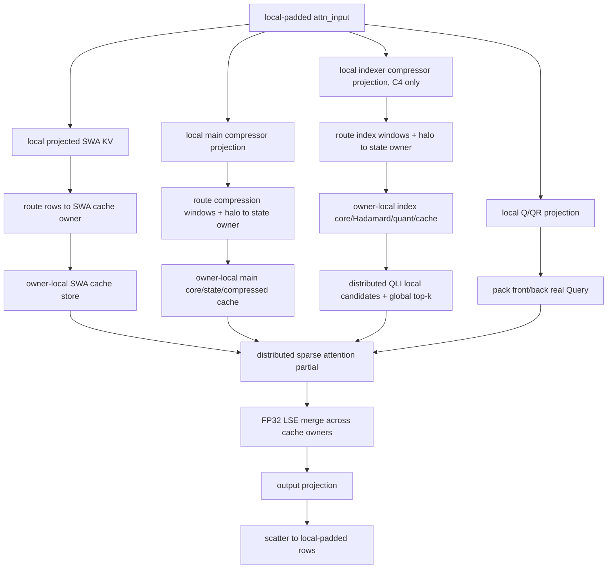

## 1. 摘要

本文给出 DeepSeek-V4（DSV4）NPU Torch 后端完整 Context Parallelism 方案。现有
**projection-first replicated pre-compressor** 已完成正确性闭环，作为 reference path
保留；当前目标升级为 **sharded state-owner**：模型 hidden 按 CP 切分后，各 rank 完成本地
无状态 projection，只将目标压缩窗口及边界 halo 路由到唯一 state owner。owner 执行局部
compressor core 并独占对应 compressor state、SWA/compressed/index cache shard；Query、QLI
和 sparse attention 通过分布式 partial output/LSE 合并访问全局逻辑 cache。

本方案不新增第二套 token owner 规划器。现有 `NpuCpPlan` 继续提供 `2 * cp_size`
zigzag row layout，但需要把通用 row layout 与 ATB 专用 attention/KV-split metadata
解耦。DSV4 只消费通用 row layout，并使用模型专用 typed metadata 表达 front/back
Query、causal KV endpoint 和 sparse/QLI metadata。

本方案的核心决策如下：

1. 不 AllGather normalized hidden。
2. main compressor 和 indexer compressor 都拆成无状态 projection 与 stateful core。
3. main/index projection 保持 model dtype，并按 compression-window owner 路由；不再恢复
   每个 rank 都持有的 global-real projection。
4. Compressor state、SWA KV、compressed KV 和 index cache 按 CP owner 分片；逻辑 block
   table 保持 global 语义，物理 tensor 只保存本 rank shard。
5. Compressor padding row 永远不能进入 stateful core 或 cache write。
6. MoE 是否能直接消费 CP-local token 由明确 capability 决定，不能只靠 token count
   metadata 推断。
7. CP 同时参与 prefill 和 decode 的分布式 cache/state 路径；prefill 在固定 bucket 和稳定
   buffer address 下支持 ACL Graph capture/replay。
8. 层内 projection/routing/attention 通信使用固定双缓冲；跨 layer 采用有依赖约束的
   wavefront pipeline，禁止覆盖仍被 Graph 或 HCCL 使用的 buffer。

## 2. 设计状态和代码基线

- 文档状态：replicated reference path 的 Task 0-9 已完成。当前文档已解除首版范围，
  state/cache 分片、state-owner/halo、CP prefill Graph 和跨 layer overlap 全部升级为当前
  版本目标；Task 10 正在实施，Task 11-14 尚未完成，不得把 reference path 的结果作为
  完整版本结论。
- 代码基线：`upstream/main`，提交 `e69351b4`。
- 目标后端：NPU Torch。
- 目标模型：`deepseek_v4`、`deepseek_v4_mtp`。
- 参考实现：SGLang DSV4 projection-first prefill CP，仅用于确认 projection/core
  的数学边界，不作为 xLLM 模块边界的直接实现。
- 算子源码基线：`ops-transformer` 的 `9.0.0` 分支不含 Compressor；A3 融合实现位于
  `origin/9.1.0-beta.2:experimental/attention/compressor` 的 arch22 路径。xLLM 当前
  `xllm-ops` 已在 `xllm_ops/attention/compressor` 携带一份 A3 融合实现，但只暴露完整
  Compressor，没有 projection 后可插入 collective 的 core API。
- 算子拆分归属：新增 A3-only `CompressorProjection` 和 `CompressorCore` 到
  `xllm-ops` 的 `attention/compressor_projection` 和 `attention/compressor_core` 目录，
  复用 `attention/compressor` 的 fused kernel 组件并保留现有 fused Compressor；xLLM runtime
  只通过 wrapper 调用，不复制 AscendC 算法。源码继续保留原 CANN license header 和
  notices。

本文所说的“global”均指当前 DP replica 内、CP 切分前的 token 视图，不表示跨 DP
replica 汇总。

## 3. 目标

1. DSV4 target full prefill 在 CP=2/4/8 下保持正确。
2. 支持多序列 batch、非均匀长度和某个 half 为空的场景。
3. 支持 chunked prefill 和 prefix cache continuation。
4. 支持 DSV4 MTP prefill，并保证 target/draft 使用同一 row ownership。
5. 支持正交 `DP x CP x attention-TP` 拓扑。
6. 非 CP 路径保持不变；CP decode 使用 owner-local state/cache update 和分布式 attention，
   FP32 reference 模式继续用于差分。
7. 通过 zigzag 切分改善 causal attention 负载均衡。
8. 将 CP 编排限制在 row layout、DSV4 adapter 和 compressor 接口内，不把模型细节
   扩散到 scheduler、cache manager 或通用 collective。

## 4. 当前版本强制范围

以下四项全部是当前版本交付目标，不再属于非目标或条件升级项：

| 项目 | 当前版本结论 | 必须解决的问题 |
| --- | --- | --- |
| compressor state/KV cache CP 分片 | P0 数据模型 | 每 rank 只分配 owner-local state/cache；capacity estimator、prefix/swap/transfer 和 block mapping 同步支持 |
| state-owner/halo | P0 执行模型 | projection rows 按 compression window 路由到唯一 owner，owner-local core 消除 replicated 重算 |
| CP prefill ACL Graph | P1 执行优化 | bucket、dtype、topology、buffer address 和 collective 顺序进入稳定 graph identity |
| 跨 layer overlap | P1 执行优化 | 固定双缓冲、stream/event 所有权和 microchunk wavefront 依赖必须可证明且可观测 |

四项之间存在硬依赖：Graph 和 overlap 必须建立在最终 sharded cache/state ABI 与稳定 buffer
pool 之上；不得先 capture replicated reference path 再把 capture 结果复用于 state-owner
path。当前版本必须同时满足以下约束：

1. `REPLICATED_REFERENCE` 只用于差分、诊断和显式回滚，不是 production capability 的静默
   fallback。`SHARDED_STATE_OWNER` 缺少任一 op/collective 时启动失败。
2. cache owner 由 canonical global physical block id 纯函数确定：
   `owner = global_block_id % cp_size`、`local_block = global_block_id / cp_size`。compression
   window owner 从其 state/cache block table 派生，不由当前 batch row 或临时 padding决定；
   prefix reuse 保留同一 global block id，swap/transfer 必须显式迁移 owner。
3. 每个 state/cache slot 只有一个写 owner。其他 rank 不分配同一数据副本，也不能通过
   all-reduce 合并多个写结果。
4. C4/C128 compression window 跨 owner 边界时，仅路由完成该窗口所需的 projection halo；
   padding/dummy row 不进入 owner core 或 state update。
5. Sharded cache 上的 QLI/sparse attention 使用 local partial result 与 FP32 LSE 合并恢复
   global attention，不允许临时 AllGather 完整 KV cache。
6. CP prefill eager 继续作为 graph 差分基线；Graph 模式使用固定容量 tensor 和 device-side
   real-count metadata，不 capture allocator、host shape branch 或变化地址。
7. Overlap 只能跨越数据依赖允许的阶段。双缓冲 slot 在 producer event 完成前不可复用；
   Graph capture/replay 和 eager 使用同一 ownership state machine。
8. 启动容量门禁同时核算 owner-local persistent cache/state、Graph 固定 buffer、双缓冲和
   HCCL persistent memory；不得通过关闭门禁换取启动成功。

### 4.1 当前版本消除的 reference-path 下界

| Reference path 问题 | 当前版本实现 |
| --- | --- |
| `compressor_core` 在 P 个 rank 上对 global rows 重算 | projection owner routing + owner-local core，每个 compression window 只执行一次 |
| FP32 global projection AllGather | projection 直接以 model dtype 路由到 owner；Core tile 内升 FP32 |
| cache/state 每 rank 完整复制 | owner-local physical cache/state，容量按 CP size 扩展并扣除 metadata/对齐开销 |
| CP prefill 固定 eager | 稳定 bucket/buffer/collective identity 后 capture/replay，eager 保留为 reference |
| collective 与计算串行 | 双缓冲和 microchunk wavefront overlap，保留严格 collective sequence id |

与 PR #2097 相比，本方案仍不 AllGather normalized hidden。projection 本地计算后只发送
owner 所需 rows/halo，既消除 projection 与 core 的 N 重计算，也不恢复完整 hidden 或完整
packed projection。state-owner 是 replicated pre-compressor 的最终分布式执行 policy，
不是并列的第二套 token ownership；token owner 仍来自 `CpRowLayout`，compression/cache
owner 由独立纯函数从 global logical position 派生。

## 5. 当前实现

### 5.1 CP row layout

当前 `NpuCpPlan` 位于：

```text
xllm/core/framework/parallel_state/npu_cp_plan.h
xllm/core/framework/parallel_state/npu_cp_plan.cpp
```

它已经提供：

- 每条 sequence 的 `2 * cp_size` zigzag 分块；
- global-real 到 local-padded 的 source/destination indices；
- CP rank 间相同的 local-padded row count；
- rank-major gather 后恢复 global-real 顺序的 indices；
- model output gather/reorder/unpad；
- ATB attention、KV-split 和 CP/EP bridge metadata。

当前问题是 row layout 与 ATB 专用 metadata 在同一个 `NpuCpPlan::build()` 中一起构建，
而 DSV4 需要 global cache metadata，不能直接调用现有 `apply_attention_meta()` 和
`prepare_cache_slots()`。

### 5.2 DSV4 attention

当前 DSV4 NPU Torch attention 位于：

```text
xllm/core/layers/npu_torch/deepseek_sparse_attention.cpp
xllm/core/layers/npu_torch/deepseek_v4_indexer.cpp
```

当前 `DSAttentionImpl::forward()` 串行完成：

```text
Q/QR/KV preprocess
  -> SWA KV prepare/store
  -> main compressor
  -> indexer compressor/cache update
  -> QLI
  -> sparse attention
  -> output projection
```

该函数目前只有一套 sequence metadata，无法表达 zigzag rank 上彼此不连续的 front/back
Query fragment。

### 5.3 Compressor

当前 `CompressorImpl::forward()` 将以下输入直接传给 `aclnnCompressor`：

```text
hidden + wkv + wgate
  + kv_state + score_state
  + APE/Norm/RoPE/metadata
```

现有算子同时完成 projection、aggregation、state update、norm 和 compressed RoPE。
因此当前接口无法实现：

```text
local projection
  -> CP AllGather
  -> global stateful core
```

### 5.4 Model 和运行时门禁

当前 main 中：

- DSV4 是 NPU Torch-only model；
- NPU CP 启动校验仍主要面向 ATB model-side CP；
- NPU Torch 的 TP group 尚未按 `world / (dp * cp)` 缩小；
- `deepseek_v4` 尚未注册为 NPU model-side CP capable；
- Worker 在 model forward 前调用 `NpuCpPlan::prepare()`；
- `NpuCpPlan::prepare()` 会改写普通 attention metadata 和 cache slots。

这些门禁必须通过 typed capability 处理，不能在通用 planner 中写
`model_type == "deepseek_v4"` 分支。

## 6. 现有 Pre-Compressor 草案评审

### 6.1 保留的设计

以下判断是正确的，应继续保留：

1. Projection 是逐 token、无状态操作，可以在 local-padded rows 上执行。
2. Compressor recurrence 必须看到 global-real 原序输入。
3. 每个 CP rank 可以对相同的 global packed projection 独立执行 core，并维护完整逻辑
   state。
4. SWA KV 必须在 cache write 前恢复全局顺序。
5. Query 和 sparse attention 应保持本地，输出 scatter 回 local-padded layout。
6. DSV4 不应重新实现第二套 token owner/reorder planner。
7. Global cache metadata 与 local query metadata 必须分离。

### 6.2 必须修正的问题

#### P0：Projection/Core 算子契约尚未被证明

拆分接口不能只按数学公式定义，还必须证明与现有 fused operator 的以下状态完全等价：

- `compressed_kv`；
- `kv_state` 原地更新；
- `score_state` 原地更新；
- C4 overlap；
- C128 recurrence；
- full/chunked prefill；
- main/indexer 两套权重和 state。

在该等价测试通过前，不能开始多卡 CP 正确性验证。

#### 当前目标：16-bit Projection Storage 与 FP32 Compute

A3 融合算子的 L0C accumulator 和 Vector 数值路径仍为 FP32，但这不要求 projection 以
FP32 写入 GM。当前版本将 storage/transport 与 compute dtype 分离：

- hidden、projection weight 和 packed projection 使用 model dtype；目标 DSV4 为 BF16；
- Cube 使用 FP32 accumulate，Fixpipe 以 `F322BF16` 直接写 packed projection；
- owner routing/halo 传输 BF16 projection，不创建完整 FP32 GM tensor；
- Core tile load 后升 FP32，APE、overlap、softmax、reduce 和 state recurrence 保持 FP32；
- compressor state storage 默认 FP32、可选 BF16，BF16 只发生在 state load/store 边界；
- split Core 首版输出 FP32 pre-norm，RMSNorm/RoPE 完成后转 model dtype。

这里的 tensor dtype 与 `_GLIBCXX_USE_CXX11_ABI` 无关；当前 xLLM C++ ABI 仍为 1。FP32
reference operator 保留用于差分，但 production owner path 不执行 global projection
AllGather。以 `H=4096,D=512,index_D=128` 为例，C4 main+index BF16 projection bundle 为
每 token 5120 B；state-owner routing 的实际链路字节还取决于 owner 分布和边界 halo，必须
记录 send/recv split，不能按 AllGather 公式估算。

Correctness MoE bridge 是独立于 ratio 的额外预算：

| 路径 | 每 token 逻辑 CP payload | 发生频率 |
| --- | ---: | --- |
| MoE bridge gather | hidden BF16 8192 B | 每个使用正确性 bridge 的 MoE 层一次 |

该预算使用当前 `hc_pre()` 契约：decoder state 为 `[T, hc_mult, H]`，但 FFN 前的
`ffn_input` 已收缩为 `[T, H]`，所以 payload 不乘 `hc_mult`。实现中的字节指标必须根据
实际 `ffn_input.numel() * element_size()` 计算，不能硬编码 8192 B。

该行只统计 Pre-Compressor 新增的 CP-group gather。`shard_rows()` 是本地索引，不产生
第二次 collective；AllGather 的实际链路收发量应按 CP size 和通信实现另行计算。Baseline
已有的 DP/EP dispatch、combine 或 reduction 通信必须分项记录，不能归入新增 CP payload。

#### P0：现有 MoE 并不天然支持不同 CP token rows

部分 `FusedMoE` 路径最终在 `moe_ep_group_` 上执行 reduction。若同一 group 内不同
CP rank 持有不同 token，逐元素 reduction 会把不同行错误相加。新增
`dp_cp_padded_token_nums` 只能解决变长 gather/slice，不能解决 EP reduction 的 token
对齐问题。

因此必须显式区分：

- 能消费 CP-local token 并返回同一 local row order 的 dispatch/combine 路径；
- 要求 group 内 token rows 完全一致的 reduction 路径。

#### P0：通用 row layout 与 ATB metadata 必须解耦

DSV4 需要 global cache slot/block table，而现有 ATB CP 会改写 attention metadata 和
cache slots。仅增加 DSV4 条件分支会进一步加深耦合。应在 `NpuCpPlan` 内部拆出通用
`CpRowLayout`，由不同 execution policy 选择后续 metadata 构建。

#### P1：Graph identity 必须覆盖 CP owner path

replicated reference path 已通过 phase gate 将 CP prefill 留在 eager。完整版本不再以该
fallback 作为 production 行为：full/chunked/MTP prefill、decode 和 spec-verify 都必须使用
最终 owner/cache layout 的 bucketed Graph。Graph identity、固定 buffer 和 collective
sequence 约束见 §14；eager 仅作为相同 layout 的差分基线。

#### P1：MTP 不能共享带 raw ProcessGroup 指针的 plan

Target/draft 可以共享 immutable row layout tensors 和 layout signature，但不能在 worker
之间传递包含 non-owning `ProcessGroup*` 的完整 plan。每个 leaf 使用自己的 CP group
重新绑定 collective executor。

#### P1：空 DP replica 与 padding 必须分开

用于保持 collective shape 的 CP padding 可以进入无状态 projection，但不能进入
compressor core、cache write、router 或采样。用于 empty DP rank 的 dummy row 也不能
伪装成真实 DSV4 token 更新 state/cache。

## 7. V2 总体设计

### 7.1 数据布局

设 CP size 为 `P`。每条 sequence 被切为 `2P` 个等长物理 chunk：

```text
global: [B0, B1, ..., B(P-1), BP, ..., B(2P-1)]
rank r: [Br, B(2P-1-r)] + local padding
```

运行时存在以下 row/cache view：

| View | dim 0 | 顺序 | 用途 |
| --- | ---: | --- | --- |
| local-padded | `Tp` | 每条 sequence 的 front/back + padding | layer、projection、owner-routing input |
| local-real-half | 当前 half 真实行 | active sequence 顺序 | QLI、sparse attention |
| owner-routed | 当前 owner 收到的 real rows + boundary halo | `(sequence, compression-window, offset)` canonical 顺序 | owner-local compressor core |
| owner-local cache | 本 rank 拥有的 logical cache blocks/slots | local physical slot 顺序 | state/cache write、local attention partial |
| query-local partial | 本 rank Query 对某个 cache shard 的 output/LSE | local-real-half 顺序 | 跨 rank FP32 LSE merge |
| global-real reference | `T` | CP 切分前 batch 原序 | metadata、测试和最终 model output；不作为 production core/cache tensor |

### 7.2 每层执行流



所有 CP rank 使用相同的 `collective_sequence_id` 执行 owner routing、QLI candidate merge 和
attention partial merge；empty owner/half 发送零 real-count 的固定容量 buffer，不能跳过
collective。replicated reference path 保留原 global gather，只用于 eager 差分。

## 8. 模块边界

### 8.1 Typed CP capability

将当前单一 `CpShardingMode` 扩展成可表达 backend 和 metadata policy 的 capability。
示意接口：

```cpp
enum class CpMetadataPolicy : int8_t {
  NONE = 0,
  ATB_ATTENTION = 1,
  MODEL_MANAGED_GLOBAL_CACHE = 2,
  MODEL_MANAGED_SHARDED_CACHE = 3,
};

struct NpuModelCpCapability {
  CpMetadataPolicy metadata_policy = CpMetadataPolicy::NONE;
  std::string required_backend;
  bool supports_dp = false;
  bool supports_mtp_prefill = false;
  bool supports_sharded_cache = false;
  bool supports_cp_prefill_graph = false;
  bool supports_cp_overlap = false;
};
```

DSV4 target/MTP 注册为：

```text
required_backend          = TORCH
metadata_policy           = MODEL_MANAGED_GLOBAL_CACHE
supports_dp               = true
supports_mtp_prefill      = true
supports_sharded_cache     = true
supports_cp_prefill_graph  = true
supports_cp_overlap        = true
```

完整版本注册时 `metadata_policy` 必须改为 `MODEL_MANAGED_SHARDED_CACHE`；上表中的
`MODEL_MANAGED_GLOBAL_CACHE` 仅表示当前 reference implementation 的状态。Master 根据
capability 校验 backend、DP、MTP、cache owner 和 Graph/overlap。Worker 根据
`metadata_policy` 决定 `NpuCpPlan::prepare()` 是否改写普通 attention metadata。

### 8.2 `NpuCpPlan` 内部拆分

不创建新的 DSV4 planner。将现有 plan 内部整理为：

```text
NpuCpPlan
  ├── CpRowLayout               通用 zigzag row ownership
  ├── CpAttentionMeta           ATB attention 专用
  ├── CpEpMeta                  ATB/EP bridge 专用
  ├── CpCompressionOwnership    DSV4 compression/cache owner 纯 value semantics
  └── CpOutputMergeMeta         可由 CpRowLayout 派生
```

新增通用 row API：

```cpp
class CpRowLayout final {
 public:
  torch::Tensor shard_rows(const torch::Tensor& global_rows,
                           const torch::Scalar& pad_value) const;

  torch::Tensor gather_global_rows(
      const torch::Tensor& local_padded_rows,
      ProcessGroup* cp_group) const;

  int64_t global_real_token_count() const;
  int64_t local_padded_token_count() const;
  uint64_t signature() const;
};
```

要求：

- `shard_rows()` 支持 1-D tokens 和任意 trailing dimensions；
- `gather_global_rows()` 在 dim 0 AllGather 后恢复原序并 unpad；
- `signature()` 在 plan 构建时由 canonical host row descriptor 计算，只包含 value
  semantics，不包含 tensor 地址或 process-group 指针，也不在 forward 中触发 D2H；
- API 不理解 compressor、ratio、prefix cache 或 DSA；
- 现有 `shard_model_input()`、`merge_model_output()` 保留为兼容 wrapper；
- `MODEL_MANAGED_GLOBAL_CACHE` 下不执行普通 attention metadata 改写和 KV slot shard。
- `MODEL_MANAGED_SHARDED_CACHE` 下由 DSV4 owner plan 生成 local physical slot 和通信 split，
  不复用 ATB KV split metadata。

### 8.3 DSV4 typed CP metadata

新增：

```text
xllm/core/layers/npu_torch/deepseek_v4_cp_metadata.h
xllm/core/layers/npu_torch/deepseek_v4_cp_metadata.cpp
```

建议结构：

```cpp
struct Dsv4CpHalfMetadata {
  torch::Tensor pack_indices;
  torch::Tensor destination_indices;
  torch::Tensor q_seq_lens;
  torch::Tensor q_cu_seq_lens;
  torch::Tensor kv_endpoints;
  torch::Tensor active_sequence_indices;
  torch::Tensor qli_metadata;
  torch::Tensor c1_sparse_metadata;
  torch::Tensor c4_sparse_metadata;
  torch::Tensor c128_sparse_metadata;
  bool empty = false;
};

struct Dsv4CpMetadata {
  Dsv4CpHalfMetadata front;
  Dsv4CpHalfMetadata back;
};
```

它只表达 local Query 执行，不拥有：

- process group；
- compressor state；
- cache tensor；
- global block table/slot mapping；
- collective 方法。

Global `DSAMetadata` 保持以下内容不变：

- global q/kv lengths；
- `start_pos`；
- compressed positions 和 RoPE；
- multi-cache block tables/slot mappings；
- compressor/indexer state metadata。

### 8.4 Compression/cache owner 和分布式 attention

新增模块：

```text
xllm/core/layers/npu_torch/deepseek_v4_cp_ownership.*
  Dsv4CpOwnershipPlan / Dsv4CpOwnershipPlanner

xllm/core/framework/kv_cache/deepseek_v4_cp_cache_shard.*
  global block id <-> owner/local block mapping

xllm/core/layers/npu_torch/deepseek_v4_cp_attention_exchange.*
  owner routing / distributed QLI / output+LSE merge

xllm/core/layers/npu_torch/deepseek_v4_cp_buffer_pool.*
  graph-stable double buffers / event state machine
```

核心 descriptor 只保存 value semantics：

```cpp
struct Dsv4CpRouteDescriptor {
  torch::Tensor send_row_indices;
  torch::Tensor send_owner_ranks;
  torch::Tensor recv_sequence_ids;
  torch::Tensor recv_window_ids;
  torch::Tensor recv_window_offsets;
  torch::Tensor recv_real_counts;
  int64_t padded_rows_per_peer = 0;
};

class Dsv4CpOwnershipPlanner final {
 public:
  Dsv4CpOwnershipPlan build(
      const CpRowLayout& row_layout,
      const DSAMetadata& global_metadata,
      int64_t compress_ratio,
      int64_t block_size,
      int64_t cp_size) const;
};
```

owner mapping 规则：

```text
owner(global_block_id) = global_block_id % cp_size
local_block(global_block_id) = global_block_id / cp_size
```

SWA、C4 compressed、C4 index 和 C128 compressed cache 都使用该映射。state window 使用
对应 state block table 的 global block id，因此 full/chunked/prefix continuation 的同一窗口
始终路由到当前 block owner。block swap 导致 global block id 变化时，由 transfer 层在提交
新 block table 前完成跨 owner copy；不能只改 metadata。

Projection routing 使用 `ProcessGroup::all_to_all_single()`。为兼容 Graph，每个 peer 使用
固定 `padded_rows_per_peer`，真实 send/recv count 放在 device tensor；eager 和 Graph 共用
同一 padded layout。每个 compression window 的全部 real rows按
`(sequence_id, window_id, offset)` 排序，跨 CP cut 的最多 `compress_ratio - 1` 个边界 rows
作为 halo 一起发送。Core 只消费完整窗口或带既有 continuation state 的合法 partial window。

Sharded cache attention 不 AllGather 完整 KV。Query owner 的 local-real Query 在 CP ring/
fixed all-to-all 中依次访问每个 cache owner：

1. 每个 cache owner 对本地 cache shard计算 local score、partial output 和 FP32 LSE。
2. C4 QLI 先在各 index shard 产生 local candidates，再对固定 `local_topk` candidates 做
   AllGather，按 global logical index 执行 deterministic global top-k。
3. sparse attention 只在选中 index 属于本 owner 时读取 local compressed KV。
4. partial output 使用稳定公式合并：
   `m=max(lse_i)`、`w_i=exp(lse_i-m)`、`O=sum(O_i*w_i)/sum(w_i)`。
5. 合并后的 output 返回 Query owner，顺序保持 local-real-half，不恢复 global Query。

空 cache owner 仍参与相同 collective，local LSE 使用 `-inf`、partial output 使用 0。所有
LSE、`exp` 和 weighted reduction 使用 FP32。该分布式 attention 是 cache 分片的正确性
前置项；禁止通过临时复制完整 cache 绕过。

### 8.5 Compressor API

`CompressorImpl` 继续拥有权重和 stateful 算子调用，不把 `wkv/wgate` 暴露给
`DSAttentionImpl`。

目标接口：

```cpp
class CompressorImpl final : public torch::nn::Module {
 public:
  torch::Tensor project(const torch::Tensor& local_hidden) const;

  torch::Tensor forward_owner_core(
      const Dsv4CpOwnerMetadata& owner_metadata,
      const torch::Tensor& owner_projection,
      std::tuple<torch::Tensor, torch::Tensor>& owner_states,
      std::tuple<torch::Tensor, torch::Tensor>& owner_block_tables,
      const torch::Tensor& compressed_sin,
      const torch::Tensor& compressed_cos,
      const torch::Tensor& owner_q_cu_seq_lens);

  torch::Tensor forward_owner_decode(
      const Dsv4CpOwnerMetadata& owner_metadata,
      const torch::Tensor& local_hidden,
      std::tuple<torch::Tensor, torch::Tensor>& owner_states,
      std::tuple<torch::Tensor, torch::Tensor>& owner_block_tables);

  torch::Tensor forward(/* existing fused API */);
};
```

底层在 `xllm-ops/xllm_ops/attention/compressor` 新增两个 A3 kernel API：

```text
compressor_projection(x, wkv, wgate, coff) -> packed_projection
compressor_core(packed_projection, owner_states, owner_metadata)
    -> owner_pre_norm_fp32
compressor_owner_decode(x, weights, owner_states, owner_metadata)
    -> owner_compressed_kv
```

实现直接从现有 fused Compressor 拆出：

1. Projection 复用 AIC `CompressorBlockCubePerf::ComputeMm1()` 的 MM1、tiling 和
   Fixpipe 逻辑；
2. Core 复用 AIV `CompressorBlockVectorPerf` 的 overlap、APE、state、softmax 和 reduce
   逻辑，输出 FP32 pre-norm；
3. `CompressorImpl::forward_core()` 组合 FP32 RMSNorm、partial RoPE 和 model-dtype cast；
4. fused Compressor 保留非 CP pipeline；CP decode 增加 owner-local fused entry，不在非 owner
   rank 写 state/cache；
5. Core 需要独立 host tiling，不直接依赖 fused kernel 的 AIC/AIV
   double-buffer 同步 flag。

Projection 已按以下物理实现落地：A3 AIC-only kernel 复用
`CompressorBlockCubePerf<COMP, true>`，两个 `ndNum=1` Fixpipe 串行写出 KV/score slice，
当前 reference operator 直接生成 token-major FP32 packed tensor；P2 将 Fixpipe 输出改为
model dtype。production owner path 不分配 per-core projection workspace，也不经过 AIV
repack，并把 routing ABI 与 fused 双缓冲 workspace 解耦。

当前 `xllm-ops` 已包含融合源码，技术上可拆分，不需要逆向或在 xLLM runtime 重写公式。
但 Core 不是简单删除 MM1：现有 fused kernel 在 cube/vector 间做双缓冲流水，因此必须把
原 workspace 输入改为显式 `packed_projection` 输入，并重新生成仅 AIV core 所需的 tiling。

约束：

1. `project()` 无 state、副作用、collective 和 cache write。
2. `project()` 输出 contiguous model dtype；Core 只在 tile 内升 FP32，禁止 runtime 完整 cast。
3. 不额外长期保存 merged `wkv_gate`，避免在保留 non-CP fused path 时复制大权重。
4. `forward_owner_core()` 只更新 owner-local state storage，并返回 owner-local compressed rows。
5. 非 CP 继续调用当前 fused `forward()`；CP decode 调用 owner-local fused entry。
6. state storage 默认 FP32、可选 BF16，softmax/reduce/state recurrence 始终 FP32。
7. 若运行库缺少 projection/core/owner-decode 任一 op，完整 DSV4 CP capability 启动失败。

Projection shape 和 layout 契约如下：

```text
local_hidden:             [Tp, H]                  BF16/FP16
wkv:                      [coff * D, H]           BF16/FP16
wgate:                    [coff * D, H]           BF16/FP16
local_packed_projection:  [Tp, 2 * coff * D]      model dtype
local_logical_view:       [Tp, coff, 2, D]        model dtype
owner_packed_projection:  [To, 2 * coff * D]      model dtype
owner_logical_view:       [To, coff, 2, D]        model dtype
```

其中：

- main C4：`coff=2`、`D=main_head_dim`；
- main C128：`coff=1`、`D=main_head_dim`；
- indexer C4：`coff=2`、`D=index_head_dim`。

维度 `2` 的顺序固定为 `[kv, score]`，`coff=2` 时 branch 顺序固定为
`[branch0.kv, branch0.score, branch1.kv, branch1.score]`。该布局与当前 `xllm-ops`
Compressor 的 `pre/cur` packed MM1 workspace 一致，避免在 Projection 内增加一次重排。

operator 的物理输出是二维 `local_packed_projection`，四维形式只用于定义 layout 和测试
索引。`Tp` 包含 local padding，`To` 是当前 rank 作为 owner 收到的固定 padded capacity；
`forward_owner_core()` 通过 device real-count 和 window metadata 忽略 padding，不接收
rank-major gathered/global projection。

### 8.6 Collective bundle

在 DSV4 owner exchange 层实现 typed route bundle，不扩展底层 `ProcessGroup` 语义。
`ProcessGroup::all_to_all_single()` 只负责固定容量 tensor 交换；owner indices、real counts
和 route ordering 由 `Dsv4CpOwnershipPlan` 管理。

C4 main/indexer projection 都是 model dtype。只有二者 owner descriptor 完全一致时才 bundle：

```text
[main_packed_projection, index_packed_projection]
  -> concat last dim
  -> one fixed-capacity owner all-to-all
  -> split owner-local outputs
```

建议 helper：

```cpp
std::vector<torch::Tensor> route_owner_rows_bundle(
    torch::TensorList local_packed_tensors,
    const Dsv4CpRouteDescriptor& route) const;
```

它只接受二维、row count/device/dtype 相同的 contiguous tensors，内部记录各 tensor 的
feature width，执行一次 pack、一次固定容量 all-to-all，再按原 width 返回 view/split。
不接受 mixed dtype，不拥有 ProcessGroup；owner descriptor 不同时必须拆分 collective。

SWA KV 使用独立 cache owner mapping，不能与 compressor projection bundle。replicated
gather 仅作为显式 reference；production 不允许在 bundle 失败时回退到完整 AllGather。

不得使用 byte tensor 手工拼接不同 dtype，也不得让 Graph replay 使用不同 owner descriptor。

### 8.7 DSAttention CP adapter

在 `DSAttentionImpl` 中新增 `forward_cp()`，从现有 `forward()` 抽取可共享 phase helper，
避免复制整个 attention 实现：

```text
preprocess_local_q_qr_kv
project_main_compressor
project_indexer_compressor
route_and_store_owner_swa
route_main_index_projection_and_halo
run_owner_main_core_and_store
run_owner_index_core_and_store
run_distributed_qli_candidates
run_sharded_sparse_attention_and_lse_merge
project_and_scatter_half_output
```

`forward_cp()` 只做编排；权重仍由原模块拥有，row ownership 仍由 `CpRowLayout` 拥有。

## 9. Query 和 Cache 语义

### 9.1 Front/Back Query

同一 rank 的 front/back fragment 在原 sequence 中不连续，必须分别执行 QLI 和 sparse
attention。每个 half 独立拥有：

- packed real Query rows；
- per-sequence q length/cu-seqlens；
- causal KV endpoint；
- duplicated global cache block-table row；
- ratio-specific QLI/sparse metadata。

对 sequence `i` 的某个 fragment：

```text
prefix_i = global_kv_len_i - global_q_len_i
kv_endpoint_i = prefix_i + fragment_global_end_i
```

Kernel 的 right-aligned causal 语义必须使用该 endpoint，不能把所有 rank 的 Query 都对齐
到整个 sequence 尾部。

### 9.2 SWA KV

```text
local-padded hidden
  -> local kv_proj/norm/RoPE
  -> local projected SWA KV
  -> route rows by SWA global block owner
  -> owner-local SWA cache store
  -> distributed SWA partial attention + FP32 LSE merge
```

Padding projection 在 route pack 阶段删除，不能写 owner-local cache。Full prefill 不再构造
每 rank 完整 temporary PA_ND cache；reference eager path 可以保留该实现用于差分。

### 9.3 Main Compressor

```text
local-padded hidden
  -> main project()
  -> local main packed projection
  -> route compression windows + boundary halo to owner
  -> main forward_owner_core(owner metadata)
  -> owner-local state update + compressed KV store
  -> distributed compressed attention partial + FP32 LSE merge
```

### 9.4 C4 Indexer

```text
local-padded hidden
  -> indexer compressor project()
  -> local index packed projection
  -> route C4 windows + boundary halo to owner
  -> owner-local indexer compressor core
  -> Hadamard + dynamic quant
  -> owner-local index cache store

local QR/hidden
  -> half-local query/weights
  -> each owner computes local QLI candidates
  -> candidate AllGather + deterministic global top-k
```

Indexer cache update 与 query-side QLI 必须拆成两个方法，不能继续由一个
`select_qli()` 隐式串联。

## 10. Prefix Cache 和 Chunked Prefill

DSV4 CP prefix cache 使用 sharded physical cache。Master/worker 仍共享 global block-table value
semantics，但每个 rank 只分配满足 `global_block_id % cp_size == cp_rank` 的 local physical
block。prefix hash 命中复用同一 global block id，因此 owner 不变。

Chunked prefill 每次只恢复当前 chunk 的 projected outputs：

```text
current local projected rows
  -> owner route/reorder/unpad
  -> current owner-local windows + boundary halo
  -> owner-local start_pos/block table/state continuation
```

必须保持：

1. `start_pos` 使用 CP 切分前的 global metadata。
2. Compressor core 输入不包含 CP padding，只包含本 owner 的 canonical window rows。
3. 每个 global state/cache slot 只在 owner rank 更新；non-owner block-table entry 映射为
   invalid local slot，但保留 global id 用于 attention routing。
4. Prefix hit 不因 CP 强制回退到 4/128 边界；边界语义由现有 stateful core 负责。
5. C4 overlap 使用显式 halo descriptor 延续既有 state 语义；halo row 只参与 owner core，
   不作为新的 cache token 重复写入。
6. swap/out/in 和 PD transfer 按 global block id 分组到 owner；metadata 提交晚于数据 copy
   completion event。

## 11. MoE Bridge

### 11.1 Capability 分类

为 MoE execution path 增加内部 capability：

```text
REQUIRES_ALIGNED_GLOBAL_ROWS
SUPPORTS_LOCAL_TOKEN_DISPATCH_COMBINE
```

判断必须来自实际执行路径，而不是仅根据 `ep_size` 或配置推断。

`FusedMoE` 对 decoder 暴露只读查询，不让 decoder 复制门禁逻辑：

```cpp
MoeRowCapability row_capability(
    const ModelInputParams& input_params,
    const torch::Tensor& hidden_states) const;
```

该方法复用 `can_use_ep2_dispatch_combine()` 的 dtype、TP、quant、op、weight 和 phase
判断；返回 `SUPPORTS_LOCAL_TOKEN_DISPATCH_COMBINE` 后，随后的同一次 `forward()` 必须
选择相同 dispatch/combine 分支。若两次检查间 capability 发生变化，应直接失败而不是
回退到 reduction，因为此时输入 rows 已按 local capability 准备。

当前 DSV4 NPU Torch `FusedMoE` 的四种 prefill 配置结论如下。表中的 EP degree 指
`--expert_parallel_degree`，MC2 指 `--enable_fused_mc2`：

| EP degree | MC2 | Prefill 实际路径 | CP-local 不等真实行数 | 设计处理 |
| ---: | ---: | --- | --- | --- |
| 1 | 0 | legacy `forward_expert` + MoE TP/EP reduction | 不支持 | correctness bridge |
| 1 | 1 | 与 MC2=0 相同；degree 1 不进入 EP2 dispatch/combine | 不支持 | correctness bridge |
| 2 | 0 | prefill 不满足 `all_dp_ranks_are_decode()`，回退 legacy reduction | 不支持 | correctness bridge |
| 2 | 1 | 满足动态门禁时使用 `DispatchFFNCombine` | 支持 | local dispatch/combine |

`DispatchFFNCombine` 支持不等 local rows 的源码依据是：每个 rank 的 tiling 使用本地
`problemShape.m()`；routing 后交换的是每个 source rank 的 per-expert token count；远端
读取和 combine offset 均由这些计数计算；最后按本 rank 的 `M * topK` 执行 unpermute，
输出 shape 与本地输入一致。它不做要求同 shape 的逐元素 EP reduction。

degree 2 + MC2 1 只有同时满足以下条件才报告
`SUPPORTS_LOCAL_TOKEN_DISPATCH_COMBINE`：

1. DSV4、`ep_size > 1`、MoE TP group size 为 1；
2. W8A8 dynamic routed expert、SwiGLU/Silu gated FFN；
3. `DispatchFFNCombine` op、weights 和 scales 均已准备；
4. 当前支持拓扑 `ep_size == world_size`，确保创建 dispatch/combine comm domain；
5. 当前 forward 的 eager/Graph preparation 都已准备相同 weights、active mask 和 comm
   domain，不因 capture 状态回退。

任一动态门禁失败都必须返回 `REQUIRES_ALIGNED_GLOBAL_ROWS` 并走 bridge，不能根据
`expert_parallel_degree=2 && enable_fused_mc2=1` 静态跳过 bridge。mode 0 的
`MoeDistributeDispatchV2/CombineV2` 可服务 pure decode，但当前代码在 prefill 明确回退，
不作为本设计的 local-prefill capability。

### 11.2 正确性路径

若当前 MoE path 要求 group 内 row 对齐：

```text
local-padded ffn_input
  -> gather_global_rows
  -> current DP gather/slice path using dp_global_token_nums when required
  -> global-real gate + MoE/EP reduction
  -> current DP-local global-real output
  -> shard_rows
  -> local-padded ffn_output
```

这条桥接只位于 FFN/MoE 边界，不改变 attention/compressor 的 projection-first 设计。
先恢复 CP-global rows 后，现有 `dp_global_token_nums` 才重新具有当前代码所要求的
DP-local row-count 语义。不能先按 DP gather CP-local rows，再尝试恢复 CP 顺序。

### 11.3 优化路径

只有 dispatch/combine 已证明支持每个 rank 不同 token rows，并按调用方 local row order
返回结果时，才允许直接执行：

```text
local-padded real rows
  -> local gate
  -> distributed dispatch/combine
  -> local output rows
```

Padding rows 必须在 router 前过滤，输出再 scatter 回 local-padded buffer。

该优化路径若同时支持 DP，需要显式的 `dp_cp_real_token_nums` 描述每个 DP replica 在固定
CP rank 上的真实行数。它只用于 local-token dispatch/combine 的 DP gather/slice，不能
替代 MoE CP capability。Padding row 不应记录为 router 输入行。

## 12. Target Model 接入

`DeepseekV4ModelImpl::forward()` 的固定顺序：

```text
1. 使用 global tokens/positions 构建 global DSAMetadata
2. 读取 worker 已准备的 NpuCpPlan/CpRowLayout
3. shard hidden、positions、tokens 到 local-padded
4. local hidden 扩展为 [Tp, hc_mult, H]
5. 从 global DSAMetadata + CpRowLayout 构建一次 Dsv4CpMetadata
6. 所有 decoder layer 复用同一 metadata
7. 最后一层后 gather global-real pre-hc hidden
8. 保存 MTP aux hidden
9. 执行 hc_head、final norm 和 LM head
```

`tokens`、`positions` 和 hidden 必须使用同一 source/destination mapping，确保 hash gate
和真实 token ID 对齐。

最终 gather 必须位于 `hc_head` 之前，从而一次恢复同时满足 final output 和 MTP aux
hidden。

## 13. MTP 接入

CP 同时参与 target/draft prefill 和 MTP decode/validate 的 sharded cache/state path。Target
和 draft 各自拥有 block pool、owner plan 和 Graph buffer pool；只共享 immutable token row
layout 和跨模型 collective sequence contract。

Target 和 draft 共享的是 immutable row layout 描述，不共享 raw process-group pointer。
Layout 必须提供由 canonical host descriptor 计算的 signature：

```text
hash(cp_size, cp_rank, global q lengths, global positions, row indices)
```

MTP prefill 要求：

1. Target/draft leaf 的 layout signature 一致。
2. Shifted token、position、target aux hidden 使用相同 row mapping。
3. Shifted token embedding、position 和 target aux hidden 先按同一 layout shard，再在
   local-padded view 执行逐行 predictor fusion。Target aux hidden 必须在 reshape 为
   `[N * hc_mult, H]` 前按 token 维 shard。
4. Draft model 使用自己的 CP group binding 和 cache/state，不复用 target 的 mutable state。
5. 首 token、draft token 和 accepted token 的跨 TP/CP 共识继续由 runtime 明确保证。

`MtpDecoderLayerImplBase::forward_with_decoder()` 中的 DSV4 predictor fusion 只包含
RMSNorm、`e_proj`、`h_proj` 和逐 token 相加，没有跨 token 依赖。对真实行，先 shard 后
fusion 与 global-real fusion 后再 shard 等价，并避免 draft 侧重复执行全序列 projection。
Padding 可以经过无状态 fusion，但不能进入 compressor core、cache write 或 router。

## 14. Graph 和执行阶段

### 14.1 Forward phase policy

| Forward 类型 | CP | ACL Graph |
| --- | --- | --- |
| Full prefill | sharded owner path | eager reference + Graph production |
| Chunked prefill | sharded owner path | eager reference + bucketed Graph |
| MTP prefill | target/draft 独立 owner path | eager reference + Graph production |
| Pure decode | sharded owner path | Graph production |
| Spec-verify | target/draft 独立 owner path | 固定 token bucket Graph |

`NpuCpPlan::prepare()` 在 decode 继续构建 lightweight cache-owner metadata，不能直接返回
disabled plan。非 CP 仍使用现有 fused compressor/Graph。

### 14.2 Graph identity 和稳定地址

CP Graph key 至少包含：

```text
model/target-or-draft identity
forward phase
token bucket / sequence bucket / microchunk count
dp/cp/tp/ep topology
cache layout version / block size / compression ratio
projection dtype / state dtype
owner route capacity signature
overlap schedule version
```

`Dsv4CpBufferPool` 在 capture 前分配 projection route、owner receive、QLI candidate、attention
partial output/LSE 和双缓冲 tensor。block table、slot mapping、real counts 和 route indices
复制到稳定地址的 device metadata tensor；replay 只更新内容，不更换地址。capture 区域内
禁止 allocator、动态 `cat`、host real-row branch、D2H 或不同 collective sequence。

HCCL collective 必须通过 A3 capability probe 证明可 capture/replay。任一 rank 的 probe、
bucket 或 sequence id 不一致时完整 capability 启动失败，不允许单 rank Graph、其他 rank
eager。eager reference 使用相同 fixed-capacity layout，保证 Graph 差分不混入 layout 差异。

### 14.3 跨 layer wavefront overlap

仅靠 Transformer layer 循环无法合法重叠相邻层，因为 layer `L+1` 依赖 layer `L` 输出。
当前版本把固定 prefill bucket 切成 compression-aligned microchunks，按二维 wavefront 调度：

```text
node(L, K) depends on:
  node(L - 1, K)  # hidden dependency
  node(L, K - 1)  # causal cache/compressor-state order
```

因此 `node(L+1,K)` 的 owner routing/core 可以与 `node(L,K+1)` 的 local projection/route
重叠。microchunk 边界必须同时满足 C4/C128 continuation metadata，不能通过丢弃 halo 强行
对齐。

每层使用两个 buffer slot，状态机固定为：

```text
FREE -> PROJECTION_READY -> ROUTE_IN_FLIGHT -> OWNER_READY
     -> CORE_DONE -> ATTENTION_DONE -> FREE
```

compute stream、CP communication stream 和 cache-copy stream 通过显式 event 转移状态。
`ROUTE_IN_FLIGHT` 前禁止 producer 覆盖，`ATTENTION_DONE` 前禁止复用 owner/cache partial
buffer。每个 collective 带单调 `collective_sequence_id=(forward,layer,microchunk,phase)`；
所有 rank 即使 real count 为 0 也按相同顺序 enqueue。

Graph capture 固化整个 wavefront schedule 和双缓冲 slot 选择。eager 与 Graph 共用同一状态
机，调试模式记录每个 slot 的 generation/event/sequence id；发现提前复用立即 fail-fast。

## 15. 错误处理和可观测性

### 15.1 启动门禁

以下条件不满足时启动失败：

- backend 不是 NPU Torch；
- `world_size % (dp_size * cp_size) != 0`；
- 缺少 compressor-projection、owner-core、owner-decode、distributed QLI/attention/LSE merge
  任一 operator；
- cache allocator/estimator 未声明 `MODEL_MANAGED_SHARDED_CACHE` layout version；
- MTP model 未声明 CP prefill capability；
- CP target/draft 拓扑不一致，例如 CP 开启时同时使用
  `enable_mtp_draft_body_tp1=true`；
- 当前 MoE path 既不支持 local dispatch/combine，也未启用正确性 bridge。
- owner-local persistent cache/state、Graph buffer pool、双缓冲和 MoE bridge 的峰值超过
  KV cache 分配前的可用 HBM。
- Graph collective capability probe 或跨 rank graph identity 不一致；
- overlap schedule 无法为最大 bucket 生成 compression-aligned microchunks。

KV capacity estimator 按 `ceil(global_blocks/cp_size)` 计算每 rank owner-local SWA、C4、C128、
index 和 compressor state，再加入 alignment/metadata。其之前预留 Graph 固定 buffer、双缓冲、
owner route、QLI candidates、partial output/LSE 和 MoE bridge。CP communicator 先执行
all-to-all、all-gather 和 LSE merge warmup，使 HCCL persistent buffer 在 free-memory 快照前
完成初始化。逻辑容量、local physical bytes、Graph reserve 和 allocator 实测 peak 分项打印。

### 15.2 运行时检查

Debug/测试构建至少检查：

- local-padded row count 在 CP group 内一致；
- Plan 构建时在 host 侧检查 source/destination indices 是无重复、无遗漏的置换；
- 每个 global block/state slot 映射到唯一 owner/local slot；
- route 后每个 compression window 的 real offset 无重复且满足 continuation 语义；
- padding/halo duplicate 不作为新 token 进入 compressor core 或 cache write；
- front/back destination 不重叠；
- active fragment 覆盖每个真实 Query 且只覆盖一次；
- owner-local slot mapping 行数与 owner compressor output 行数一致；
- non-owner rank 对该 slot 无物理写入；
- QLI global top-k index 唯一且指向正确 owner；
- distributed output/LSE merge 与 replicated FP32 reference 在容差内一致；
- target/draft layout signature 一致。
- buffer generation、event 和 collective sequence id 在所有 rank 一致。

端到端顺序诊断可通过显式开关在首次 forward 让 position sentinel 经过同一
`shard -> owner route -> local store -> distributed merge` 路径，但不得进入默认路径或每次
debug forward，
避免增加 collective 和同步点。

### 15.3 日志和指标

增加一次性路径日志和计数：

```text
dsv4_cp_enabled
dsv4_cp_projected_swa_bytes
dsv4_cp_main_projection_bytes
dsv4_cp_index_projection_bytes
dsv4_cp_collective_count
dsv4_cp_moe_bridge_mode
dsv4_cp_moe_bridge_bytes
dsv4_cp_padding_rows
dsv4_cp_front_half_launch_count
dsv4_cp_back_half_launch_count
```

Profiler 中应能区分 projection、collective、core、QLI、sparse attention 和 MoE bridge。

## 16. 实施阶段和测试门禁

### Task 0：Operator Split

状态：已完成。Projection/Core、fused-vs-split output/state 差分、xLLM wrapper、operator
capability fail-fast 和 DSV4 CP 模型链路均已接入。

在 `xllm-ops/xllm_ops/attention/compressor` 实现 A3-only
`compressor_projection` 和 `compressor_core`，不接入 CP。Projection 从现有
`CompressorBlockCubePerf` 拆出，Core 从 `CompressorBlockVectorPerf` 拆出；原 fused
Compressor 不改 ABI。

单测：

- xllm-ops 单算子 projection FP32 dtype、packed layout 和 golden GEMM；
- xllm-ops core 与 fused stateful math 的 golden 对比；
- CP=1 下 fused 与 split 路径比较；
- C4/C128；
- main/indexer；
- full/chunked prefill；
- 比较 compressed output、两类 state 和 cache scatter 结果；
- 明确 projection output dtype/shape。

门禁：Task 0 不通过，不进入多卡开发。

已完成的 Projection/Core 验证：

- A3 单算子构建通过；
- `test_compressor_projection.py` 8 项通过（FP16/BF16、`coff=1/2`、2D/3D 输入、
  FP32 matmul golden 和 packed 顺序）；
- Task 0 最初以 FP32 packed projection 完成 split reference；Task 10 已将 AIC Fixpipe
  输出升级为 model dtype `[T, 2*coff*D]`，仍无 AIV 重排和完整 FP32 GM workspace；
- Core 为 AIV-only，输入 global-real FP16/BF16 packed projection，tile 内升 FP32，输出
  连续 FP32 `[Tc,D]` pre-norm，并原地更新 FP32/BF16 KV/score state；
- `test_compressor_core.py` 68 项通过，覆盖 C4/C128、projection/state dtype 矩阵、
  3/4/5、127/128/129 continuation、HALF/INTERLEAVE RoPE、multi-sequence split，以及
  fused-vs-split output/state 差分和 FP32/BF16 fused prefill-to-decode continuation；
- Projection/Core 联合回归命令共 76 项通过：`pytest -q
  test_compressor_projection.py test_compressor_core.py`。

BF16 fused continuation 初次验证暴露出 `ReadFromCacheState()` 使用的
`packedProjectionInputQue` 未在 fused `InitBuffers()` 初始化，decode 读取历史 state 时触发
AICore `507015` 非法地址访问。现已为 fused 路径初始化该专用 16 KiB queue，并使用全新
build 目录、`CCACHE_DISABLE=1` 重建全部 50 个算子，确认不是旧 AscendC object cache
掩盖结果。新增 C4/C128 continuation 用例 2/2 通过，联合回归 76/76 通过。

同时增加 operator capability 查询。DSV4 CP 启动必须同时发现 projection/core，缺失时
直接失败；CP=1 和 decode 不受该 capability 影响，继续走 fused op。

### Task 1：通用 Row Layout API

状态：已完成。`CpRowLayout` 已支持任意 trailing dimensions、bundle gather、去 padding
恢复和 value-semantic signature。`NpuCpPlanTest` 23 项通过。

在 `NpuCpPlan` 内部抽出 `CpRowLayout`，增加任意 trailing dimensions 的
`shard_rows()` 和 `gather_global_rows()`。

单测：

- CP=2/4/8；
- 单/多 sequence；
- 长度不能整除 `2P`；
- 空 fragment；
- 1-D/2-D/3-D tensor；
- source/destination indices 构成无重复、无遗漏的置换；
- gather 后逐元素恢复 global 原序并删除 padding。

### Task 2：Typed Capability 和正交通信组

状态：已完成。typed capability、独立 attention-TP/CP group、端口分配、首版拓扑门禁和
启动 transient 容量门禁已实现；`ComputeCpGroupRanks` 5 项、`NpuCpCapabilityTest` 3 项、
`Dsv4CpMemoryBudgetEstimatorTest` 8 项和 `Dsv4CpExecutionContextTest` 2 项通过。

实现 typed CP capability，NPU Torch 下创建独立 TP/CP group。group builder 按正交
`DP x CP x attention-TP` 公式实现，避免后续重写，但第一阶段正式支持范围固定为：

```text
world=8, dp=1, cp=8, attention-tp=1, ep=8, kv-split=1
```

即 `cp=world,tp=1,ep=world`。该拓扑直接覆盖本文目标的长上下文并满足 EP2 MC2 comm
domain 的 `ep_size == world_size` 约束；在 operator split、CP metadata、MoE bridge 和
MTP 同时尚未验证前，不把 `cp=2,tp=4` 等正交组合列为首版上线范围。

单测：

- `dp=1,cp=8,tp=1`；
- group rank 纯函数继续覆盖 `dp=1,cp=2,tp=4` 和 `dp=2,cp=2,tp=2`，但只作为后续
  拓扑扩展的结构性门禁；
- 每个 rank 的 TP/CP group rank list；
- DSV4 只走 model-managed global-cache policy；
- ATB 现有 CP 行为不变。

本 Task 同时实现首版显存预算器和 per-forward gather adapter。预算单测覆盖 C4/C128、
target+draft、不同 max-token bucket、bundle/sequential 选择和容量不足时 fail-fast。
`Dsv4CpExecutionContext` 只持有 non-owning `ProcessGroup`，不持有跨层 tensor；HCCL
persistent buffer 在 free-memory 快照前 warmup，tensor 临时量由 allocator 和作用域管理。

### Task 3：DSV4 CP Metadata

状态：已完成。front/back pack、destination、active sequence、local q/kv 长度和 endpoint
已通过 `Dsv4CpMetadataBuilderTest` 5 项单测；ratio-specific sparse/QLI metadata 已接入
DSV4 attention 运行时。

实现 front/back pack/scatter、endpoint 和 ratio-specific metadata builder。

单测：

- 每个真实 token 只属于一个 half；
- destination 无重叠；
- multi-sequence 非均匀长度；
- prefix length 非 0；
- rank 0/front、rank P-1/back 和空 half endpoint；
- QLI/sparse metadata 与 packed Query 行数一致。

### Task 4：C1 Attention

状态：代码接入完成。C1 使用 CP-local Query、global-real SWA KV 和 front/back half
attention；标准 NPU 构建通过，模型级对比归入 Task 9。

先接入无 compressor 的 C1：local Query + projected SWA gather + half attention。

测试：

- CP=1/2/4 与单卡输出对比；
- full/chunked prefill；
- prefix cache；
- cache 内容和最终 hidden。

### Task 5：C128 Main Compressor

状态：代码接入完成。C128 已使用 local projection、global-real gather、split core 和
global cache slot 写入；标准 NPU 构建和 split operator 单测通过，模型级对比归入 Task 9。

接入 main projection/gather/core/cache。

测试：

- state/cache/output 对比；
- 127/128/129 token 边界；
- chunk continuation；
- multi-sequence batch。

### Task 6：C4 Main 和 Indexer

状态：代码接入完成。C4 main/index projection 支持 bundle/sequential gather，index cache
update 与 CP-local QLI 已拆分；`DeepseekV4IndexerTest` 4 项和标准 NPU 构建通过，完整
cache/output 对比归入 Task 9。

接入 main/indexer 两条 projection/core，并拆分 index cache update 与 QLI。

测试：

- 3/4/5 token 边界；
- main/index state；
- quantized index cache/scale；
- QLI top-k；
- 独立 gather 与 bundled gather 结果一致。

### Task 7：Decoder、HC 和 MoE Bridge

状态：代码接入完成。Decoder/HC 使用 row layout pack/scatter；MoE 根据 typed capability
选择 CP-local `DispatchFFNCombine` 或 global-row correctness bridge，空 local rank 也会
进入 bridge collective。相关 row/EP metadata 单测和标准 NPU 构建通过，四组合模型验证
归入 Task 9。

接入完整 decoder layer，先使用正确性 MoE bridge，再验证 local dispatch/combine。

测试：

- HC residual/front/back scatter；
- hash gate token 对齐；
- shared/routed expert；
- `expert_parallel_degree={1,2}` x `enable_fused_mc2={0,1}` 四组合；
- 三种 fallback 配置使用 global-row bridge，EP2+MC2 配置使用 local
  `DispatchFFNCombine`；
- 人为构造 CP ranks 不等 local real row count，验证 dispatch/combine 返回各自 local
  row order；
- EP2+MC2 动态门禁不满足时强制回到 bridge；
- padding 不进入 router。

### Task 8：Target Output 和 MTP Prefill

状态：代码接入完成。Target/draft 按 value-semantic layout signature 对齐，model boundary
恢复 global output，MTP token 共识和 bootstrap state 已接入；`NpuCpPlanTest` 中 MTP/layout
用例、`MtpPrepareNextDraftTest` 2 项、`MtpAsyncStateTest` 5 项和
`SequenceMtpBootstrapTest` 1 项、`MtpTokenConsensusTest` 4 项通过。CP 下
`enable_mtp_draft_body_tp1=true` 会在启动时因 target/draft CP 拓扑不一致而被拒绝。

接入 model boundary merge、aux hidden 和 MTP layout signature。

测试：

- target first-token logits；
- target aux hidden；
- draft first token；
- target/draft signature；
- CP=2/4 下先 shard 后 fusion 与 global-real reference 的真实行逐元素对比；
- aux hidden 在 `[N, hc_mult * H]` view 的 token 维 mapping；
- CP rank token 共识；
- MTP 接受率与 CP=1 基线。

### Task 9：DP、Graph 和端到端验证

状态：首版门禁已完成。代码中已显式关闭 CP-active prefill 的 effective graph flag，pure decode
仍保留原 graph-eligible 路径。已通过 CP=1 baseline、CP=8 eager 1K/8K、4 并发、4K
chunked prefill、1K prefix、20K chunked+prefix（第二次请求命中 16384 cached tokens）、
MTP=3 单请求/2 并发，以及前三种 MoE 组合。graph 开启时 CP prefill 成功，随后 8 个 rank
均完成 8/4/2/1 token pure-decode ACL Graph bucket capture。

EP2 fused MC2 验证已定位并修复 Python forkserver 的 `LD_PRELOAD` 信号继承问题，以及
`DispatchFFNCombine` wrapper 缺失 `xActiveMask` 导致 group 指针被错当 `aclTensor*` 的
ABI 参数错位。修复后 CP8 单请求与 MC2=0 的输出、结束原因和 token usage 完全一致，
双并发通过；打开 SHM 后继续通过双并发及 25 轮、每轮 4 并发共 100 条请求，8 个 rank
全程存活，轮耗时中位数为 1.338 秒、最大值为 1.543 秒。

长输入性能固定后 8 卡、20 GiB KV cap、chunked prefill、EP2 和 MC2=0，CP1/CP8 各执行
5 轮。约 7.5K token 输入的中位端到端耗时为 1.098/0.959 秒，CP8 降低 12.7%；约
29.8K token 输入为 3.195/2.486 秒，CP8 降低 22.2%；所有输出一致。MC2=0 用于规避
现有 fused MC2 对 CP1 全局长 rows 的独立 tiling 限制，保证该组只比较 CP 差异。

先完成第一阶段 `dp=1,cp=8,tp=1,ep=8` 的 1K/8K/32K、MTP 和 decode graph 门禁；
该阶段已完成。下列正交矩阵、msprof 分层数据和长时间 soak 作为发布扩展验证继续执行；
未完成扩展矩阵前，对外 capability 只能接受第一阶段拓扑。

测试矩阵：

```text
DP: 1, 2, 4
CP: 1, 2, 4, 8
TP: 1, 2, 4
EP: 1, world
Input: 1K, 8K, 32K
Batch: 1, multi-sequence, uneven, empty DP replica
Mode: full prefill, chunked, prefix hit, MTP, decode graph
```

Graph 验证必须证明 CP-active prefill 的 effective graph flag 为 false，紧随其后的 pure
decode 仍能命中原 ACL Graph 和 fused compressor。该验证属于首版 P0，而 CP prefill 自身
的 capture/replay 仍不在第一版范围内。

以上是 replicated reference path 的历史验证。完整版本新增以下任务，前一任务未完成时
不得将后一任务标记为 supported：

### Task 10：16-bit Projection 与 Mixed Compressor State

状态：进行中。P2.1 16-bit Projection/collective 和 P2.2 mixed-state Split Core 已完成；
P2.4 的本地配置、allocator、capacity estimator、日志和 Graph identity 已完成，跨 rank/PD
配置一致性门禁待补。P2.3 owner-decode/fused mixed-state 端到端验证及 P2.5 长上下文 A/B
尚未完成。

- Projection/Fixpipe 直接输出 model dtype，owner routing 不产生完整 FP32 GM tensor；
- state storage 默认 FP32、可选 BF16，split/fused owner op 内部计算保持 FP32；
- allocator、capacity estimator、Graph key 和日志携带 resolved dtype；
- 完成 C4/C128、chunk/prefix、decode/MTP 的 FP32/BF16 A/B。

当前验证证据：

- 全量 50 个 `xllm_ops` A3 构建和安装通过，安装后的 Projection OPP ABI 为
  `bfloat16,float16`；
- `test_compressor_projection.py test_compressor_core.py` 76/76 通过，其中 C4/C128 的 BF16
  fused prefill-to-decode continuation 2/2 通过；
- `deepseek_v4_cp_execution_test` 10/10 通过，projection bundle/sequential 的 dtype 保持和
  16-bit byte accounting 已覆盖；
- `config_json_test` 14/14、`kv_cache_estimation_test` 9/9、`kv_cache_test` 14/14 通过；
- `spawn_worker_protocol_test` 8/8 通过，覆盖新 dtype 参数、旧 36 参数协议默认 FP32 和
  null 参数拒绝；
- `python setup.py build --device npu` 通过。

### Task 11：CP Cache/State Ownership 和物理分片

状态：未完成。

- 实现 `global_block_id -> owner/local_block` 纯函数及单测；
- SWA/C4/C128/index/state pool 每 rank 只分配 owner-local blocks；
- block table、prefix reuse、swap、PD transfer 和 target/draft 支持 owner migration；
- estimator logical capacity 与 allocator physical bytes 一致；
- 证明单卡 persistent cache/state 随 CP size 缩减，不存在隐藏完整副本。

### Task 12：State-owner/Halo Core 和 Sharded Attention

状态：未完成。

- fixed-capacity all-to-all 路由 compression windows 和 halo；
- main/index owner-local Core 每个 window 只执行一次；
- distributed QLI candidate merge；
- C1/C4/C128 sharded attention partial output + FP32 LSE merge；
- full/chunked/prefix/decode/MTP 与 replicated reference 做 state/cache/output 差分。

### Task 13：CP Prefill ACL Graph

状态：未完成。

- 实现完整 Graph identity、固定 device metadata 和 `Dsv4CpBufferPool`；
- capture/replay owner routing、owner Core、QLI 和 distributed attention collective；
- 覆盖 full/chunked/MTP prefill 与 spec-verify bucket；
- eager/Graph 多轮交替，验证地址、owner、collective sequence 和输出一致。

### Task 14：跨 Layer Wavefront Overlap

状态：未完成。

- compression-aligned microchunk planner；
- 双缓冲 slot、compute/comm/cache stream 和 event state machine；
- `(layer,microchunk)` dependency 和 collective sequence id 单测；
- eager/Graph 使用同一 schedule；
- allocator peak、slot generation、rank skew 和 overlap 收益 profiling。

### Task 15：完整版本 8 卡门禁

状态：未完成。

- 后 8 卡执行 CP1 replicated reference 与 CP8 sharded owner A/B；
- 1K/8K/32K/目标长上下文、multi-sequence、uneven、empty owner；
- 四种 MoE 组合、MTP=3、SHM、full/chunked/prefix、Graph 和 overlap；
- 精度、MTP 接受率、TTFT/TPOT、input throughput、HBM、collective bytes 和 soak；
- 每完成一个 Task，在本文和 implementation 文档同步状态及证据路径。

## 17. 性能验收

完整版本不再包含 replicated core/cache 固定下界。单个 wavefront steady-state 的成本分解为：

```text
T_cp(P) = T_local_projection(P)
          + T_owner_route(P, halo)
          + T_owner_core(P)
          + T_distributed_qli(P)
          + T_distributed_attention_lse(P)
          + T_moe(P)
          + T_graph_replay
          - T_legal_overlap(P)
```

Projection、owner core 和 cache bytes 理想上随 P 缩减，但 block striping、halo、owner
skew、padding 和 kernel shape 会偏离 `1/P`。`T_legal_overlap` 只能计算 profiler 中实际时间
重叠区间，不能把异步 enqueue 时间直接当收益。

性能结论必须按 ratio 分开记录：

- projection 时间；
- owner route/halo 的 send/recv splits、logical/padded/transport bytes 和耗时；
- owner-local compressor core 时间、window 数和 owner skew；
- distributed QLI candidate、global top-k、partial attention 和 LSE merge 分项时间；
- 新增 CP MoE bridge 与 baseline DP/EP 通信的分项时间；
- Graph capture/replay 命中、host enqueue gap 和 replay duration；
- wavefront slot generation、event wait、compute/comm overlap ratio 和 rank skew；
- 每层总耗时；
- TTFT 和 input throughput。

C4 的验收重点是 BF16 owner route、C4 halo、main/index route bundle 和 distributed QLI 的
合计成本。不得回退到 FP32 global AllGather 获取表面正确性。若 owner skew 抵消收益，应先
调整 global block striping/route capacity，再优化 bundle 和 wavefront，不降低 FP32
softmax/LSE/state compute 精度。

Task 7 的 correctness bridge 里程碑只做正确性门禁，不参加性能验收。§11.3 是预期性能
路径，但最终是否上线仍以完整优化路径的实测 TTFT 为准，不把某一种 MoE 实现写成逻辑上
唯一可能获益的前提。

上线门禁：

1. 输出 token 与 CP=1 基线一致或满足既定数值容差。
2. 汇总所有 owner shard 后的 compressor state/cache checksum 与 replicated reference 一致；
   rank 间不再要求持有相同副本。
3. 8K/32K prefill TTFT 相比 CP=1 有明确收益。
4. Decode owner update、distributed attention 和 Graph 的 TPOT 满足既定门限。
5. MTP 接受率无显著下降。
6. 每 rank persistent cache/state logical bytes 与 `ceil(global_blocks/P)` 估算一致，不存在
   完整隐藏副本，并达到目标 context/concurrency。
7. 最大 bucket 的 Graph buffer、双缓冲和 HCCL persistent memory 不超过启动预算；多轮
   eager/Graph/overlap 交替后 allocator peak 稳定。
8. Graph 与 eager 输出一致，所有 rank 的 collective sequence id 完整且无分叉。

## 18. Rollout 和回滚

1. 保留已完成的 replicated reference path，仅用于差分。
2. 完成 model-dtype projection 和 mixed state dtype，默认 state FP32。
3. 合入 owner mapping、sharded allocator/estimator 和 transfer，但暂不注册 production
   capability。
4. 按 C1、C128、C4 接入 owner core、distributed QLI/attention，完成 eager 差分。
5. 接入 CP prefill/decode/MTP Graph，完成 eager/Graph 差分。
6. 接入 wavefront overlap，完成 peak HBM、正确性和性能门禁。
7. Task 10-15 全部通过后，注册 `MODEL_MANAGED_SHARDED_CACHE` production capability。

回滚需重启服务并重新分配 cache。非 CP 继续使用原 fused path；CP 可通过显式诊断配置回到
`REPLICATED_REFERENCE`，但必须重新执行其完整 HBM 门禁，不能在 sharded 服务运行中动态
切换，也不能因某个 owner op 失败而自动回退。

## 19. 主要风险

| 风险 | 影响 | 缓解 |
| --- | --- | --- |
| Split core 与 fused op 不等价 | 精度、cache 或后续 decode 错误 | Task 0 状态级对比作为 P0 门禁 |
| owner mapping 或迁移错误 | 读写错误 shard、prefix 污染 | 纯函数映射、owner-only write 断言、swap/transfer 事务测试 |
| halo 缺失或重复 | C4/C128 continuation 精度错误 | window offset 覆盖单测、owner core 与 reference state 差分 |
| BF16 state 累积误差 | 长上下文精度或 MTP 接受率下降 | 默认 FP32、BF16 opt-in、FP32 compute 和长上下文 A/B |
| front/back endpoint 错误 | 静默精度下降 | 绝对位置单测和短序列 reference attention |
| MoE reduction 行不对齐 | 结果错误或跨 rank 混行 | typed MoE capability + correctness bridge |
| Padding/halo duplicate 更新 state/cache | chunk continuation 错误 | owner route real-count 和唯一写检查 |
| Target/draft layout 不一致 | MTP token/state mismatch | immutable layout signature |
| 隐藏完整 cache 副本 | HBM 不随 CP 扩展 | allocator inventory、per-role bytes 日志、容量单测 |
| Graph replay 旧 owner/地址 | 错 cache 或 collective 卡住 | 完整 Graph key、stable buffer、device metadata generation |
| 双缓冲提前复用 | 静默数据覆盖 | slot state machine、generation/event/sequence id 断言 |
| distributed LSE 合并错误 | attention 精度下降 | FP32 reference、empty owner、极值 score 和多 shard 单测 |
| 修改通用 CP 影响 ATB | 现有模型回归 | policy 分层、ATB 回归测试、兼容 wrapper |

## 20. 已决策实施前置项

1. **算子来源**：在 `xllm-ops/xllm_ops/attention/compressor` 基于现有 A3 fused
   Compressor 拆出 `CompressorProjection` 和 `CompressorCore`；`ops-transformer`
   `origin/9.1.0-beta.2` arch22 源码作为上游行为依据。保留 fused op，不修改
   `ops-transformer` 9.0 分支。
2. **Projection/state dtype**：projection storage/transport 使用 model dtype，目标为 BF16；
   Core 内部计算 FP32。state storage 默认 FP32、BF16 opt-in，split/owner-decode 使用同一
   mixed-state ABI。
3. **MoE local capability**：仅 `expert_parallel_degree=2 + enable_fused_mc2=1` 且全部
   W8A8/TP/comm/op 动态门禁满足时，使用 CP-local `DispatchFFNCombine`；degree 1、
   MC2 0 或任一门禁失败均使用 global-row correctness bridge。
4. **Owner routing API**：复用 `ProcessGroup::all_to_all_single()`，DSV4 exchange 层管理
   fixed-capacity route descriptor、real counts 和 bundle；production 不调用 global projection
   AllGather。
5. **Cache owner**：`owner=global_block_id%cp_size`、
   `local_block=global_block_id/cp_size`；所有 state/cache role 使用相同 striping contract，
   swap/transfer 在 metadata commit 前迁移数据。
6. **显存策略**：每 rank 只分配 owner-local persistent cache/state；额外预留 Graph 固定
   buffer、双缓冲、route/halo、distributed QLI/attention 和 HCCL persistent memory。
7. **Graph/overlap**：prefill/decode/MTP 的 CP owner path 都进入 bucketed ACL Graph；
   compression-aligned microchunk wavefront 和双缓冲 state machine 是 production capability
   的组成部分，不再列为后续优化。
