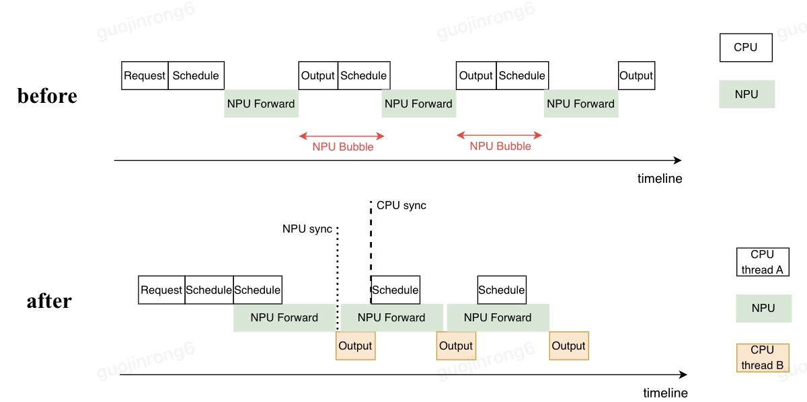

# 异步调度

## 背景
大模型推理过程可划分为3个阶段，包括CPU执行调度准备模型输入阶段，device计算阶段，CPU处理输出阶段。
由于解码操作的序列性，step-i+1 的输入需要依赖 step-i 的输出结果，
上述3个阶段需要按顺序串行执行，导致在CPU执行阶段1和3的时候，device侧空闲等待出现空泡，资源利用不充分。


## 功能介绍

xLLM在框架层支持了异步调度功能，在device执行 step-i 计算的同时提前让CPU执行 step-i+1 的调度操作，device在完成 step-i 计算后可立即开始 step-i+1 的计算，从而消除空泡。
具体地，CPU在发起 step-i 计算调用后，不等待device计算完成，为 step-i 的请求构造fake token，使用fake token执行 step-i+1 的调度操作，分配KV Cache等；device在启动 step-i+1 的计算时，用 step-i 计算出来的true token替换fake token，保证计算的正确性。CPU在另外的线程中同步处理 step-i 的结果返回给client。

整体架构如图，实现中CPU侧执行阶段1和阶段3的操作分别采用了不同的线程池，rpc等函数调用采用C++ future和promise非阻塞调用，实现全异步runtime。


## 使用方式

xLLM中提供了gflags参数`enable_schedule_overlap`，默认false，如需开启在xLLM的服务启动脚本中设置为true即可，示例如下：
```shell
--enable_schedule_overlap=true
```


## 性能效果
- 异步调度开启后，两个step之间的device空闲时在200us左右，基本类似一个kernel launch的时间。
- 在DeepSeek-R1-Distill-Qwen-1.5B模型上，限制TPOT 50ms，吞吐**提升17%**。


## 注意事项
- 异步调度功能会在服务端额外计算一个step，当使用场景中输出token数量较少，或是类似embedding模型只一次性输出的场景，不建议开启，会影响服务端吞吐。