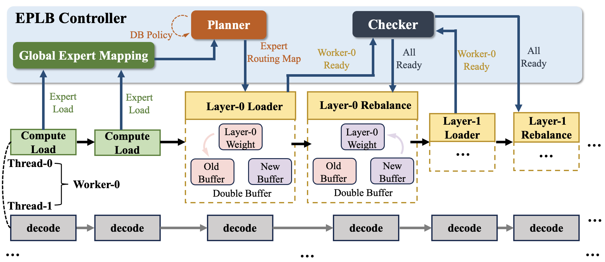

# EPLB负载均衡

## 背景介绍

MoE模型依赖动态路由分配tokens给专家，但实际部署中因数据分布不均，导致专家负载失衡（部分过载、部分闲置）。专家冗余调整（如新增/删除副本）需要消耗额外显存，并可能因权重迁移影响推理延迟，如何高效、平滑地完成是一大挑战。为此，采用专家冗余策略（复制热点专家）结合分层和全局动态负载均衡实现了动态的MOE负载均衡。

## 功能介绍
xLLM eplb功能主要通过以下三个模块实现：
- eplb manager: 负责专家负载并收集并管理专家分布更新更新，采用逐层更新机制，根据专家负载变化情况判断是否更新该层。
- eplb excutor: 实际专家分布更新执行器。
- eplb policy: 新专家负载表生成策略。
整体架构图如下：


## 使用方式
只需在启动 xLLM 时加上下面的 gflag 参数即可：

```bash
  --enable_eplb=true 
  --eplb_update_rate=2000
```

## 未来工作
* 采用更加细粒度的专家更新机制。
* 与调度层结合，通过请求batch的重组实现更好的负载均衡。