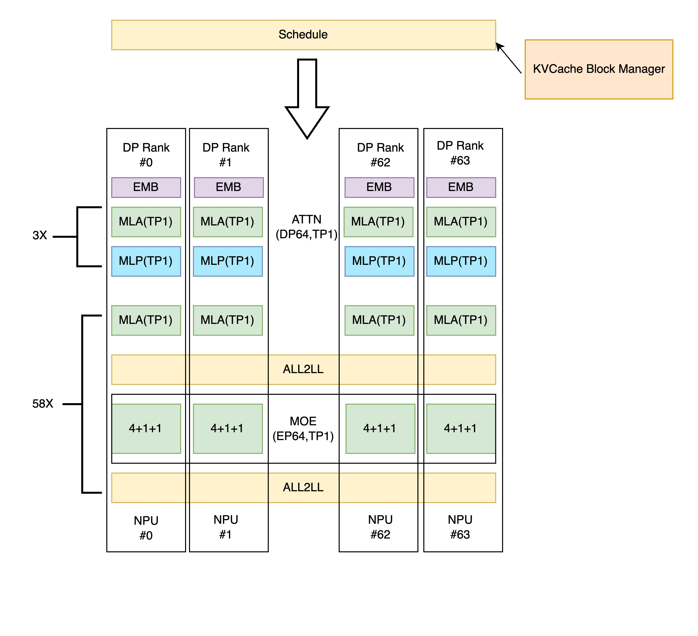

# MoE参数介绍
## 背景介绍
在部署DeepSeek-R1 671B参数规模模型时传统分布式部署面临、显存利用率低、通信开销大、硬件成本高昂等核心瓶颈，因此需要引入ep并行。
+ 在同等资源下，单张卡上的Expert越少，可用于KV Cache的显存越多，可Cache的token个数越多。
+ 因MLA的特性，同等资源下TP Size越小，冗余的KV Cache就越少，可Cache的token个数越多。
+ 采用大规模ep并行部署，可以将同一个expert的token计算集中到同一设备上，提高硬件利用率
## 参数设置
+ dp_size：设置Attention部分的dp规模大小，默认值为1，可设置为2的指数倍，当dp_size不等于卡数时，dp组内为tp并行.
+ ep_size：设置MoE部分的ep规模大小，默认值为1，可设置为2的指数倍，当ep_size不等于卡数时，dp组内为tp并行.
+ enable_mla ：默认为false，当模型使用mla时需要设置为true.
+ expert_parallel_degree ：ep并行相关参数，不开启ep时默认设置为0，开启ep时默认为1，此时为ep level1，当ep_size等于卡数时可以设置为2开启ep level2.
## 方案设计
+ 当开启ep时，默认为ep level1，此时attn与moe部分计算完成后，通过All Gather全卡通讯将数据发送到下一阶段，以64卡attn部分dp32tp2 moe部分ep32tp2为例，执行流程如下：

+ 当ep_size设置为卡数时，可以开启ep level2，此时attn部分与moe部分之间通讯变为ALL2ALL，只向需要的卡发送数据，降低通讯量与通讯开销，以64卡部署为例，执行流程如下：

